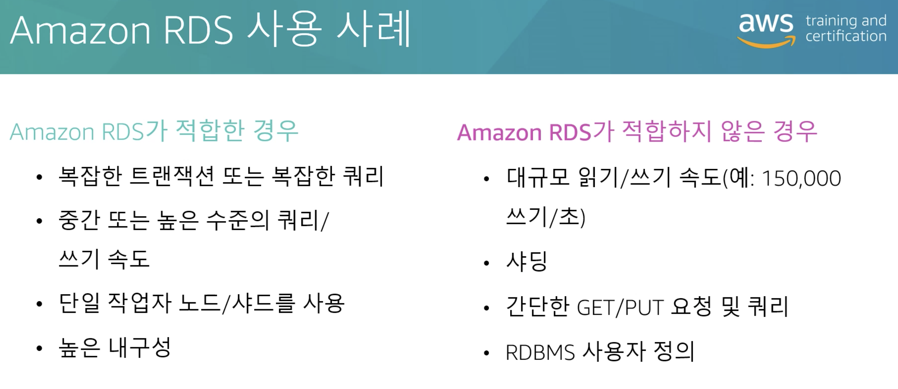

# RDS
- 관계형 DB
- MySQL
- PostgreSQL
- MariaDB
- Oracle
- MS SQL Server


<br>

## EC2에 자체 DB 서비스를 설치하지 않고 RDS를 이용하는 이유
- 데이터베이스 뿐만 아니라 여러 기타 서비스도 같이 제공
- 완전히 자동화 된 프로비저닝
- OS 자동 패치
- 지속적인 백업
- 특정 타임스탬프 복구 가능 (Point In Time Restore)
- 모니터링 대시보드
- 읽기 전용 복제본
- 다중 AZ
- EBS 기반 스토리지 (gp2, io1)
- 다만 SSH를 따로 가질 수 없다.
  - 관리형 서비스이기 때문에 AWS에서 제공되므로 사용자가 따로 접근 권한을 갖지 않는다.

<br>

## RDS 백업
- RDS에서 자동으로 활성화
- 정의해놓은 기간동안 백업 수행 및 일일 트랜잭션 로그가 5분마다 쌓임
- 자동 백업은 기본적으로 7일간 보관 (최대 35일)
- 스냅샷
  - 사용자가 수동으로 발동시키는 백업 (자동 백업과 다름)
  - 백업 보관 기간을 임의로 설정 가능 (6개월 등)

<br>

## RDS Storage Auto Scaling
- 스토리지 사용이 많고 용량이 부족해지면 RDS가 자동으로 스토리지 오토스케일링 수행
  - 스토리지 확장하는 동안 DB를 중단하는 등의 작업을 따로 수행할 필요가 없다.
  - 스토리지 임계값을 설정하여 확장 갯수를 설정할 수 있다.
  - 스토리지 확장 후 조건을 통해 스토리지 상태를 판단하여 자동으로 다시 축소한다.

<br>

## RDS Read Replicas for read scalability
- RDS 읽기 전용 복제본과 다중 AZ의 차이를 이해하고 각 사용 사례를 알아보자.
- 읽기 전용 복제본은 최대 다섯개까지 생성할 수 있다.
    - `동일한 AZ`, `Cross AZ`, `Cross Region`에 생성할 수 있다.
- **주 RDS 인스턴스**와 **읽기 전용 복제본** 사이에 `비동기식 복제`가 발생한다.
- 복제본을 데이터베이스로 승격시킬 수 있다.
  - 자체 라이프사이클을 가져서 복제 사이클 적용이 되질 않는다.
- SELECT 명령문만 사용 가능하다.
- 네트워크 비용
  - AWS는 하나의 AZ에서 다른 AZ로 데이터 이동시 비용이 발생한다.
  - RDS 읽기 전용 복제본은 `동일한 Region 내에 있을 때 비용이 발생하지 않는다.`
    - `다른 AZ라도 동일한 Region이면 발생하지 않는다.`

<br>

## RDS Multi AZ (Disaster Recovery)
- 주로 재해 복구에 사용한다.
- 다중 AZ는 어떤 데이터베이스가 작동 중인지에 관계없이 동일한 연결 문자열을 유지합니다.
  - 연결 문자열에는 호스트 파라미터로 DB 인스턴스 엔드포인트의 `DNS 주소`와 `포트` 파라미터를 지정한다.
- 마스터 DB의 모든 변화를 StandBy DB에 `동기적으로 복제`한다.
- 하나의 DNS 이름을 갖고 마스터 디비에 장애가 발생하면 StandBy DB에 대해 자동으로 장애 조치를 수행한다.
  - 전체 AZ 혹은 네트워크 손실 대비에 대한 장애 조치이자
  - 마스터 DB 혹은 스토리지 장애 발생시 스탠바이 DB가 마스터 디비가 될 수 있다.
  - 마스터로 승격되는 과정이 자동으로 이루어진다.
  - 스탠바이 디비는 대기 목적 하나만 수행해야 하므로 스케일링에 이용되지 않는다.
    - 즉 읽고 쓸 수 없다. 마스터 디비에 문제가 발생할 경우 대비한 장애 조치이기 때문
- 재해 복구를 대비해서 읽기 전용 복제본을 다중 AZ로 설정할 수 있는가?
  - 가능하다. 읽기 전용 복제본을 다중 AZ로 설정이 가능하다. (Single AZ to Multi AZ)
  - 다운 타임이 전혀 없다.
  - 대신 설정에서 다중 AZ 기능을 활성화해야한다.
  - ```
    1. 마스터 DB가 자동으로 스냅샷을 생성한다.
    2. 이 스냅샷은 새로운 스탠바이 DB로 복원된다.
    3. 복원된 후 두 DB간 동기 복제가 설정된다.
    4. 다중 AZ 설정 상태가 된다.
    ```

<br>

## RDS Security
- 사용하지 않는 미사용 데이터 암호화는 AES 256를 사용하는 KMS를 사용하여 마스터, 읽기 전용 데이터베이스를 암호화할 수 있다.
- 암호화 실행 시 실행시간을 정의해야 한다.
- 마스터 DB를 암호화하지 않으면 복제본도 암호화할 수 없다.
- 오라클과 MS SQL Server는 Transparent Data Encryption (TDE)라는 암호화 대안을 제공한다.
- 클라이언트에서 디비로 데이터 전송중에 보안 소켓 계층(SSL) 또는 전송 계층 보안(TLS)을 사용하여 연결을 암호화할 수 있다.
- 모든 클라이언트가 SSL을 사용하도록 하려면
  - PostgreSQL : rds.force_ssl=I RDS 파라미터 그룹 설정 필요
  - MySQL : 내부에서 명령문 실행해야함, Grant USAGE ON *.* TO 'mysqluser'@'%' REQUIRE SSL

### RDS 백업 암호화
- 암호화 되지 않은 RDS DB 스냅샷을 생성하면 스냅샷 자체는 암호화 되지 않는다.
  - 암호화된 RDS DBS 스냅샷을 생성하면 스냅샷은 기본으로 암호화가 된다.
  - 암호화 되지 않은 스냅샷을 암호화하는 방법은 
    1. RDS 콘솔에서 암호화할 스냅샷을 선택
    2. 스냅샷 작업(Snapshot Actions)에서 스냅샷 복사(Copy Snapshot)를 선택
    3. 암호화 사용(Enable Encryption) 옵션을 예(Yes)로 변경
    4. AWS KMS 키를 선택 후 진행

### RDS 암호화
- 미사용 데이터 암호화는 데이터베이스 인스턴스를 처음 생성할 때만 실행된다.
- 암호화되지 않았으면 스냅샷을 생성해야한다.
  - 암호화 되지 않은 RDS 백업 암호화 하는 방법과 같다.
- 암호화된 스냅샷에서 DB 복원 가능
- 암호화가 되면, 이전에 암호화 되지 않은 디비의 데이터를 다 옮긴 후 삭제한다.


### RDS 네트워크 보안
- 보통 RDS 디비는 private subnet에 배포한다.
  - DB가 www에 노출되지 않도록 한다.
- 보안 그룹을 활용하여 IP 또는 보안 그룹을 제어한다.
- 사용자 생성 및 권한 관리는 IAM 정책으로 관리하며, MySQL 과 PostgreSQL에서만 가능하다.
  - 데이터 삭제, 읽기 전용 복제본 생성 등 제어 가능하다.
  - 암호는 필요없고 인증 토큰이 필요하다.
  - 인증 토큰은 RDS API 호출을 사용해서 IAM으로 직접 얻을 수 있다.
  - 인증 토큰은 수명이 짧다 (15분)
  - IAM 인증 장점은 SSL로 암호화 된다는 것
  - IAM 역할과 EC2 인스턴스 프로파일은 쉽게 통합할 수 있다.