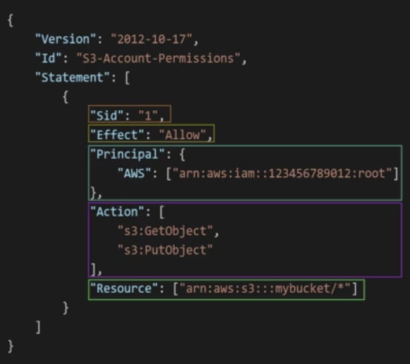

# IAM
- Identity and Access Management
- 사용자 생성, 그룹에 배치
- 계정 생성시 루트 계정이 기본으로 생성된다.
  - 루트 계정은 오직 계정을 생성할 때만 사용되어야 한다.
- 그룹에는 오직 사용자만 배치가 가능하다.
  - 다른 그룹을 포함시킬 수 없다.
  - 사용자가 여러 그룹에 배치될 순 있지만 추천하지 않는 방법
- 사용자 및 그룹을 생성함으로써 필요로 하는 권한만 부여하고 AWS 리소스에 제한적으로 관리할 수 있다.

 

# Policies
- 사용자와 그룹, 역할에 권한을 부여하는 방법으로써 사용자나 그룹이  
하나 이상의 AWS 리소스에 대한 어떤 작업을 수행할 수 있는지 허용 규칙(권한)을 JSON 형식으로 작성되는 문서이다.
- 구조
  - Version
  - ID : 정책 식별자 (선택)
  - Statement (필수)
    - sid : 문장 ID (선택)
    - effect : 특정 API에 접근 허용/거부 여부 (Allow, Deny)
    - action : effect 기반으로 허용 및 거부되는 API 호출 목록들 
    - resource : action이 적용될 aws 리소스 목록
    - principal : 특정 정책이 적용될 사용자 계정 혹은 역할로 구성됨
    - condition : statement가 언제 적용될지
  
- 

 

## Password Policy
- 두가지 방법이 있다.
1. 비밀번호 정책
   - 비밀번호 최소 길이 설정
   - 특정 글자 사용
   - 비밀번호 변경 허용 혹은 금지
   - 일정 기간이 지나면 비밀번호 재설정
   - 비밀번호 재설정시 비밀번호 재사용 금지
2. MFA
   - Multi Factor Authentication
   - 비밀번호 + 소유하고 있는 보안 장치 함께 사용
   - 해킹을 당해 비밀번호가 누출되더라도 보안 장치를 통해 로그인 가능하기 때문에 계정에 침투 제한
   - MFA Device options
     - 가상 MFA 장치
       - Google Authenticator (only one phone)
       - Ahthy (multi device)
     - U2F (Universal 2nd Factor Security Key)
       - USB 같은 물리적 장치
       - AWS가 아닌 제 3자의 회사
       - YubiKey
     - Hardware Key Fob
       - Gemalto
       - 삐삐 같은 애
     - Hardware Key Fob for AWS GovCloud

