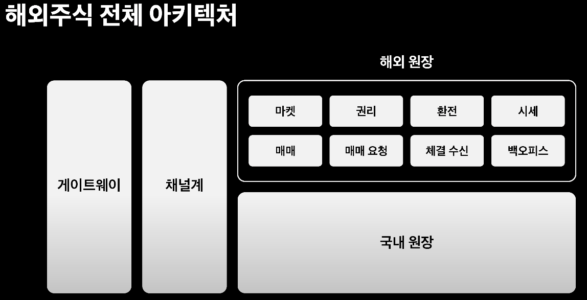
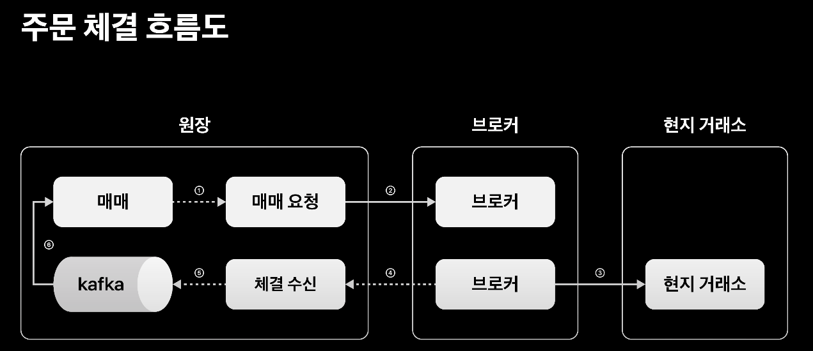
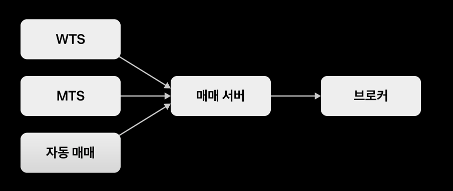
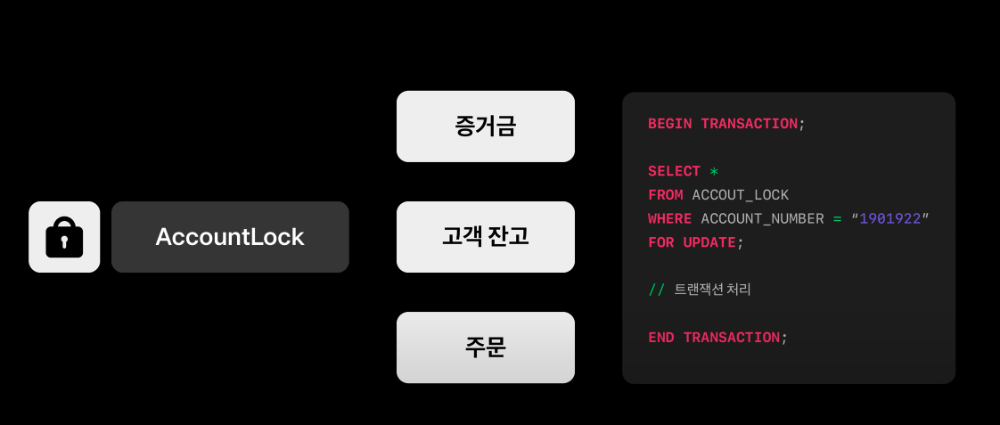
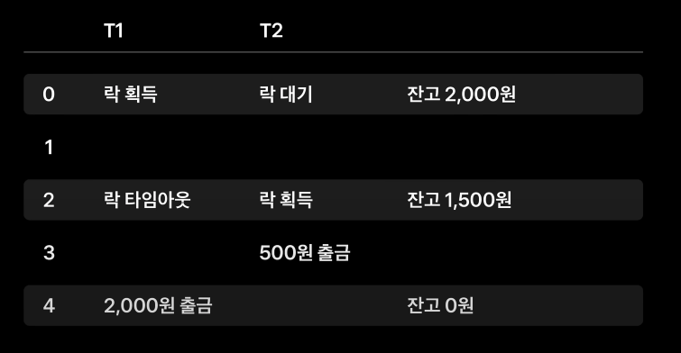
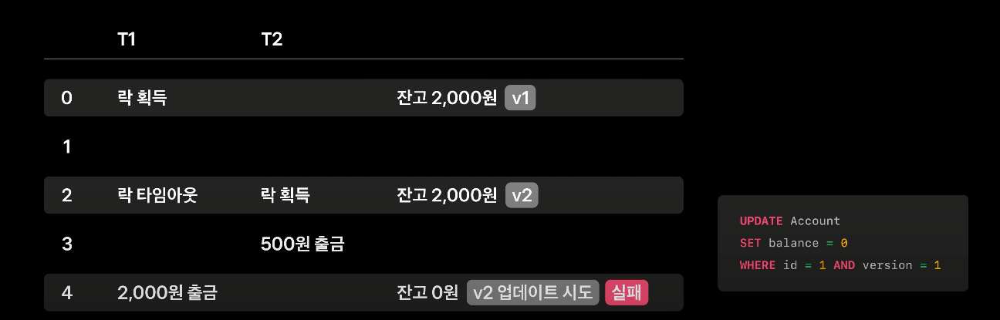

# 토스 애플 한 주가 고객에게 전달되기까지

- 해당 [컨퍼런스 영상](https://www.youtube.com/watch?v=UOWy6zdsD-c&t=55s&ab_channel=%ED%86%A0%EC%8A%A4)을 보고 좋은 인사이트가 되어 정리
- 토스 증권에서는 다양한 곳에서 고객의 잔고를 갱신하는 트랜잭션들이 발생한다.
- 그렇기에 안전하게 동시성을 제어해야한다.
- 이 과정을 다음과 같은 목차로 설명이 진행된다.

1. 해외주식 아키텍쳐
2. 동시성으로부터 고객의 자산을 안전하게 처리하기
3. 해외구간 네트워크 지연으로부터 안전하게 서비스하기
4. 브로커 의존성 격리하기

## 해외주식 아키텍쳐

- 토스 증권은 위 사진과 같이 해외 원장은 MSA로 분리되어있다.
  - 모듈의 장애가 전체 장애로 전파되지 않도록

- 내부 흐름도는 다음과 같다.
- 매매 서버를 통한 주문 요청과
- 매매 서버를 통해 제출된 주문에 대한 체결 결과는 별도의 트랜잭션으로 되어있다.
- 하나의 주문에 대해 다수의 이벤트가 발생할 수 있다.

 

## 동시성으로부터 고객의 자산을 안전하게 처리하기

- 자동 매매는 여러 테이블에 대한 삽입 및 갱신이 일어나는 트랜잭션이기에 테이블 하나하나 모두 락을 잡아버린다면 성능 저하와 데드락 지옥을 피할수가 없다.
- 데드락을 피할수가 없다고?
    - 데드락은 서로 다른 트랜잭션들이 서로에 대한 락을 소유한 상태로 대기 상태가 되어 더 이상 요청에 대한 응답을 수행하지 못하는 상황을 말한다.
    - 만약 insert 하는 테이블에 락이 걸리고 update한 테이블에 락이 걸린 상태에서 서로 교차해서 수행을 해야하는 경우 걸릴 수 있다고 생각한다.

 

- 이런 경우 **락을 위한 테이블을 별도로 두어 각 테이블들이 계좌락 테이블을 대한 락을 획득하는 것으로 트랜잭션을 시작하는 방식이다.**

- 토스는 **Redis 기반 분산락**을 이용해 해결하고 있다.
- Redis 분산락을 사용함으로써 DB 락을 강제하지 않게 된다.
- Redis 분산락을 사용하게 되면 여러 서버들에서 많은 요청들이 발생하기 때문에 높은 처리량이 보장되어야 한다.
  - Redis는 메모리 기반 저장소다보니 RDBMS AccountLock에 비해 보다 높은 처리량을 제공하는 것 역시 장점이다.

 

- 분산락은 모든 서버가 공통으로 사용하기 때문에 하나의 트랜잭션이 무한정 락을 소유하고 있을 경우 다른 서버들의 요청이 무한정 대기할 수 있다.
- 그렇기에 분산락은 적절한 타임아웃 설정이 필요하다.
- 락 타임아웃은 락을 획득하기 위해 기다리는 시간을 정해놓는다는 것을 의미한다. 
  - 락 타임아웃을 건 쓰레드가 주어진 시간을 소진하기까지 락을 획득하지 못하면 쓰레드는 이 락을 포기한다.

- 조심해야할 부분은 분산락 타임아웃은 의도대로 동작하지 않을 수 있다.
    - 분산락 타임아웃이 지나 락 해체가 되었지만 트랜잭션이 끝나질 않아서 다른 트랜잭션과 경합이 발생할 수 있다.

1. 0초에 T1과 T2 트랜잭션이 동시에 발생했다.
2. 그리고 T1이 락을 획득하고 T2가 락을 대기하는 상태가 되었다고 가정하자.
3. 2초뒤에 T1은 락 타임아웃으로 락이 해제되었고 T2는 락을 획득하고 500원을 출금하여 잔고가 1,500원이 남게된다.
4. 그리고 2초뒤인 4초에 지연된 T1 트랜잭션이 락 획득을 다시 시도하고 락 획득이 되어 트랜잭션 처리가 완료되어 2,000원을 출금하게 되면 고객의 돈이 맞질 않게 되는 갱신 유실이 발생하게 된다.

 

- 분산 락을 해제하기전에 디비 트랜잭션이 커밋되거나
- **분산 락을 해제하고 나서 다른 트랜잭션이 락을 먼저 획득하고나서 다른 트랜잭션의 결과가 커밋이 되는 경우 등에 발생 (위 상황)**
- JPA 환경에서는 쿼리 쓰기 지연 등으로 인해 이러한 문제가 발생할 확률이 높다.

 

- 갱신 유실 방지를 하는 방법은 아래 방법들로 방지가 가능하다.
1. 원자적인 연산 사용
2. 명시적 잠금
3. 갱신 손실 자동 감지
4. CompareAndSet 연산

- 원자적 연산 사용과 갱신 손실 자동 감지는 DBMS에 의존적이기 때문에 ORM과 궁합이 좋지 않다.
- 명시적 잠금 방법인 2번은 여러 테이블을 갱신하는 트랜잭션에서는 비용이 매우 비싸고
- 토스 증권은 CAS 연산을 통해 갱신 유실을 방지하고 있다.

 

### @OptimisticLocking
- JPA에서는 OptimisticLocking 어노테이션을 통해 간단하게 CAS 연산 구현이 가능하다.
- OptimisticLocking은 versioning을 통해 갱신 유실을 방지한다.

- 0초에 잔고의 버전은 1이고
- 3초에 T2가 갱신하면서 버전이 2로 증가했다.
- 1초 뒤인 4초에 T1 트랜잭션이 락을 획득하고 아직 T2의 커밋이 되지 않은 상태에서 잔고 2000원을 읽어 출금 업데이트를 시도할 때
- T2가 버전을 이미 업데이트했기 때문에 오른쪽 쿼리의 where 문으로 인해 T1 트랜잭션이 실패하게 된다.

 

- 그러면 분산 락 없이 OptimisticLocking 만으로 동시성을 제어할 수 있지 않을까?
  - 분산 락이 없다면 동시에 발생하는 트랜잭션들은 대기 없이 실패하게 되거나
  - 별도의 재시도 구현이 필요하며 코드의 복잡도가 상승하게 된다.
- 토스 증권에서는 분산락으로 동시성을 제어하고 만약의 상황에 OptimisticLocking을 통해 데이터 정합성을 틀어지지 않도록 하고있다.
- 주요 테이블들은 하이버네이트의 envers를 이용해 변경 히스토리를 저장

 
 

## 해외구간 네트워크 지연으로부터 안전하게 서비스하기
- 해당 파트는 동시성에 대해 좀 더 공부하고 진행하도록 한다.

 
 
 

# CAS 연산
- CAS 연산은 멀티 쓰레드, 멀티 코어 환경에서 CPU가 변수에 접근할 때 CPU 캐시에서 값을 참조한다.
- 이때 CPU 캐시와 메인 메모리에 저장된 값이 서로 다를 수 있다. (가시성 문제)
- 현재 쓰레드에 저장된 값과 메인 메모리에 저장된 값을 비교하여 일치하는 경우 새로운 값으로 교체하고, 
- 일치 하지 않는 다면 실패하고 재시도를 하는 알고리즘을 CAS 연산이라고 한다.