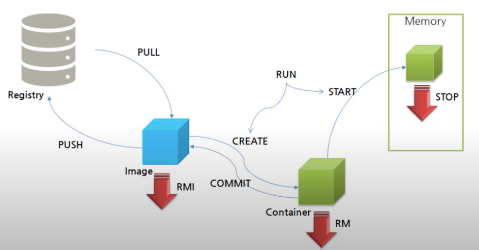

## Life Cycle

### Pull
- Registry(docker hub)에서 Image `Pull`
- 도커 이미지 저장소에서 Image를 다운

### Push
- Image `Push` Registry(docker hub)
- 도커 이미지 저장소에 Image 업로드
  - `Push` 할 때 **권한이 필요함**

### Create
- Image `Pull` 후 이미지 자체는 **실행이 불가능한 상태**
- `Pull`된 Image를 실행하려면 `Container`로 만들어주는 작업이 필요하다.
  - 이때 작업은 `CREATE` 라는 명령어를 실행하면 **Image가 Container가 된다.**

### Start
- `Container` 를 실행시킨다 => 메모리에 적재하여 컨테이너의 어플리케이션이 동작하게 한다는 뜻
- `Start` 명령어를 실행한다.

### Run
- `PULL` + `CREATE` + `START`
- 이 3가지 명령어가 한번에 실행이 된다.
- 만약 이미 Pulling된 이미지를 Run 명령어를 실행하면 다시 받지 않고 `CREATE` + `START` 만 실행
- 만약 `Run`을 수행해서 `Container`를 만든 상태에서 또 `Run`을 수행한다면 또 `Container`가 만들어진다.
  - 불필요한 컨테이너가 계속 만들어지게 된다.
- **`Run` 명령어 같은 경우는 `CREATE`가 필요한 경우에만 사용하도록 제한하는게 좋다.**
  - `CREATE` 와 `START`를 따로 사용하도록 하자.
