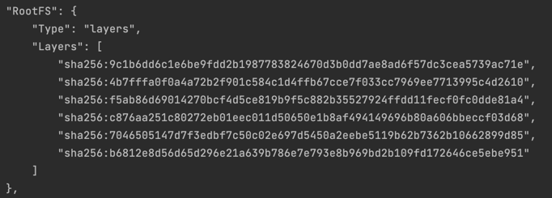
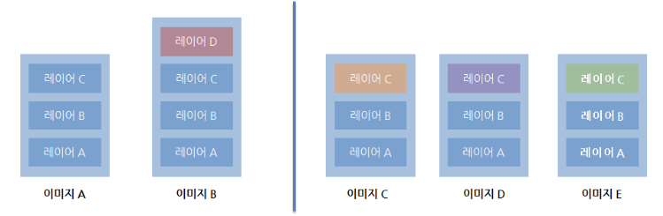

# 이미지 레이어
- 도커 이미지는 컨테이너를 실행하기 위한 모든 정보를 가지고 있기 때문에 용량 크기가 크다.
- 만약 기존 이미지에 파일 하나가 추가된 이미지를 다시 다운받는다면 매우 비효율적일 수 밖에 없다.
- 이런 문제를 해결하기 위해 **이미지는 여러 개의 레이어 구조**로 되어 있다.



- 도커 Registry(도커 허브)에는 이미지 저장시 레이어 단위로 저장하게 되어있다.
- 기존 이미지에 추가적인 파일이 필요할 때 다시 다운로드 받는 방법이 아닌 해당 파일을 추가하기 위한 개념
- 이미지를 다운 받고 inspect 명령어로 도커 정보를 보면 여러 레이어 (ID)로 구성된 것을 확인할 수 있다.

<br>



- 왼쪽처럼 이미지 A를 도커 허브에서 다운 받고 A를 통해 B를 만든 후 새로운 파일을 추가할 경우 레이어가 추가된다.
- 그리고 B를 푸시하면 이미지 B 전체가 저장이 되는 것이 아닌 새로운 레이어 D만 저장이 된다.
- 혹은 이미 이미지 A가 있는 상태에서 도커 허브에서 이미지 B를 받으면 없는 레이어 D만 받게 된다.
- 만약 왼쪽처럼 A, B 이미지가 존재하는 상태에서 이미지 A만 삭제한다면 이미지A는 삭제되지만 안의 레이어는 살아있다.

<br>

- 만약 오른쪽처럼 2개의 레이어(A, B)로 구성되어 있는 이미지 하나를 다운 받았고 레이어 C가 추가된 이미지를 다운로드 받으면 레이어 C만 받는다.
- 쪼개서 일치하는 데이터들은 그대로 유지하고 일치하지 않는 부분은 새롭게 저장하게 된다.

<br>
<br>

## 도커 이미지 정보 확인
```shell
$ docker pull nginx
$ docker inspect nginx
```

<br>

## 도커 이미지 저장소 위치 확인
```shell
$ docker info 
#Client:
# Context:    default
# ...
#Server:
#  Storage Driver: overlay2 <- 이미지 레이어 저장소 위치
# ...
# Docker Root Dir: /var/lib/docker <- 도커가 설치된 루트 디렉토리 위치

# cd /var/lib/docker/overlay2
```
- ubuntu에서 docker는 이미지와 컨테이너에서 사용하는 스토리지는 /var/lib/docker 하위를 사용
  - mac에서는 도커가 vm 위에서 동작하기 때문에 경로가 다르다.

<br>

## 도커 용량 확인
```shell
$ du -sh /var/lib/docker/ #도커가 설치된 환경 용량 확인
#2.0G	/var/lib/docker/

$ du -sh /var/lib/docker/image/ # 도커 이미지에 대한 정보 저장 디렉토리
#2.7M	/var/lib/docker/image/

$ du -sh /var/lib/docker/overlay2/ # 도커 이미지의 레이어파일 시스템이 사용되는 실제 디렉토리
#.0G	/var/lib/docker/overlay2/

$ du -sh /var/lib/docker/containers/ # 도커 컨테이너 정보 저장 디렉토리
#136K	/var/lib/docker/containers/
```

<br>

## 도커 히스토리 확인
```shell
$ docker history nginx
```

<br>


