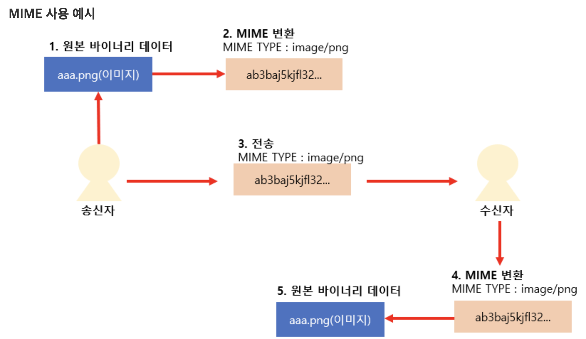

# MIME
- 생각해보면 MIME 타입을 대충 추측하고 넘어갔지, 이걸 왜 사용했는지에 대해 알아보지 않았다.
    - 이번 Next Step 책을 독학하면서 확실하게 알고 넘어가자.
    
## MIME 란?
- Multipurpose Internet Mail Extension의 약자로, 표준화된 전자 우편의 데이터 형식 포맷이다.
- 기존에는 전자 우편과 함께 업로드할 파일들을 텍스트 문자로 변환해 이메일 시스템에서 전달하기 위해 개발되었지만 <br>
현재 전자 우편뿐만 아니라 웹을 통해 여러 형태의 파일을 전달할때 쓰이고 있다.

## MIME 특징
- 전자 우편은 7bit `아스키 코드`를 사용하여 이외 `바이너리 데이터` (이미지, 동영상, 음악, 문서 등)의 멀티 타입 데이터들은 전송이 불가했다.
- 때문에 **여러 바이너리 데이터를 아스키 코드로 변환하는 방법(인코딩)과 해당 미디어 타입들을 MIME 타입 목록들로 정의하였고, <br>
MIME 타입에 따른 바이너리 데이터들을 아스키 코드 데이터로 변환(인코딩)후 전송한다.**
    - 전송전 송신측은 인코딩된 데이터가 원래 어떤 형식의 파일이였는지 MIME 타입을 파일 앞부분에 기록하여 전송
    - 수신측은 해당 MIME 타입을 참고하여 수신한 아스키 데이터를 원래 바이너리 데이터로 변환(디코딩)후 사용. <br>

        

<br>

## MIME TYPE 종류
- MIME 타입은 메인 타입과 서브 타입으로 분류되는데, `/`로 분류한다.
    - ex) image/png, image/jpeg <br>
      &nbsp;&nbsp;&nbsp;&nbsp; text/plain, text/html <br>
      &nbsp;&nbsp;&nbsp;&nbsp; application/octet-stream, application/xml, application/json <br>
      &nbsp;&nbsp;&nbsp;&nbsp; multipart/form-data, multipart/byteranges
- application : 모든 종류의 이진 데이터를 표현한다.
    - octet-stream : 8비트 단위의 바이너리 데이터를 의미
        - 표현할 수 있는 프로그램이 존재하지 않는 데이터의 경우 사용. (기타 파일)
        - Content-Disposition 헤더를 붙여줌으로써 해당 데이터를 수신받은 브라우저가 파일을 저장 또는 다른이름으로 저장 여부를 설정하게 할 수 있다.
          
- multipart : 여러가지 타입의 데이터들을 동시에 전송할때 사용한다.
    - form-data : html과 같은 form 태그 안에서 여러가지 데이터를 함께 묶어 전송하는 경우 사용.
        ```html
        <form>
          <input type="text" name="name"/>
          <input type="radio" name="radio">
          <input type="file" name="img">
          <input type="submit" value="전송">
        </form>
        ```
        - submit을 하게 되면 다음과 같이 요청 메시지 본문에 작성된다.
        ```
            Content-Type: multipart/form-data; boundary=ab31tg90
             
            --ab31tg90
            Content-Disposition: form-data; name="name"
            ohtaeg
             
            --ab31tg90
            Content-Disposition: form-data; name="radio"
            1
             
            --ab31tg90--
            Content-Disposition: form-data; name="img"; filename="img.jpg"               
            Content-Type: image/jpeg
        ```  
        - Content-Type이 multipart/form-data 라는것이 명시되며 각 데이터를 구분할 수 있는 구분자 문자열이 boundary 의 값으로 주어진다. <br>
          boundary 앞에는 --를 주어 경계라는 것을 알려주고 마지막 boundary 에는 --boundary-- 와 같이 뒤에 -- 를 붙여주어 데이터의 끝이라는 것을 알려준다.
    
    - byteranges : 클라이언트에서 데이터를 한번에 아닌 부분적으로 요청한 경우에 사용한다.
        - http 응답 메시지에 대한 멀티파트 타입
        - 서버는 응답메세지 상태코드 `206 Partial Content` 와 함께 범위 응답을 하게 됩니다.           
        - 클라이언트가 대용량 파일 하나를 서버에게 요청하여 다운받아야 하는 경우를 예로 100mb의 데이터를 1~50mb까지 받고난 후 51~100mb 다시 요청하여 여러번에 응답받을 수 있다.
          또한 이를 응용하면 50까지 받다가 네트워크 오류가 난 경우에 다시 1부터 요청하는 것이 아닌 51부터 요청하여 이어받을 수 있습니다.

출처 : https://dololak.tistory.com/130?category=636624
