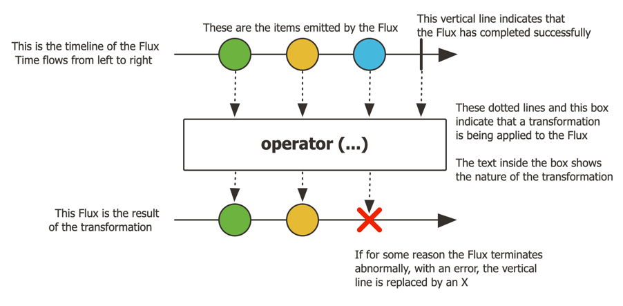

# Reactive Streams
리액티브란 여러 의미가 존재하지만 **어떤 이벤트나 데이터 변경이 발생하면 대응하는 방식으로 작성한 프로그래밍**

Reactive Streams는 여러 진영에서 개발한 Non-Blocking + Back Pressure를 사용하여 비동기식 스트림 처리에 대한 표준이다.

Back Pressure? 먼저 옵저버 패턴의 문제점을 살펴보자.

## 옵저버 패턴
Java는 1.0 부터 옵저버 패턴을 쉽게 구현할 수 있는 인터페이스를 제공

옵저버 패턴의 대표적인 특징은 `데이터를 밀어낸다는 것.`

데이터를 밀어낸다는 개념을 Iterable 과 Observable 이 두개의 예제로 비교해보자.

Iterable로 예를 든 이유는 Observable과 서로 쌍대성(`Duality`)을 가지고 있음을 표현하기 적절한 것 같다.

> 쌍대성 : 두 가지 기능이 궁극적으로 같지만 서로 반대 방향으로 표현될 수 있는 것.

IterableExample 클래스를 예로 Iterable은 **데이터를 끌어오는 방식**, 
  - Pull
    - iterator.next()
  - Data method()

ObservableExample 클래스 예로 Observable은 **데이터를 밀어내는 방식**, 
  - Push
    - notifyObservers(arg)
  - void method(Data);
  - source -(event/data)-> target (Observer)
  - 타겟이 제공자한테 관심을 가지도록 하여 옵저버를 옵저버블에게 등록시킴으로써 전달받도록

<br>

### 옵저버 패턴의 문제점
publisher는 subscriber의 데이터를 전달하는데만 집중

그러다보니 아래 문제점들이 존재

1. publisher의 데이터 제공의 끝을 알 수 없다. 끝을 어떻게 알려줄 수 있을까?
2. 예외 만약 subscriber에서 예외가 발생한다면, 여러 예외 상황마다 pubsliher에서 원하는 예외 처리 방식을 지원하기에 제한적이다.
3. 특히 가장 중요한 문제는 **publisher가 subscriber의 상태를 고려하지 않고 데이터를 전달한다.** <br>
subscriber에 문제가 있어 처리를 하지 못하고 있는데 전달만 한다. <br>
그러다보니 subscriber가 publisher에 비해 속도나 성능이 받쳐주지 않는 문제가 생긴다.

<br>
<br>

## Reactive Streams API
위 문제점들을 해결하고자 리액티브 프로그래밍을 위한 표준이 탄생하였다.

### 표준 인터페이스 API
```java
public interface Publisher<T> {
   public void subscribe(Subscriber<? super T> s);
}

public interface Subscription {
   public void request(long n);
   public void cancel();
}

public interface Subscriber<T> {
   public void onSubscribe(Subscription s);
   public void onNext(T t);
   public void onError(Throwable t);
   public void onComplete();
}
```


### `Publisher`
- 데이터/이벤트 생산자
- 제한되지 않은 수의 순서를 가진 요소를 제공하는 제공자
- `Subscriber`를 인자로 받는 subscribe 메서드 하나만 갖는다.
- Publihser에서 여러 쓰레드를 만들어 동시 처리를 하는 것은 스펙 상 불가
  - Subscriber는 Publisher로부터 시퀀셜하게 데이터가 날라올 것으로 기대하고 멀티 쓰레드 문제를 고려하지 않음

<br>

### `Subscriber`
- 데이터/이벤트를 소비한다.
- onSubscribe(Subscription s)
    - `Publisher`로부터 데이터를 소비하기 위해 필요한 행위가 명시되어있는 `Subscription`을 전달받는 메서드
    - 필수로 호출되어야한다.
- onNext(T t)
    - 데이터를 받아 처리 
    - onSubscribe() 호출한 뒤 onNext() 호출
    - 호출 여부는 optional
- onError(Throwable t)
    - onNext() 호출 뒤 발생한 에러를 처리
    - 호출 여부는 optional
- onComplete()
    - 모든 데이터를 받아 완료되었을 때 완료 처리
    - 호출 여부는 optional

<br>

### `Subscription`
- `Publisher` 와 `Subscriber`를 중개해주는 역할
- request(long n)
  - 처리할 수 있는 데이터 갯수를 파라미터로 받아 `Publisher`에게 요청
  - **소비자가 필요한 만큼 생산자에게 데이터를 `요청`**하는 `Back Pressure`의 원리
  - Publisher와 Subscriber 사이에 속도 조절을 위해 사용
- cancel()
  - 구독을 취소

<br>
  
### `Processor`


### Operator
- Publisher -> [Data1] -> multiplyOperator -> [Data2 * 10] -> negativeOperator -> [-Data3] -> Subscriber
- 중간에 데이터를 가공




## REF
- [reactive-streams](https://www.reactive-streams.org/)
- [reactor](https://projectreactor.io/docs/core/release/reference/)
- [토비의 봄 5회 스프링 리액티브 프로그래밍 (1) - Reactive Streams](https://www.youtube.com/watch?v=8fenTR3KOJo&list=PLOLeoJ50I1kkqC4FuEztT__3xKSfR2fpw&index=1&ab_channel=%ED%86%A0%EB%B9%84%EC%9D%98%EC%8A%A4%ED%94%84%EB%A7%81)
- [블로그](https://jongmin92.github.io/2019/11/05/Java/reactive-1/)
- [블로그](https://bgpark.tistory.com/160)
