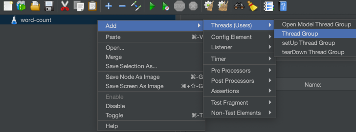
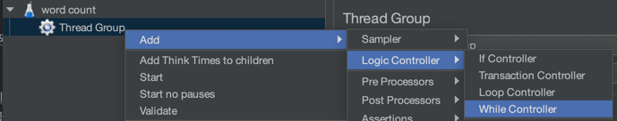
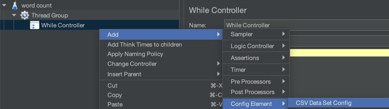
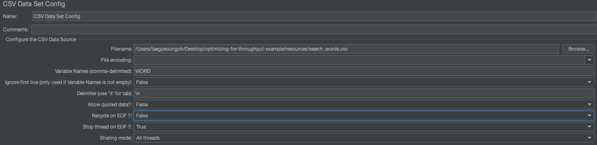
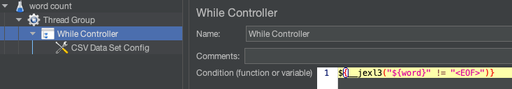
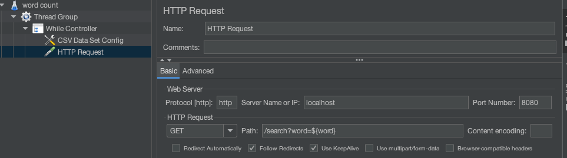
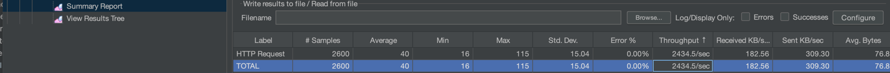
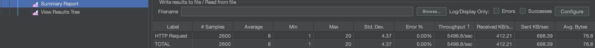
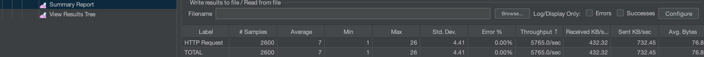

# 처리량
- 주어진 기간에 완성되는 작업의 수
  - 시간, 초 단위로 작업을 나눠 처리량을 측정
- 동시적으로 많은 작업을 수행할 때 가능한 빨리, 많은 작업을 수행해야하는 경우 처리량이 중요하다.
- 각 작업을 완료하는 데 시간 T가 소요되는 경우 작업을 하위 작업들로 분리할 수 있다면 하위 작업을 나란히 실행하여 T/N의 최대 처리량을 얻을 수 있다.
- 하지만 작업을 여러 작업으로 나누고 스케줄링한 후 하나로 결합하는 데에 비용 발생
- 그렇다면 각 하위 작업을 별개 스레드에 스케줄링을 하고 스레드를 풀링한다면 최대 처리량과 리소스 최대 사용률을 얻을 수 있다.

## 스레드 풀링
- 스레드 풀링은 스레드를 생성하고 추후 작업을 위해 재사용
- 스레드가 생성되면 풀에 쌓이고 작업이 대기열을 통해 스레드별로 분배된다.
- 스레드는 이용 가능할 때마다 대기열을 통해 작업을 받는다.
- 스레드 풀링을 이용하여 HTTP 서버 어플리케이션을 만들어보자
  - 해당 어플리케이션은 검색 기능을 제공하며 클라이언트가 어떤 단어를 전송하면 어플리케이션은 단어를 검색하서 등장 횟수를 사용자에게 전송
  - 단어를 제공하는 소설은 양이 방대한 책이다.
- Apache Jmeter를 사용하여 어플리케이션을 측정 및 성능 분석을 해보자.

## Jmeter
- 성능 테스트 계획 툴
- 현재 하려는 성능 테스트 계획은 다음과 같다.
1. 단어 리스트를 포함한 파일을 로딩
2. Jmeter를 통해 각 단어에 HTTP 요청을 가능한 많고 빨리 전송하여 전송된 요청 수 / 응답 받는데 걸린 시간을 통해 처리량을 계산
   - Throughput = requests / test duration

<br>

- 맥북에 Jmeter 설치 및 실행
   ```shell
   $ brew install jmeter
   $ open /usr/local/bin/jmeter
   ```
  
1. Jmeter 실행 후 스레드 그룹을 추가
    - 테스트에 사용될 스레드 갯수를 설정한다. 스레드 개당 사용자 1명이라고 보면 된다.
   
       
   
2. Number of Threads : 동시에 실행할 사용자 스레드 수 설정 (200)
3. while 루프 컨트롤러를 추가하여 반복 작업을 하도록 설정

    

4. while 루프에 csv 데이터베이스 추가해서 csv 파일에서 단어를 읽고 요청에서 변수로 전달할 수 있도록 설정 
        
    

5. CSV Data Set Config에는 다음과 같이 설정한다.
    - Filename에는 불러올 csv를 명시하고 Variable Names에는 HTTP Request의 Parameters 변수 이름들을 나열한다. (${변수명}처럼)
        - comma 기준으로 여러개를 설정할 수 있다. 아래 구분자 줄바꿈 기준으로 엑셀의 각 열이 매핑된다.
    - 파일의 각 단어는 다른 줄에 있기 때문에 구분자를 줄바꿈으로 설정
    - 파일을 하나씩 읽게 하기 위해 Stop thread on EOF를 True로 설정
    - 반복하지 않기 위해 Recycle on EOF를 False로 설정

      

6. CSV Data set Config 설정이 끝났다면 While Controller에 While 루프 조건을 설정한다. 
    - Condition 란에 jmeter가 제공하는 함수 사용 `__jexl3`
    - [jexl](https://commons.apache.org/proper/commons-jexl/)은 `J`ava `Ex`pression `L`anguage 로써 어플리케이션에서 jexl 라이브러리를 
      사용한다면 어플리케이션 외부에서 동적으로 해당 jexl 스크립트 혹은 표현식으로 제어할 수 있다. JSTL 처럼!
    - `${__jexl3("${word}" != "<EOF>")}` => 엑셀 파일을 읽으면서 파일의 끝이 아니면 다음 행의 엑셀 데이터를 읽을 수 있또록 반복 조건 설정 

      

7. 엑셀에서 읽은 단어가 어플리케이션 내에 있는 파일에서 몇번이나 반복되는지 요청하는 HTTP Request 추가
    - While Controller -> Add -> Sampler -> HTTP Request
    - 프로토콜 http 추가
    - IP / PORT 작성
    - 엔드포인트에 쿼리스트링 추가 /search?word=${word}

       

8. 요청을 할 수 있는 설정이 끝났으며, 실행 테스트를 요약해서 볼 수 있도록 설정
    - While Controller -> Add -> Listener -> SummaryReport
9. 디버깅 목적으로 View Result Tree 추가
    - While Controller -> Add -> Listener -> View Results Tree
10. 작성한 테스트 계획을 저장

<br> 
<br>

- 스레드 풀 1로 실행한 결과 어플리케이션이 처리할 수 있는 초당 최대 처리량이 약 810개로 측정이 된다.
    
    

- 스레드 풀 2로 실행한 결과 어플리케이션이 처리할 수 있는 초당 최대 처리량이 약 1010개로 요청수가 늘었고 
- 4개로 늘려서 실행하니 초당 2400가 되어 더 많은 처리를 할 수 있는 것을 확인하였다.

    

- 물리 코어 수(6)만큼 스레드를 늘리니 최대 처리량이 급격히 늘어나고 (약 5400개)
  
    

- 가상 코어 수(12)만큼 스레드를 늘리니 최대 처리량이 완만하지만 조금은 늘어난 것을 확인하였다. (약 5700개)

    

- 가상 코어 수 이상으로 스레드를 늘리니 최대 처리량이 늘어나지 읺은 것을 확인 할 수 있다.