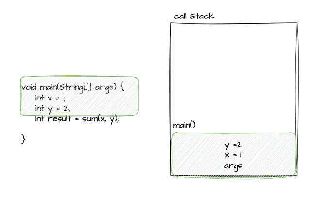
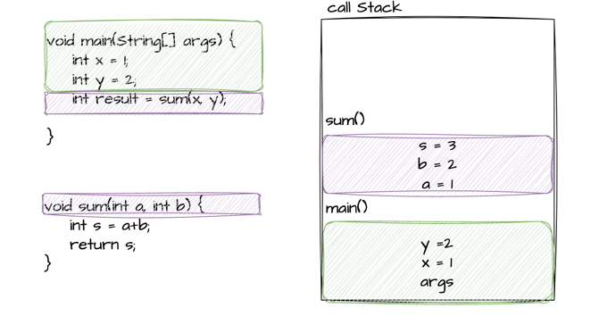
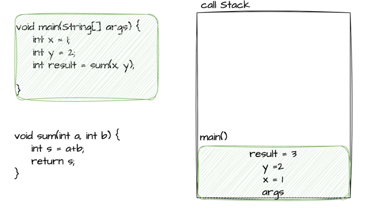

# 스택 / 힙
## 스택
- 메서드가 실행되는 메모리 영역
  - 메서드 파라미터
  - 메서드 내 지역 변수 
  - 등이 스택에 할당된다.
- 스택과 명령어 포인터를 통해 각 실행되고 있는 스레드의 상태를 알 수 있다.
- 코드와 그림을 예로 들어보면

<br>

- main 스레드가 실행할 코드 
```java
void main(String[] args) {
    int x = 1;
    int y = 2;
    int result = sum(x, y);
}

int sum(int a, int b) {
    int s = a + b;
    return s;
}
```

1. 메인 스레드가 main() 메서드를 호출하면 호출 스택(call stack)에 메서드에 해당하는 스택 프레임이 형성된다.
    - 스택 프레임 : 스레드가 메서드에 진입하면 호출 스택 내에 실행한 메서드에 대해 할당한 공간
2. String[] args 인자와 메서드 내 지역 변수들은 스택에 할당된 main() 메서드 스택 프레임에 푸시된다.
    - 지역 변수는 선언된 순서대로 푸시가 된다.

    

3. 현재 main() 메서드가 다른 메서드 sum()을 호출하게 되면 sum() 메서드 스택 프레임이 쌓인다.

    

4. sum() 메서드가 종료되면 반환 값은 CPU 레지스터에 저장되고 sum() 메서드의 스택 프레임은 사라지게 된다. CPU 레지스터에 저장된 값을 result 로컬 변수에 할당하고 스택에 푸시가 된다.

    

5. main() 메서드가 종료되면 마찬가지로 main() 메서드의 스택 프레임은 사라지게 된다. <br>
모든 스택 프레임은 할당되었다가 후입 선출 순서로 사라지게된다.


<br>

- 스택에 입력된 모든 변수들은 특정 스레드에 속하기에 다른 스레드는 해당 변수에 접근이 불가능하다.
- 스레드가 생성될 때 스택은 정적으로 할당되기 때문에 고정된 크기를 갖는다.
- 많은 메서드를 중첩해서 호출하게 된다면 스택에 할당된 메모리가 고갈되어 스택오버플로우가 발생할 수 있다.

<br>

## 힙
- 모든 스레드가 데이터를 공유하고 객체를 할당, 접근할 수 있는 메모리 영역
- 모든 객체가 힙에 할당된다.
  - Strin
  - Object
  - Collection 등
- 클래스 멤버들 (멤버 변수)
- 정적 변수
- GC가 관리하고 통제하는 영역
- 객체는 레퍼런스가 최소 하나라도 있으면 힙에 머문다.

```
Object referenceVar1 = new Object();
Object referenceVar2 = referenceVar1;
```
- referenceVar1, referenceVar2는 레퍼런스 변수이고 레퍼런스가 메서드에 로컬 변수로 선언되면 `레퍼런스는 스택에 할당된다.`
