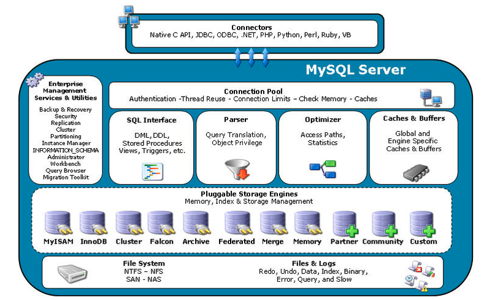
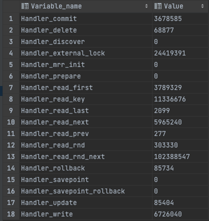

# 04. MySQL 엔진 아키텍쳐

- MySQL은 크게 `MySQL 엔진`과 `Storage 엔진`으로 구분된다.



## MySQL 엔진
- 요청된 SQL 문장을 분석하거나 최적화 등을 수행한다. 구성은 다음과 같다.
- 클라이언트로부터의 접속, 쿼리 요청을 처리하는 `커넥션 핸들러`
- `SQL Parser`
- `전처리기`
- 쿼리의 최적화를 위한 `옵티마이저`

<br>

## Storage 엔진
- 실제 데이터를 **디스크에 저장**
- **디스크로부터 데이터를 읽어온다.**
- 여러 스토리지 엔진이 존재하며 대표적인 스토리지 엔진은 `InnoDB` 와 `MyISAM`이 있다.
  - 성능 향상을 위해 MyISAM은 키 캐시를, InnoDB는 버퍼 풀을 내장하고 있다.

<br>

### MySQL 엔진 - 핸들러 API
- MySQL 엔진이 스토리지 엔진에게 **데이터 쓰기/읽기 요청**을 보내는 것을 핸들러 요청이라고 한다.
  - 여기서 사용되는 API를 핸들러 API라고 한다.
```sql
-- 핸들러 API를 통해 데이터 작업 상황을 확인하는 쿼리
SHOW GLOBAL STATUS LIKE 'Handler%' 
```

- 해당 결과에서 각 지표들은 [공식 문서](https://dev.mysql.com/doc/refman/8.0/en/server-status-variables.html)에서 확인이 가능하다.
- 위 문서에서 살펴본 내용 중 Handler_read_first에 대한 설명은 다음과 같다.
```text
The number of times the first entry in an index was read. 
If this value is high, it suggests that the server is doing a lot of full index scans.
```
- 인덱스의 첫 번째 항목을 읽은 횟수 라고 하며. 이 값이 높으면 서버가 full index scan을 많이 수행하고 있음을 나타낸다.
  - 즉, 인덱스에 저장된 데이터를 시작부터 끝까지 풀 스캔을 한다는 뜻으로써 적절한 튜닝이 필요하다는 신호이기도 하다.
  - Handler_read_first == index full scan 발행한 횟수와 동일하다고 볼 수 있다.

<br>

## MySQL 엔진 스레딩 구조
- MySQL은 프로세스 기반이 아닌 스레드 기반으로 동작한다.
- 책과 [공식 문서](https://dev.mysql.com/doc/refman/8.0/en/performance-schema-threads-table.html)에서 살펴보면
```text
The thread type, either FOREGROUND or BACKGROUND.
User connection threads are foreground threads.
Threads associated with internal server activity are background threads. 
Examples are internal InnoDB threads, “binlog dump” threads sending information to replicas, and replication I/O and SQL threads.
```
- 크게 `포어그라운드 스레드`, `백그라운드 스레드`로 구분한다.

### 포어그라운드 스레드
- 포어그라운드 스레드는 fore라는 접미사 뜻처럼 주로 `클라이언트 연결을 담당`한다.
  - 클라이언트 스레드라고도 한다.
  - 최소 MySQL에 접속된 클라이언트 커넥션 수 만큼 존재한다.
  - 클라이언트가 커넥션을 종료하면 스레드 캐시에 보관되며
  - 스레드 캐시에 일정 숫자 이상 대기중인 스레드가 있다면 해당 스레드는 종료시킨다.
- 주로 커넥션을 담당하지만 `데이터 버퍼나 캐시로부터 데이터를 가져오는 역할`도 한다.
- 데이터 버퍼나 캐시에 없는 경우 디스크 접근을 해야하는데 이때
  - **InnoDB : 백그라운드 스레드가 처리한다.**
  - MyISAM : 디스크 쓰기/읽기 작업까지 포어그라운드 스레드가 처리한다.

### 백그라운드 스레드
- 백그라운드 스레드는 내부 서버 활동에 동작하는 스레드이다.
- 주로 **InnoDB**에서 다루며 백그라운드 스레드마다 역할이 존재한다.
1. Insert Buffer를 병합하는 스레드
   - Insert Buffer란? 버퍼 풀에서 자세하게 설명할 예정
   - 디스크에 변경해야 할 데이터를 바로 변경하지 않고 임시 공간에 저장해 두고 바로 사용자에게 결과를 반환하여 성능을 향상시키게 되는데,
     이때 사용하는 임시 메모리 공간을 Insert Buffer라고 한다.
2. **로그를 디스크에 기록하는 스레드**
3. **InnoDB 버퍼 풀의 데이터를 디스크에 write하는 스레드**
4. 데이터를 버퍼로 읽어 오는 스레드
5. 잠금이나 데드락을 모니터링하는 스레드
- InnoDB에서는 쓰기 작업을 버퍼링해서 일괄 처리하는 기능이 있지만
- MyISAM은 클라이언트 스레드가 직접 쓰기 작업까지 처리한다.
  - 즉, MyISAM은 버퍼링 기능이 없어서 쓰기 작업이 종료될 때까지 기다려야한다.

<br>
<br>

## 커넥션 풀과 스레드 풀 차이는?
- 커넥션 풀과 스레드 풀은 비슷한 역할을 하는 것 같지만 차이가 존재한다.
- 우선 큰 차이는 `관리 위치`가 다르다.
- [문서](https://dev.mysql.com/doc/refman/8.0/en/faqs-thread-pool.html#faq-thread-pool-how-diff-connector-pool)에서 확인한 내용은 다음과 같다.
```text
The MySQL Connection Pool operates on the client side to ensure that a MySQL client does not constantly connect to and disconnect from the MySQL server. 
It is designed to cache idle connections in the MySQL client for use by other users as they are needed. 
This minimizes the overhead and expense of establishing and tearing down connections as queries are submitted to the MySQL server.
The MySQL Connection Pool has no visibility as to the query handling capabilities or load of the back-end MySQL server.
By contrast, the Thread Pool operates on the MySQL server side and is designed to manage the execution of inbound concurrent connections and queries as they are received from the client connections accessing the back-end MySQL database.
Because of the separation of duties, the MySQL Connection Pool and Thread Pool are orthogonal and can be used independent of each other.
```
- 커넥션 풀
  - `클라이언트 측`에서 작동하여 클라이언트가 MySQL 지속적으로 연결될 수 있도록 한다.
  - Connection이 필요할 때마다 Connection pool에서 연결 정보를 가지고 연결을 재사용하도록 유지한다.
  - > The MySQL Connection Pool has no visibility as to the query handling capabilities or load of the back-end 
    MySQL server.
  - `MySQL 백엔드 서버와의 쿼리 처리나 로드에 대한 가시성이 없다고 한다.`
- 스레드 풀
  - `MySQL 서버 측`에서 작동
  - 스레드 풀은 커넥션이 맺어지면 대기하고 있는 스레드를 커넥션에 할당하여 클라이언트와의 커넥션을 관리하고
  - 인바운드된 받은 쿼리 처리를 담당한다.
- 마지막 줄을 보면 커넥션 풀과 쓰레드 풀은 서로 독립적으로 사용할 수 있다고 하는 것으로 보아 엄연히 다르다.
```text
MySQL Connection Pool and Thread Pool are orthogonal and can be used independent of each other.
```