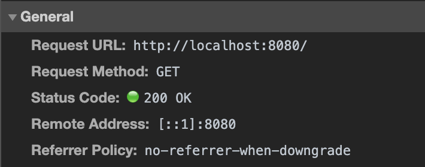
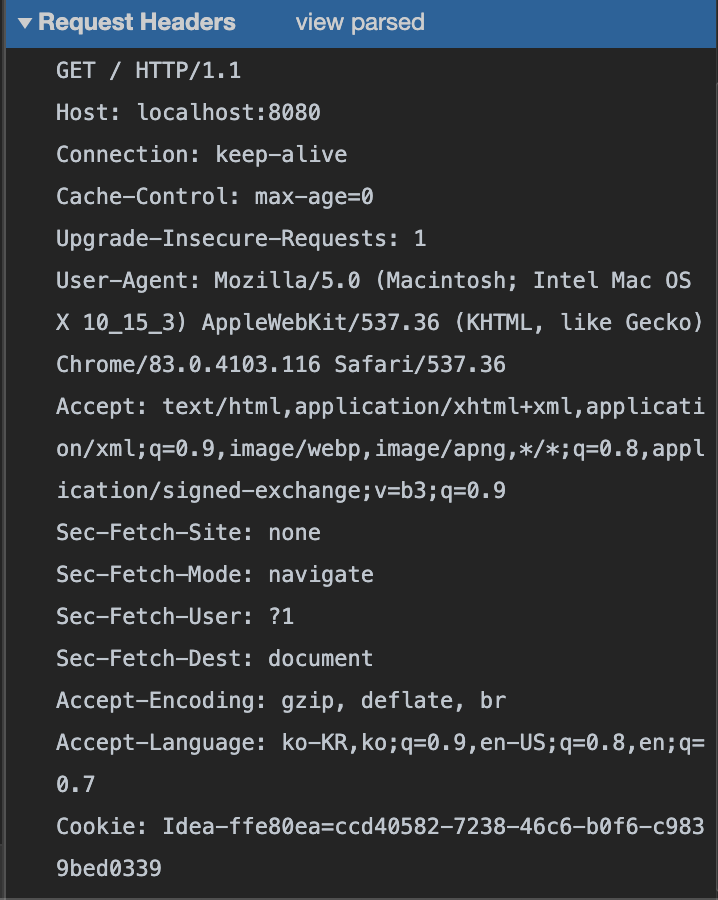

# HTTP
- Slipp Step 3-1을 진행하면서 Http Header를 보니 한번 제대로 이해하고 넘어갈 필요가 있는 것 같아 정의함.
- HTTP에서 교환하는 정보는 `HTTP 메시지`라고 불리는데 리퀘스트 측 HTTP 메세지를 리퀘스트 메시지, <br>
리스폰스 측 HTTP 메시지를 리스폰스 메시지라고 부릅니다.
- 두 메시지는 공통 포맷을 가지고 있다.
    - HTTP 메시지 헤더와 HTTP 메시지 바디

## HTTP 헤더란?
- HTTP 헤더는 본문, 요청/응답에 대한 정보를 포함한다.
- HTTP/1.1에서 크게 세부분으로 나눈다.
    - `일반 헤더`
    - `요청 헤더`와 `응답 헤더`
    - `엔티티 헤더` 
    - 즉 HTTP 요청은 일반 헤더, 요청 헤더, 엔티티 해더가 그룹핑 되어 전달될 수 있다.
    - 즉 HTTP 응답은 일반 헤더, 응답 헤더, 엔티티 해더가 그룹핑 되어 전달될 수 있다.
- 클라이언트가 HTTP 프로토콜을 이용해 웹 서버에게 보낼때 HTTP 요청 헤더에 부가적인 정보를 담아 전송한다. <br>
  이를 `HTTP 메시지`를 요청 메시지라 부르며, 웹 서버가 웹 클라이언트에게 보낸 `HTTP 메시지`를 응답 메시지라고 한다.

## HTTP 메시지
- HTTP 메시지는 ASCII로 인코딩된 텍스트 정보이며 이진 형식이 아닌 일반 텍스트 이기 때문에 사람이 읽고 쓰기 쉽다.
- HTTP 요청 메시지와 응답 메시지의 구조는 크게 `시작줄`, `헤더`, `본문` 으로 나뉜다.
- **첫 줄은 `시작줄`이 오고 이어서 위에서 설명한 `헤더`들이 나온 다음에 줄바꿈을 하고나서 `메시지 body(본문)`가 오게된다.**
- `시작줄` : 첫줄이 시작줄이며 어떠한 메시지인지 나타내는 역할
- `헤더` : 요청에 대한 정보를 담고 있다.
    - :(콜론)을 기준으로 키와 값으로 구분되며 값 앞에 붙은 공백 문자열은 무시된다.
    - 대소문자를 구분하지 않는다.
    - 헤더에서 마지막 한줄 띄고 본문이 시작된다.    
    - 커스텀 등록 헤더는 X-으로 시작될 수 있지만 비표준.
- `본문` : 웹 서버로 데이터를 전달, 클라이언트에게 데이터를 반환할때 담는 부분
    - 본문은 시작줄이나 헤더와 달리 이진 데이터를 포함할 수 있다.
    
<br>

## General Header
 

<br>

- 공통(일반) 헤더, 즉 클라이언트와 서버 양쪽 모두 사용하는 헤더이다.
- HTTP 본문과는 관련없고 요청/응답이 생성된 날짜, 시간등 통신에 대한 일반적인 정보가 포함된 헤더이다.
- 일반 헤더의 주요 필드들
    - Request Url : 요청 주소
    - Request Method : HTTP 메서드
    - Status Code : 상태 코드
    - Remote Address : 연결되어 있는 외부 시스템의 IP 주소 또는 도메인명과 포트번호 
    - `Referrer Policy` : 생성된 요청이 Referer 헤더에 전송된 referrer 정보에 포함되어야 하는지 관리
    - Date : HTTP 메시지를 생성한 일자
    - `Cache-Control` : 요청과 응답내 캐시를 제어하는 항목.
    - Connection : 클라이언트와 서버의 연결에 대한 옵션을 정할 수 있게 해준다.
        - keep-alive : 클라이언트와 TCP 접속 유지
        - close : 메시지 전송 직후 클라이언트와 TCP 접속 중단
        
#### Cache-Control
- Cache-Control HTTP 헤더를 통해 캐싱 정책을 정의할 수 있다.
- Cache-Control는 응답 헤더 뿐만 아니라, 요청 헤더로도 사용할 수 있다.
- 여러개의 정책을 지정할 수 있으며 콤마(,)로 구분한다.
- `no-cache` : 캐시 사용하지 말란 뜻이 아닌 캐시 사용 전에 서버에게 해당 캐시를 사용해도 되는지 확인한후 써도 된다는 응답이 오면 캐시 사용, 안되면 새로운 응답을 받아 사용.
- `no-store` : 아무것도 캐싱하지 않는다.
- `must-revalidate` : 만료된 캐시만 서버에 확인을 받는다.
- `public` : 중개 서버(공유 캐시)에 데이터를 캐시한다.
- `private` : 브라우저 같은 특정 사용자 환경에만 캐시한다.
- `max-age` : 캐시의 유효시간, 초단위, 1시간이면 3600
- 해당 캐시 관련은 Web_Cache 파일에서 다룬다.

#### Referrer Policy
- Referrer Policy : 생성된 요청이 Referer 헤더에 전송된 referrer 정보에 포함되어야 하는지 관리
- Referrer : 현재 요청된 페이지 이전의 웹 페이지 주소 (해당 요청을 할 수 있게된 페이지)
    - 어디로부터 와서 방문 중인지 추적 가능 그로 인해 생활과 관련된 브라우징 히스토리에 관한 정보를 노출할 가능성이 있다.
    - `unsafe-url`  : **기본값, 전체 url을 보낸다.**
    
    - `no-referrer` : **referrer가 전송되지 않도록 지정**
    
    - `no-referrer-when-downgrade` : **대상 주소가 https 일때만 전송한다.**
        ```
        http://abcd.com/board/1 에서 연결된 링크를 통해 https://www.efg.com 으로 갈때 abcd.com/board/1 을 www.efg.com 으로 전송한다.
      
        http://abcd.com/board/1 에서 연결된 링크를 통해 http ://www.efg.com 으로 갈때 Referrer 값을 전송하지 않는다.
        ```
      
    - `origin` : **도메인만 전송한다.**
        ```
        https://abcd.com/board/1 에서 http://www.efg.com 으로 갈때 도메인 abcd.com을 efg.com으로 전송한다.
        ```
        
    - `strict-origin` : **대상 주소가 https일때만 도메인을 전송한다.**
        ```
        https://abcd.com/board/1에서 https://www.efg.com로 갈때 도메인 abcd.com을 전송한다.
      
        https://abcd.com/board/1에서 http ://www.efg.com로 갈때 Referrer값을 전송하지 않는다.
        ```
       
    - `same-origin` : **대상 주소가 같을때만 전체 주소를 전송한다.**
        ```
        https://abcd.com/board/1에서 https://abcd.com/board/2로 갈때 전체주소 abcd.com/board/1를 전송한다.
      
        https://abcd.com/board/1에서 https://efgh.com/board/1로 갈때 Referrer 값을 전송하지 않는다.    
        ```
      
    - `origin-when-cross-origin` : **같은 홈페이지일때는 전체주소, 다른 페이지로 갈때는 도메인 주소만 전송한다.**
        ```
        https://abcd.com/board/1에서 https://abcd.com/board/2로 갈때 전체주소 abcd.com/board/1를 전송한다.
      
        https://abcd.com/board/1에서 https://efgh.com/board/1로 갈때  도메인 abcd.com 전송한다.
        ```
      
    - `strict-origin-when-cross-origin` : **같은 홈페이지일때는 전체주소, 다른 https 페이지를 갈때는 도메인, http로 갈때는 전송 X**
        ```
        https://abcd.com/board/1에서 https://abcd.com/board/2로 갈때 전체주소 abcd.com/board/1를 전송한다.
      
        https://abcd.com/board/1에서 https://efgh.com/board/1 도메인 abcd.com을 전송한다.
      
        https://abcd.com/board/1에서 http://efgh.com로 갈때 Referrer 값을 전송하지 않는다.
        ```

<br><br>

## Request Header
- Request Headers Spec
```
Request-Line
*(( general-header | request-header | entity-header ))
newLine
[ message-body ]
```
 

- Request-Line : 요청에 사용되는 메소드와 URI, HTTP 버전이 포함된다.
    - **GET /user/1 HTTP1.1**
    - 어떤 동작을 수행하는지에 대한 HTTP 메서드 (get)
    - 해당 동작에 대한 요청 주소 : /user/1
    - HTTP Version (HTTP1.1)
    - 모든 필드는 `공백`으로 구분한다.
- 요청 헤더의 주요 필드들
    - Host : 요청하는 호스트 명 및 포트
    - Content-Type : 해당 개체에 포함되는 미디어 정보 타입
    - 컨텐츠의 타입 (MIME 미디어 타입) 및 문자 인코딩 방식을 지정.
- Content-Encoding : 데이터의 압축 방식

## Response Header

## Entity Header
- 실제 메시지 or 전송중인 HTTP 본문에 대한 정보(컨텐츠 길이, 컨텐츠 언어, 인코딩, 만료날짜 등)
