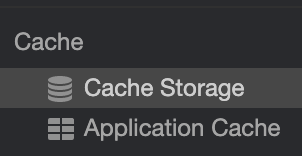

# Web Cache
- HTTP를 이용하는 어플리케이션을 개발하다보면 효율적인 송수신을 위해 클라이언트/서버에서 캐시를 이용한다.
- HTTP를 이용할때, 어떤 종류의 캐시가 있고, 어떤 방식인지 알아보자.

<br>

## 캐시의 종류
- 일단 기본적인 캐시의 종류를 알아보자.
- 캐시는 위치에 따라 분류가 가능한데 다음과 같다.

1. 브라우저 캐시 :
    - 웹 브라우져 혹은 HTTP 요청을 하는 클라이언트 어플리케이션들이 내부적으로 갖고있는 캐시이다. <br>
    
         
        
    - 모든 브라우저는 HTTP 캐시의 구현을 제공한다.
    
2. 프록시 캐시 : 
    - 다른 서버의 리소스를 찾는 클라이언트의 요청에 대한 중개 역할을 한다.
    - 사용자의 로컬, 네트워크, 중개 서버에 존재할 수 있다.
    - 네트워크 관리자에 의해 네트워크 상에서 동작한다.
    - 우회, 트래픽을 줄이는데 도움이 된다.
    
3. 게이트 웨이 캐시 : 
    - 네트워크상이 아닌 실제 서버 앞단에 설치된 캐시.
    - 서버의 응답 성능을 좋게 한다.
    
4. 하드 디스크 캐시 : 
    - 서버 내 하드디스크에 존재하는 캐시
    - 서버로 요청시, 하드 디스크는 캐시를 확인하는데, 첫 요청이라면 `캐시 미스`를 발생시킨다.
    - 그 이후로 같은 요청시, 캐시를 사용하여 하드 디스크가 아닌 버퍼에서 캐시를 제공하여 데이터를 응답한다.
    - 이때 캐시를 사용하는 경우 `캐시 히트`를 발생한다.

5. 디비 캐시
    - 데이터베이스 쿼리는 데이터 베이스 서버에서 수행되기 때문에 사용자가 급격히 증가함에 따라 속도가 매우 느려지고 부하가 몰릴 수 있다. <br>
      이런 쿼리들이 반복되면 그 결과값을 데이터베이스에 캐싱하여 응답시간 향상 및 서버 부하 감소가 가능하다.
    - 비용이 높은 데이터베이스 쿼리나 자주 요청되는 파일들에 대한 응답을 캐시할 수도 있다.

- 브라우저 캐시를 더 알아보자.

<br>

## HTTP 헤더를 통한 브라우저 캐시
- 웹 캐시란 클라이언트가 요청하는 리소스에 대해 응답의 결과로 HTML, JSON 같은 데이터나 정적 파일들을 내부에 저장하여 다음 요청시 서버를 통하지 않고 캐시를 통해 응답을 제공하는 것.
    - 응답 시간이 감소하고 네트워크 트레픽이 감소되는 장점이 있다.
    - 잘못 캐시된 데이터를 제공한다면 고객들에게 실시간 정보를 올바르게 주지 못하게 된다.
- 이런 단점은 치명적이기에 위에서 설명했듯이 모든 브라우저에는 HTTP 캐시 구현이 가능하도록 설정할 수 있다.
- 즉, 서버 응답이 브라우저에 캐시할 수 있는 시점, 캐싱 여부, 캐시 데이터 만료 일자 등을 지정할 수 있다.
- 이런 설정 정보는 HTTP 헤더를 통해 전달할 수 있다.

<br>

## 캐시의 동작 방식
- 응답 헤더의 캐시가 캐싱 하지말라고 지정되어있는 경우 캐시하지 않는다
- ~~요청이 HTTPS거나 HTTP 인증을 사용한 경우 캐시되지 않는다.~~
- 캐시된 데이터는 캐시의 만료 일자(expired) 혹은 만료 시간(max-age)이 아직 남아있는 경우 최신 상태(fresh)인 것으로 인정된다.
    - 최신 상태일 경우 서버에 요청을 보내지않고 캐시를 사용한다.
- 캐시가 최신 상태가 아닐 경우 클라이언트는 서버에 유효성 검사 요청을 보내 새로운 데이터를 내려받지 않고 유효성 검사를 할 수 있다.
    - 유효하지 않을 경우, 전체 재전송이 일어나며, 유효하면 재전송이 일어나지 않는다.
    - 이때 캐시의 만료 일자와 시간을 업데이트 한다.
- 일반적으로 캐싱은 GET 요청에서 처리한다.
    - 일반적으로 200(성공), 301(다른 주소로 이동후 가져옴), 404(Not found) 상태 코드로 온 응답들을 캐싱할 수 있다.
    - 오류 페이지를 보여주는 방식도 캐싱을 이용한 방법.
- 이런 동작 방식들이 어떤 지시자들로 인해 컨트롤 되는지 살펴보자.

<br>

## HTTP Request Header 캐시 지시자
- 일반적으로 캐시 여부를 결정하는 캐시 지시자는 서버의 `HTTP 응답`에 포함되어 있다.
- 물론 요청시에도 지시자를 사용한다.
- 캐시가 최신임에도 서버에게 확인 요청을 보내 서버가 캐시를 사용해도 된다는 응답이 오면 캐시를 사용하고, 서버가 새로운 응답 써야한다고 하여 새 응답을 사용하려할땐 `Cache control: no-cache`를 지정하면 된다.
    - 중개 서버가 있고 프록시 캐시가 최신이라 할지라도 서버에 직접 접근한다.
- 요청, 응답에 대해 절대 캐싱하고 싶지 않은 경우는 `Cache control: no-store`를 지정하면 된다.
- 이 두가지 외 다른 필드들은 요청에선 의미가 없지만 응답에선 중요한 의미를 가진다.

<br>

## HTTP Response Header 캐시 지시자
- 일반적으로는 캐시 컨트롤을 위해 응답 헤더에 캐시 관련 필드를 추가하는 방법을 많이 사용한다.
- `Cache-Control`
    - `no-cache` : 응답 데이터를 캐쉬하고는 있지만, 일단 먼저 서버에 요청해서 유효성 검사(validation)을 하도록 강제한다.
    - `no-store` : 어떤 상황에서도 해당 response 데이터를 저장하지 않음.
    - `must-revalidate` : 만료된 캐시만 서버에 확인을 받도록 한다. 특정 상황(네트워크 연결이 끊어졌을때 등)일 때도 확인을 받는다.
    - `max-age=3600, must-revalidate` : 서버에 요청없이 캐쉬데이터를 사용하며, 1시간 경과 후에는 서버에 꼭 유효성검사를 해야한다.
        - 유효성 검사가 불가능할 경우엔 절대로 캐쉬데이터를 사용하면 안된다.
    - `public` : 일반적으로 HTTP 인증이 된 상태에서 일어나는 응답은 자동으로 private 이 되지만 public을 명시적으로 설정하면 인증이된 상태더라도 캐시하도록 한다.
    - `private` : 사용자의 브라우저만 캐시하도록 설정. 여러사람이 사용하는 proxy에는 캐시되지 않는다.

<br>

## 캐시가 유효한지 어떻게 검사하는가?
- 캐시가 갖고있는 데이터가 최신인지 확인하는 방법은 캐시 유효성 검사를 한다.
- 유효성 검사를 수행하기 위해선 캐시 지시자를 확인하거나, 서버에서 생성/관리하는 `ETag`를 사용한다.

## ETag (Entity Tag)란?
- 캐시된 응답에 대한 유효성 검사를 수행하는 태그, 특정 리소스가 변경되었는지 판별하는 식별자이다.
- **즉, 브라우저와 웹서버가 캐시된 데이터의 유효성을 확인하기위해 HTTP 리소스가 바뀌었는지 검사할 수 있는 태그이다.**
- 서버는 `ETag`를 HTTP 헤더에 담아 유효 토큰으로 전달한다. 클라이언트는 다음 요청부터 이 `Etag`를 서버에 전송한다. 리소스의 변경이 없다면 `ETag`도 변경되지 않아 클라이언트에게 데이터를 전송하지 않는다.
    - 캐시의 데이터와 같기 때문에 클라이언트는 캐시를 사용하라는 뜻
- 대부분의 HTTP 서버들은 정적인 컨텐츠(파일이나, 내용이 변하지 않는 웹페이지 등)에 대해 `ETag`와 Last-Modified를 생성하여 헤더에 추가하도록 설정되어있으며, 이를 HTTP 서버 관리자가 원하는대로 수정하는 것이 가능하다.
- 특정 URL의 리소스가 변경된다면, 새로운 `ETag`가 생성된다.
    ```
    예로 GET localhost:8080/board/1 의 응답 본문이 "hello world"이고 ETag값이 1234라고 가정한다. 
  
    클라이언트는 첫 요청을 통해 서버로 부터 ETag 1234를 받은 상태이다.
    클라이언트는 ETag 토큰을 HTTP Request 헤더의 "If-None-Match" 필드에 담아서 보낸다.
  
    서버는 해당 ETag 토큰을 현재 본문과 비교한다. 현재 응답 본문인 "hello world"가 동일하다면 매번 GET localhost:8080/board/1 요청에 대한 ETag값은 1234이다.
    토큰이 바뀌지 않았기에 서버는 304 Not Modified를 리턴하는데,
    이 리턴은 브라우저에게 너가 가지고 있는 캐시는 바뀐게 없으니 그대로써! 만료되었다면 시간을 다시 재할당하라고 알려주는 것이다. 
  
    만약 서버의 본문이 hello world에서 Hello Http로 본문이 바뀌었다면 ETag값도 9876으로 새로운 ETag값으로 변경된다.
    클라이언트에서 보낸 ETag값인 1234와 서버의 ETag인 9876이 동일하지 않기 때문에 서버가 응답 내용이 달라졌다는것을 깨닫게 되어
    캐시를 지우고 새로 데이터를 내려 줄 수 있게 된다.
    ```

### If - None - Match 란?
- 클라이언트가 서버한테 `ETag`가 달라졌는지 검사해서 다를 경우 새로운 데이터를 내려달라는 뜻으로 요청 헤더의 "If-None-Match" 필드에 Etag 값을 포함시켜 보낸다.
- 만약 ETag가 같다면 서버는 304 Not Modified를 응답해서 캐시를 그대로 사용하도록 하게 한다.

### ETag가 왜 필요할까?
- 만약 첫 요청 이후 캐시 유효 기간이 만료되었다고 가정해보자. 브라우저가 서버에게 다시 요청을 하게된다면, 캐시의 데이터와 서버의 데이터는 변하지 않았는데 <br>
캐시가 만료되어 불필요하게 다시 자원을 다운로드하는 비효율적인 방법으로 동작할 것이다. 그래서 ETag를 정의해 문제를 해결한다. <br>
클라이언트는 다음 요청시 해당 토큰을 서버에 전송하기만 하면된다. 식별자가 같다면 리소스가 바뀌지 않았다는 것이므로 다운로드를 건너 뛸 수 있다. 


