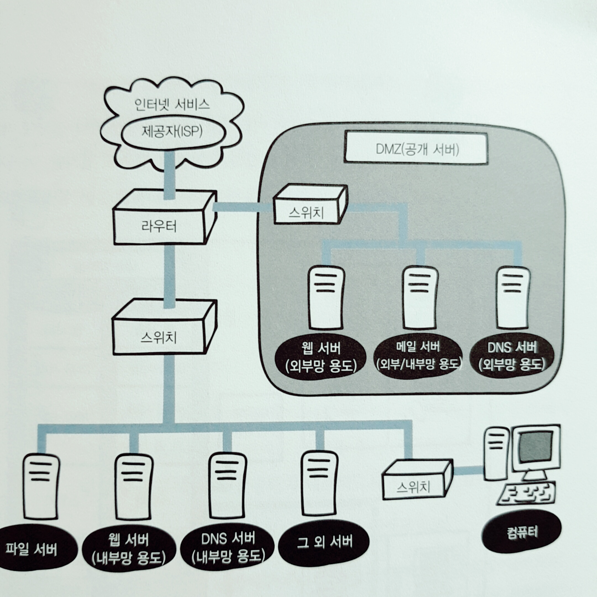

# 1. 네트워크 첫걸음
## 패킷
### # 패킷이란?
- 컴퓨터간 데이터를 주고받을 때 네트워크를 통해 전송되는 데이터의 작은 조각
    - 큰 데이터가 있더라도 작게 나누어서 보내는게 규칙
- `TCP/IP`의 특징중 하나는 **데이터를 일정한 크기로 분할해서 전송**하는 특징이 있습니다.
- 일정한 크기로 잘게 나눠진 각 데이터를 `패킷`이라 한다.
- `패킷`의 크기는 보통 1024비트이며, 데이터와, 데이터의 목적지, 주소, 제어정보가 담겨 있습니다.
    - 컴퓨터는 기본적으로 바이트 단위로 데이터를 읽고 쓰는 작업을 한다.
    - 8비트를 바이트로 다루는 것이 좋다.

 
 
### # 패킷을 작게 나누는 이유는?
- 큰 데이터를 그대로 보내면 그 데이터가 네트워크의 대역폭을 많이 점유해서 다른 패킷의 통신을 막을 위험이 있다.
    - 대역폭 (bandWidth) : 데이터를 최대 전송 속도로 전송할 수 있는 **단위 시간당 전송량**
- 주행 도로로 예로 들면 큰 트럭 하다가 차선 여러개를 점령해버리면 교통이 정체되는 것 처럼 큰 데이터를 네트워크로 보내면 통신 정체 발생
- 데이터를 세분화 함으로써 하나의 회선에 여러 데이터를 송수신할 수 있습니다.
- 만약 특정 `패킷`이 일부 손상되어도 이 `패킷`만 다시 보내면 되는 장점이 있습니다.

 
 
### # 패킷 통신이란?
- `TCP/IP`에서는 데이터를 일정한 크기인 `패킷`으로 분할해서 송수신하는 것을 `패킷 교환`이라고 하며 이 방법을 `패킷 통신`이라 합니다.
- 송신측에서는 데이터를 `패킷`으로 잘게 나누고, 각 `패킷`에 목적지 정보나 분할했던 `패킷`을 원래대로 조합할 수 있게 작업을 합니다.
    - 목적지로 보낸 패킷이 전송한 순서대로 도착하지 않을 수 있다. 또는 지연되어 늦게 도착하거나 누락될 수 있다.
    - 그렇기에 분할했던 패킷을 되돌리는 작업을 하기 위해 송신측에서 번호 등의 정보를 추가하여 데이터를 송신합니다.
- 수신측은 자기 앞으로 온 데이터를 받아 `Header` 정보를 기초로해서 분할했던 데이터를 정렬하고 되돌린다.
- 데이터가 손상되어있으면 해당 패킷만 다시 요청하고, 수신 불명일 경우는 파기하고 송신측에 알립니다.
- 데이터를 원래대로 되돌렸으면 어플리케이션에게 전달합니다.

 
 
### # 컴퓨터는 비트밖에 이해 못하는데 어떻게 패킷을 읽고 쓰는가?
- 숫자와 문자의 대응표를 미리 만들어 두었기 때문이다.
- 이 대응표를 문자 코드라고 하며 문자 코드 중 하나인 아스키 코드가 대표적이다.
- 아스키 코드는 알파벳, 기호, 숫자, 문자 등을 다룰 수 있는 기본적인 문자 코드로써,   
아스키 코드를 통해 키보드로 입력 하게되면 컴퓨터는 문자 코드가 전달되고, 컴퓨터는 그 키에 대응하는 문자 코드를 확인하고 표시한다.
- 문자나 사진도 비트 집합을 패킷으로 나누어서 목적지에 보내면 목적지에서 패킷을 원래값으로 되돌릴 수 있다.
- 다만 **네트워크에서는 비트 정보를 전기 신호로 변환하여 전송한다.**

 
 

## LAN 과 WAN
 ### # ISP 란?
- Internet Service Provider 인터넷 서비스 제공자로써 우리가 흔히 인터넷 회사라고 하는 업체들을 일컫는다.
    - KT, LG U+, SK 브로드 밴드

 
     
### # LAN 이란?
- Local Area Network 근거리 통신망의 약어로써 건물 안이나, 특정 지역을 범위로 지리적으로 제한된 곳에서 사용하는 네트워크
- 연결하는 거리가 짧은 만큼 신호가 약해지거나 오류 발생 확률도 낮다.
- 거리가 가까운 만큼 통신 속도가 빠르다.

 
 
### # 가정에서의 LAN
- ISP 와 인터넷 회선을 결정하고 계약했다면 인터넷 공유기 중심으로 내부 인터넷망(사설망)을 구성하고 다양한 기기를 연결할 수 있다.

 
 
### # 소규모 기업에서의 LAN
- 가정에서의 LAN 과 다르게 DMZ 라는 네트워크 영역이 존재한다.
- DMZ : 외부 네트워크와 내부 네트워크 사이에 위치한 중간지대로써, 외부에 서버를 공개하기 위한 네트워크
    - 웹 사이트를 불특정 다수의 외부 사용자에게 공개하려면 웹 서버를 외부에 공개하고
    - 외부 사용자와 메일을 주고받으려면 메일 서버를 외부에 공개하고,
    - 외부에서 도메인 이름을 사용하여 회사의 서버에 접속하려면 DNS 서버를 외부에 공개해야한다.
- 사내에서 서버를 운영하는 경우는 다음과 같다.
    - 사내에 서버 장비실을 두고 랙(선반)을 설치하여 직접 관리
    - 사내 or 데이터 센터에 서버를 두고 운영하는것을 `온프레미스`(on - premise)라고 한다.
    - 또는 클라우드로 운영한다.    

 
 
### # WAN 이란?
- Wide Area Network 광역 통신망의 약어로써 지리적으로 넓은 범위에 구축된 네트워크
- ISP 가 제공하는 서비스를 사용하여 구축한 네트워크를 일컫는다.
    - 서울과 부산은 먼거리이지만 ISP 서비스를 이용해 두 지역이 서로 통신할 수 있도록 네트워크를 구축할 수 있다.
- 왠은 멀리 떨어져 있는 랜과 연결되어 있어서 신호가 약해지거나 오류가 발생할 확률이 높다.
- 거리가 먼 만큼 통신 속도가 느리다.

## # LAN 과 WAN 의 차이
- 범위, 안정성, 속도 차이가 존재한다.

|제목|LAN|WAN|
|------|------|------|
|범위|좁다|넓다|
|속도|빠르다|느리다|
|안정성|높다|낮다.|
