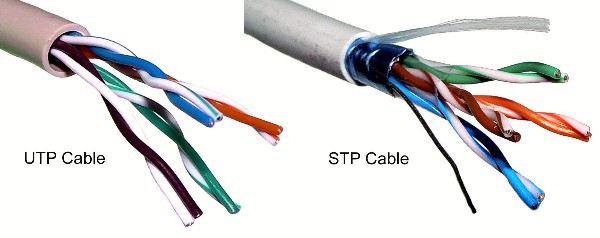

# 3. 물리 계층 : 데이터를 전기 신호로 변환하기
## 물리 계층
### # Physical Layer 란?
- OSI 모델 최하위 계층으로써, 데이터를 전송하기 위해 컴퓨터와 네트워크간의 물리적인 연결을 하고 <br>
데이터를 통신할 수 있는 **전기 신호로 변환하고 전송하는 일을 한다.**
- 송신측에서는 0과 1의 나열을 **아날로그 신호**로 바꾸어 전선으로 흘려 보내고 <br>
```
AnalogSignal encode(BinaryData data) {
    ....
}
```
- 수신측에서는 아날로그 신호가 들어오면 0 과 1의 나열로 해석하여 <br>
```
BinaryData decode(AnalogSignal signal) {
    ....
}
```
- 물리적으로 연결된 두 대의 컴퓨터가 0과 1의 이진 데이터들을 주고 받을 수 있는 계층, 모듈이다.

### # Physical Layer 기술은 어디에 구현되어 있는가?
- 1계층 모듈은 하드웨어적으로 구현되어 있다.
- 위에서 설명된 인코딩과 디코딩이 하드웨어의 회로를 통해 구현되어 있다.
- 랜카드 or 메인보드의 PHY 칩

<br>


## 전기 신호
### # 전기 신호란?
- 0과 1만으로 이루어진 이진 데이터들을 전기 신호로 변환하려면 물리 계층의 기술이 필요하다.
- 전기 신호에는 두가지 종류가 있다.
1. 아날로그 신호
2. 디지털 신호


### # 아날로그로 변환하는 이유는?
- 두 대 이상의 컴퓨터가 통신하려면 0과 1로 구성된 전자기파를 받아야하는데 수직선과 수평선이 있는 전자기파는 항상 0 ~ 무한대 주파수의 범위를 가지기 때문에 <br>
이런 주파수를 가진 전자기파 (전기신호)를 통과시킬 수 있는 전선이 없기 때문에 아날로그 신호로 바꿔서 전송한다.

<br>

## 케이블의 종류와 구조
- 데이터 전송시 전송 매체가 필요하다. 전송 매체는 데이터가 흐르는 물리적인 선로로 종류는 유선과 무선이 있다.
- 유선에는 트위스트 페어 케이블, 광 케이블 등이 있다.
- 무선에는 라디오파, 마이크로파, 적외선 등이 있다.

### # 트위스트 페어 케이블이란 ?
- 트위스트 페어 케이블은 일반적인 랜 선이다.
- 트위스트 페어 케이블에는 두가지 종류가 있다.
1. UTP 케이블 (Unshielded Twist Pair)
    - 구리 선 여덟 개를 두 개씩 꼬아 만든 네 쌍의 전선으로써 실드로 보호 되어 있지 않은 케이블
    - 실드로 보호되어 있지 않아서 노이즈의 영향을 받기 쉽지만 저렴하다.
    - UTP 케이블 구분법은 다음과 같다.
    - 10 Base T
    - 속도 / Baseband / TP 케이블
      
    |분류|규격|속도|
    |------|------|------|
    |Cat3|10BASE-T|10Mbps|
    |Cat5|100BASE-TX|100Mbps|
    |Cat5e|1000BASE-T|1000Mbps|
    |Cat6|1000BASE-TX|1000Mbps|
    |Cat6a|10GBASE-T|10Gbps|
    |Cat7|10GBASE-T|10Gbps|
    
    - 트위스트 페어 케이블은 카테고리에 따라 구분하고 카테고리가 클수록 빠른 전송속도에 대응이 가능하다.
        - 카테고리를 줄여서 Cat이라고 표기한다.
    
2. STP 케이블 (Shielded Twist Pair)
    - 구리 선 여덟 개를 두 개씩 꼬아 만든 선을 실드로 보호한 케이블
    - 노이즈의 영향을 적게 받지만 비싸다.
- 실드는 금속 호일이나 금속 매듭 같은것으로, 외부에서 발생하는 노이즈를 막는 역할을 한다.
- UTP, STP 케이블은 RJ-45 라고 불리는 커넥터로 연결한다. (일반 랜선 연결시 찰칵 소리나는 플라스틱)



### # 노이즈는 언제 발생하고 어떤 영향을 주는가 ?
- 노이즈는 케이블에 전기 신호가 흐를 때 발생한다.
- 노이즈의 영향을 적게 받기 위해 구리 선 두개를 비틀어 꼬아 만드는 이유기도 하다.
- 전기 신호가 노이즈의 영향을 받으면 신호의 형태가 왜곡 되어 올바른 데이터를 받을 수 없다.

### # 다이렉트 케이블과 크로스 케이블
- 다이렉트 케이블
    - 구리 선 여덟 개를 같은 순서로 커넥터에 연결한 케이블
    - 컴퓨터와 스위치를 연결할 때 사용한다.
    - 즉, 서로 다른 계층에 있는 장비끼리 연결할 때 사용한다.
- 크로스 케이블
    - 구리 선 여덟개 중 한 쪽 커넥터의 1번과 2번에 연결된 구리선을 다른쪽 커넥터의 3번과 6번에 연결한 케이블
    - 컴퓨터 간에 직접 랜 케이블로 연결할 때 사용한다.
    - 즉, 같은 계층에 있는 장비끼리 연결할때 사용한다.
- 다이렉트 케이블이나 크로스 케이블은 실제로 1, 2, 3, 6번 구리선만 사용한다.
    - 나머지 4개의 선은 사용하지 않는다.
- Auto MDIX라는 다이렉트 케이블과 크로스 케이블을 자동으로 판단하는 기능을 가진 장비들이 존재한다.

### # 왜 다이렉트 케이블과 크로스 케이블이 나뉘게 된걸까?
- 컴퓨터나 라우터의 인터페이스를 MDI라 하고 스위치나 허브의 인터페이스를 MDI-X 라고 한다.
- UTP 케이블은 MDI라는 규격에 맞게 1, 2번 케이블로 송신하고 3, 6번 케이블로 수신을 한다.
    - 그 반대인 MDI-X 라는 규격도 있는데 1, 2번 케이블로 수신하고, 3 6번 케이블로 송신한다.
- 만약 한쪽 장비에 MDI 규격을 사용하고, 다른 한쪽도 같은 규격인 MDI를 사용할 때 다이렉트 케이블을 사용하게 되면 <br>
서로 송신과 송신이 만나고, 수신과 수신이 만나 통신이 될 수 없다.
- 그래서 크로스 케이블로 연결을 해줘야 한다.
- 만약 한쪽 장비에 MDI 규격을 사용하고, 다른 한쪽도 같은 규격인 MDI-X를 사용할 때 다이렉트 케이블을 사용하여 통신할 수 있다.
- 즉, 송 수신 데이터가 충돌하지 않기 위해 일부러 중간에 전선을 교차시키거나 다이렉트로 전선을 구성하여 올바르게 연결되도록 하기 위해 나뉘게 되었다.

<br>

## 물리 계층 장비
### # 리피터란 ?
- 전기 신호를 정형(일그러진 전기 신호를 복원)하고 증폭하는 기능을 가진 네트워크 중계 장비
    - 멀리 있는 상대방과도 통신할 수 있도록 파형을 정상적으로 만드는 기능을 한다.
    - 요즘은 다른 네트워크 장비도 리피터 기능을 지원하기 때문에 리피터를 사용할 필요가 없다.

### # 허브란 ?
- 실제로 통신하는 통로인 포트를 여러개 가졌으며 여러 대 컴퓨터를 연결하는 장치이다.
- 허브는 리피터와 마찬가지로 전기 신호를 정형하고 증폭하는 기능도 한다.
- 허브는 어떤 특정 포트로부터 데이터를 받는다면 해당 포트를 제외한 나머지 포트로도 받은 데이터를 전송하는 특징이 있다.
    - 허브는 스스로 판단하지 않고 전기 신호를 모든 포트로 보내서 더비 허브라고도 불린다.
- 이러한 단점으로 불필요한 데이터가 전송되어 비효율적이기에 `스위치`라는 장비가 대체로 나오게 되었다.
