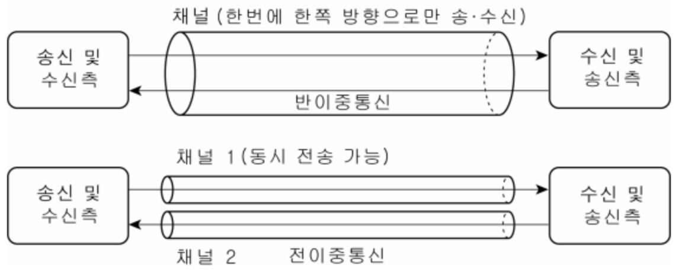

# 4. 데이터 링크 계층 : 랜에서 데이터 전송하기
## 데이터 링크 계층
### # 데이터 링크 계층이란 ?
- 데이터 링크란 기기끼리 연결하는데 여러 방법이 있으며, 동일한 방법으로 연결된 한덩어리의 기기를 `데이터 링크`라고 한다.
    - 네트워크라고 해도 사용하는 통신 매체나 연결 방법에 따라 다양한 종류가 있다.
    - 나라마다 문화와 볍률이 다르듯 네트워크 종류에 따라 통신 방법도 다르다.
    - 같은 규칙을 바탕으로 연결되어 있는 한 덩어리의 기기를 `데이터 링크`라고 한다.
    - 데이터 링크 내에서 로컬 규칙을 처리하기 위해 있는 것이 데이터 링크 계층의 프로토콜이다.
    - 로마에 가면 로마의 법을 따르라
- 같은 네트워크에 있는 여러 대의 컴퓨터들이 데이터를 주고 받기 위해서 필요한 모듈
- 데이터 링크 안에서 (네트워크 장비 간) 신호를 주고 받는 규칙(프로토콜)을 정하는 계층이다.
    - 규칙들 중 일반적으로 많이 사용되는 규칙이 `이더넷 (Ethernet)`이다.
    - 그 외 프로토콜로 PPP, PPPoE가 존재한다.
    - 이더넷 이전에 토큰이라는 프레임을 사용하여 통신하던 토큰 링 방식이 존재하는데 지금은 거의 사용하지 않는다.
- 해당 계층은 데이터를 네트워크 전송 방식에 맞게 `Framing(단위화)`해서 전송한다.
    - Framing : 데이터에 헤더와 트레일러를 붙여 캡슐화 하여 하나의 단위로 만드는 작업
- 일반적으로 헤더에는 프레임의 시작을 알리는 플래그(flag)를 시작으로 **목적지의 주소**가 포함되며,
- 트레일러 부분에는 에러 검출을 위한 **체크섬**(checksum)과 패킷의 끝을 알리는 플래그 등으로 구성된다.

 
 

## 스위치
- 허브의 상위 호환으로써 목적지의 MAC 주소를 보고 여러개의 포트 중에서 특정 노드에만 신호를 보내는 기능을 가진 기기
- 데이터 링크 계층에서 동작하고, L2 스위치 또는 스위칭 허브라고 불린다.

 
 

## 이더넷
### # 1. 이더넷이란 ?
- 이더넷은 LAN 에서 데이터를 정상으로 주고받을 수 있도록 데이터 충돌을 막기 위한 규칙이다.
    - 허브는 전기 신호를 전달받은 포트를 제외한 나머지 포트에 전달한다. 만약 여러대가 동시에 데이터를 보내면 데이터들이 서로 부딪힐 수 있다. 
    - 이것을 충돌이라 한다.
- 이더넷은 여러 컴퓨터가 동시에 데이터를 전송해도 충돌하지 않는 구조로 되어 있다. CSMA / CD
- CSMA / CD : 데이터가 동시에 케이블을 지나가면 충돌하기에 데이터를 보내는 시점을 늦춘다.
    - Carrier Sense Multiple Access / Collision Detection, 반송파 감지 다중 접속 및 충돌 탐지
    - CS : 데이터를 보내려고 하는 컴퓨터가 케이블에 신호가 흐르고 있는지 아닌지 확인한다.
    - MA : 케이블에 데이터가 흐르고 있지 않다면 데이터를 보내도 좋다.
    - CD : 충돌이 발생하고 있는지 확인한다. 충돌 감지가 되면 조금 있다가 다시 보낸다.
- 현재 효율이 좋지 않다는 이유로 CSMA / CD는 거의 사용하지 않고, **스위치라는 네트워크 장비를 사용하여 충돌을 방지한다.**
- 이 계층에서 이더넷 헤더와 트레일러를 붙이는데
    - 이더넷 헤더 : 목적지의 MAC 주소 (6바이트) + 출발지의 MAC 주소 (6바이트) + 유형 (2바이트) 총 14바이트로 구성되어 있다.
        - 이더넷 유형 : 이더넷으로 전송되는 상위 계층 프로토콜의 종류를 식별하는 번호가 들어간다.
        
            |유형 번호|프로토콜|
            |------|------|
            |0800|IPv4|
            |0806|ARP|
            |8035|RARP|
            |814C|SNMP over Ethernet|
            |86DD|IPv6|
    
    - 트레일러 : FCS 라고도 한다. (Frame Check Sequence), 데이터 전송 도중에 오류가 발생하는지 확인하는 용도이다.

### # 이더넷 규격
- 이더넷은 케이블 종류나 통신 속도에 따라 다양한 규격으로 분류된다.

|규격|통신 속도|케이블|케이블 최대 길이|표준화 년도|
|------|------|------|------|------|
|10BASE5|10Mbps|동축케이블|500m|1982|
|10BASE2|10Mbps|동축케이블|185m|1988|
|10BASE-T|10Mbps|UTP케이블(Cat3이상)|100m|1990|
|100BASE-TX|100Mbps|UTP케이블(Cat5이상)|100m|1995|
|1000BASE-T|1000Mbps|UTP케이블(Cat5이상)|100m|1999|
|10GBASE-T|10Gbps|UTP케이블(Cat6이상)|100m|2006|

- 10 /  BASE  / T        or 숫자
- 통신속도 / 전송방식 / 케이블 종류 or 케이블 길이
- 전송 방식 뒤에 숫자가 붙으면 케이블 길이를 뜻하고, 영어가 붙으면 케이블 종류를 나타낸다.
    - 즉, 동축 케이블과 UTP 케이블 표시하는 방법이 다른 것. 

 
 

## 데이터가 케이블에 충돌하지 않는 구조
### # 전이중 통신과 반이중 통신
- 통신 방식에는 전이중 통신과 반이중 통신 방식이 존재한다.
- 전이중 통신 방식 : 데이터의 송수신을 **동시에** 통신하는 방식
- 반이중 통신 방식 : 회선 하나로 송신과 수신을 번갈아가면서 통신하는 방식

- 예로 컴퓨터 1과 컴퓨터 2를 직접 랜 케이블에 연결한다면 8개의 구리선이 존재하기 때문에 데이터를 동시에 전송해도 문제가 없어서 `전이중 통신 방식`이다.
- 허브 내부에는 송수신이 나누어져 있지 않기 때문에 컴퓨터 1과 컴퓨터 2를 허브로 연결하고 동시에 데이터를 보낼 때 충돌이 발생한다.
    - 허브를 사용하면 회선 하나를 송신과 수신이 번갈아가면서 사용하는 `반이중 통신 방식`을 사용하게 된다.
- 스위치는 충돌이 일어나지 않는 구조로 되어 있기 때문에 `전이중 통신 방식`으로 데이터를 주고 받는다.
- 초기 이더넷은 통신 환경 제약에 따라 CSMA / CD 방식으로 `반이중 통신`으로 프레임을 주고 받았으나
- 현재는 스위칭 허브나 트위스트 페어 케이블, 광섬유 케이블 등이 보급되어 `전이중 통신`으로 데이터를 주고받는다.

### # 충돌 도메인이란 ?
- 허브는 반이중 통신 방식으로 데이터를 동시에 전송하면 충돌이 일어난다. **충돌이 발생할때 그 영향이 미치는 범위를 충돌 도메인이라고 한다.**
    - 허브는 모든 컴퓨터에 충돌 영향이 미치기에 접속되어 있는 모든 컴퓨터가 충돌 도메인이 된다.
- 스위치는 데이터를 동시에 송수신할 수 있는 전이중 통신 방식이기 때문에 충돌이 일어나지 않고 충돌 도매인도 허브보다 범위가 작다.
- 충돌 도메인의 범위가 넓을수록 네트워크가 지연되기에 충돌 도메인 관점에서 보면 허브보다 스위치의 효율이 더 좋다.

 
 

## MAC 주소
### # MAC 주소란 ?
- 모든 데이터는 NIC라는 기기를 통해 컴퓨터를 출입한다. (Network Interface Card)
- NIC에는 제조시 전세계에서 유일한 `MAC 주소`라는 번호가 정해진다.
    - 제조할 때 새겨지기 때문에 **물리 주소**라고도 부른다. **네트워크 하드웨어를 식별하는 주소**
    - 초창기에는 ROM이나 LAN 카드에 MAC 주소를 넣어 유일했었는데, 요즘엔 플래시 메모리 같은 곳에 저장을 하여 MAC 주소를 변경할 수 있다.
    - 즉, MAC 주소는 가능하면 유일해야하지만 사용하는 MAC 주소가 반드시 유일할 것이라고 생각하면 안된다.
    - 같은 네트워크에 같은 MAC 주소가 존재하면 네트워크는 죽는다.
- MAC 주소는 총 48비트(6 bytes)로 구성되어 있으며 앞 24비트는 랜카드를 만든 제조사 번호이며 뒤 24 비트는 일련 번호이다.
    - 표현방법은 8bit(1bytes) 단위로 끊어서 총 6개의 자리를 ':' or '-'을 이용하여 구분한다.
    - 16진수 표현법을 사용한다. (Hexadecimal)
    - ex) 11:32:FF:2C:4B:AB

### # MAC 주소를 변경하는 경우는 ?
- MAC 주소를 변경하는 경우는 IP 주소를 바꾸기 위해서
- 대부분의 ISP 에서 네트워크 IP 할당시 이 MAC 주소를 확인하여 본인들이 서비스하고 있는 구간의 IP를 할당하게 된다.

### # MAC 주소 테이블이란?
- 스위치 내부에는 `MAC 주소 테이블` 이라는 것이 존재하는데, **스위치의 포트 번호와 해당 포트에 연결된 컴퓨터의 MAC 주소가 등록되어있는 데이터베이스이다.**
- 스위치 전원을 키면 MAC 주소 테이블에는 아무것도 등록되지 않은 상태에서, 프레임 데이터가 전송되면 MAC 주소 테이블을 확인하고 출발지 MAC 주소가 등록 되어 있지 않으면 MAC 주소를 포트와 함께 등록한다.
    - 이를 `MAC 주소 학습 기능`이라고 한다.
    - 더미 허브에는 없는 기능
- 컴퓨터 1에서 컴퓨터 3번으로 데이터 전송시, 아직 컴퓨터 3의 MAC 주소가 MAC 주소 테이블에 등록되어 있지 않다면 1번 포트를 제외한 모든 포트에 데이터를 전송하는데
    - 이런 전송을 `플러딩(flooding, 홍수)`이라고 한다.
- MAC 주소 기준으로 목적지를 선택하는 것을 MAC 주소 필터링이라고 한다.
    - MAC 주소 필터링으로 인해 불필요한 데이터를 다른 포트들에게 전송하지 않는다.

### # 허브에서 연결된 컴퓨터들에게 데이터 보낼때
- 하나의 허브에 5개의 컴퓨터가 연결되어 있고, 각자 고유의 MAC 주소가 있다고 가정할때
- 1번 컴퓨터가 3번 컴퓨터로 데이터 전송할때, 1번 컴퓨터는 이더넷 헤더에 데이터의 <u>목적지인 3번 컴퓨터의 MAC 주소</u>와 <u>출발지인 자신의 MAC 주소 정보</u>를 데이터에 추가하여 전송한다.
    - 즉, 1번 컴퓨터에서 데이터에 이더넷 헤더와 트레일러를 추가하여 프레임을 만들고 물리 계층에서 이 프레임 비트열을 전기 신호로 변환하여 전송한다.
- 1번 컴퓨터가 보낸 데이터를 나머지 모든 포트로 전송한다. 데이터는 2 ~ 5번 컴퓨터에 전송은 되지만 컴퓨터 2, 4, 5는 목적지 MAC 주소가 자신의 MAC 주소와 다르기 때문에 <u>데이터를 파기한다.</u>
    - 같은 데이터 링크 내에 있는 모든 기기에게 보낼 수 있는 MAC 주소를 `브로드캐스트 MAC 주소`라고 한다.
    - `브로드캐스트 MAC 주소` : 모든 비트에 1이 들어가있는 'ff:ff:ff:ff:ff' 이다.
        - 송신측 MAC 주소 -> ab:cd:ef:12:34:56
        - 수신측 MAC 주소 -> ff:ff:ff:ff:ff:ff
- 3번은 MAC 주소가 일치하기 때문에 역 캡슐화를 한 후 데이터를 수신한다.
- 만약 1, 2번 컴퓨터가 동시에 3번으로 데이터 전송하는 경우, 충돌을 방지하기 위해 CSMA / CD 방식이 사용된다.

### # ARP 란 ?
- Address Resolution Protocol 약자로써, 목적지 컴퓨터의 IP 주소를 이용하여 MAC 주소를 찾는 프로토콜
- 출발지 컴퓨터가 목적지 주소를 모르면 MAC 주소를 알아내기 위해 네트워크에 브로드 캐스트를 하는데 이것을 ARP 요청이라고 한다.
1. MAC 주소를 알고 싶은 컴퓨터의 IP 주소를 ARP 패킷에 적고 브로드캐스트 MAC 주소 앞으로 보낸다.
2. 이 요청에 대해 지정된 IP가 아니라면 해당 컴퓨터들은 응답하지 않고, 지정된 IP를 가진 컴퓨터만 MAC 주소를 응답한다.
3. 이 응답을 통해 출발지 컴퓨터는 MAC 주소를 얻고 이더넷 프레임을 만들 수 있다.
- 컴퓨터 메모리에 IP와 MAC 주소의 매핑정보를 보관하는데 이 정보를 ARP 테이블이라고 한다.

 
