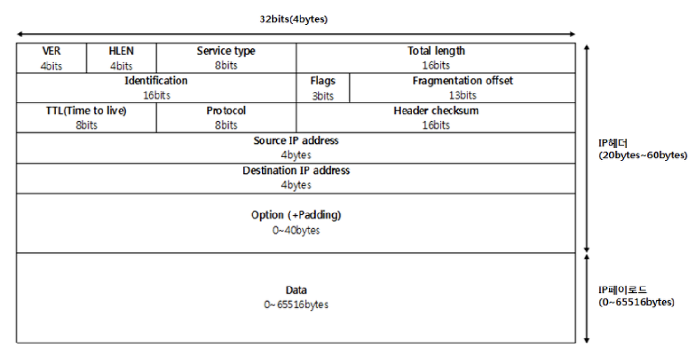

# 4. 네트워크 계층 : 목적지에 데이터 전달하기
## 네트워크 계층의 역할
### # 네트워크 간의 연결 구조
- 데이터 링크 계층에서는 이더넷 규칙을 기반으로 데이터의 전송을 담당했다.
- 즉, 같은 네트워크에 있는 컴퓨터로는 데이터를 전송할 수 있지만 인터넷이나 다른 네트워크에 있는 컴퓨터로는 데이터를 전송할 수 없다.
- 네트워크 계층은 서로 다른 네트워크에 있는 목적지로 데이터를 전송하기 위해 필요한 계층
    - 이 계층을 통해 다른 네트워크로 데이터를 전송하려면 `라우터 (Router)`라는 네트워크 장비가 필요하다.
- 랜에서는 MAC 주소만으로 통신할 수 있기에 다른 네트워크를 식별할 수 있는 `IP 주소`가 필요하다.
    
<br>
<br>

## IP
### # IP 주소 (Internet Protocol)
- 어떤 네트워크의 어떤 컴퓨터인지 구분할 수 있는 주소, IP 주소가 있다면 다른 네트워크에 있는 목적지를 지정할 수 있다.
- 네트워크 계층에서는 캡슐화 할때 IP 헤더를 붙인다.

    

    - 버전, 헤더길이, 서비스 유형, 전체 패킷 길이
    - ID, 조각 상태, 조각의 위치
    - TTL, 프로토콜, 헤더 체크섬
    - 출발지 IP 주소
    - 목적지 IP 주소
- 데이터 링크 계층에서는 프레임이었는데, 네트워크 계층에서 캡술화된 데이터를 **IP 패킷**이라고 한다.
- MAC 주소는 48비트 16진수로 표시하고, IP 주소는 32비트 10진수로 표시한다.
- 사람과 컴퓨터가 쉽게 이해하기 위해 2진수로 표시했으며 8비트 단위로 나눠서 표시한다.
    - IP 주소를 8비트 단위로 자르는데, 이 8비트를 `옥텟`이라고 한다.
    - 11000000 / 10101000 / 00000001 / 00001010
    - 1옥텟       2옥텟       3옥텟       4옥텟
    - 192        168        1          10
    - 00000000 ~ 11111111 범위 = 0 ~ 255까지
- 이 IP 주소는 `네트워크 ID` 와 `호스트 ID`로 나뉜다.
    - `네트워크 ID` : **어떤 네트워크 인지**를 나타낸다.
    - `호스트 ID` : **해당 네트워크의 어느 컴퓨터인지** 나타낸다.
    - 이 두가지가 합쳐져서 IP 주소가 되는 것이다.

<br>

### # IP 주소의 종류
- IP 주소에는 **공인 IP 주소**와 **사설 IP 주소**가 있다.
    - **공인 IP 주소**는 ISP 가 제공한다.
- IP 고갈 문제로 인터넷에 직접 연결되는 컴퓨터나 장비에는 **공인 IP 주소**를 할당하고, 랜에 있는 컴퓨터는 **사설 IP 주소**를 할당하는 정책을 사용한다.
- 랜 안에 여러 컴퓨터가 있다면 공인 IP 주소는 사용할 수 있는 숫자가 제한되므로 컴퓨터 한 대당 공인 IP 주소를 할당하기가 어렵다.
- ISP 가 제공하는 공인 IP 주소는 라우터에만 할당하고 랜 안에 있는 컴퓨터에는 랜의 네트워크 관리자가 자유롭게 사설 IP 주소를 할당하거나 라우터의 `DHCP` 기능을 사용하요 자동으로 할당한다.
- `DHCP` : Dynamic Host Configuration Protocol, 사설 IP 주소를 자동으로 할당하는 프로토콜
    - 장점 : 네트워크에 변화가 생겼을때, 자동으로 우회 경로를 사용하게 된다.
    - 단점 : 자동이다 보니까 잘못된 경로 정보를 받아올 수 있다. 그래서 경로 정보를 주기적으로 update하는데 계산하는 과정을 거치기 때문에 자원 소비가 생긴다.

<br>

### # IP 주소의 클래스
- IP 주소는 네트워크 규모에 따라 A ~ E 클래스로 나뉘어져 있다.
- 네트워크 ID를 크게 만들거나 호스트 ID를 작게 만들어 네트워크 크기를 조정할 수 있다.
    - 이때 네트워크 크기는 클래스 개념으로 구분한다.
    
    |클래스|내용|
    |------|------|
    |A 클래스|대규모 네트워크 주소|
    |B 클래스|중형 네트워크 주소|
    |C 클래스|소규모 네트워크 주소|
    |D 클래스|멀티케스트 주소|
    |E 클래스|연구 및 특수용도 주소|

- 일반 네트워크에서는 A ~ C 클래스까지 사용할 수 있다.
1. A 클래스
    - 처음 8비트가 네트워크 ID, 나머지 24비트가 호스트 ID
    ```
    [ 00000001 ] / 00000000 / 00000000 / 00000000
      네트워크 ID  /         24비트 호스트 ID
    ``` 
2. B 클래스
    - 처음 16비트가 네트워크 ID, 나머지 16비트가 호스트 ID
    ```
    [ 10000000 / 00000000 ] / 00000000 / 00000000
        16비트 네트워크 ID     /    16비트 호스트 ID
    ```
3. C 클래스
    - 처음 24비트가 네트워크 ID, 나머지 8비트가 호스트 ID
    ```
    [ 10000000 / 00000000 / 00000000 ] / 00000000
              24비트 네트워크 ID          / 8비트 호스트 ID
    ```
   
<br>

- 공인 IP 주소와 사설 IP 주소를 포함한 클래스는 다음과 같다.
- A 클래스
    - 1옥텟 범위는 00000001 ~ 01111111, **1 ~ 127**이 된다.
    - 2 ~ 4 옥텟의 범위는 00000000 ~ 11111111, 0 ~ 255가 된다.
    - 1 . 0 . 0 . 0 ~ 127. 255. 255. 255 
    - IP 주소를 1677만개를 사용할 수 있으며 이 주소들이 하나의 네트워크에서 사용한다.
- B 클래스
    - 1옥텟 범위는 10000000 ~ 10111111, **128 ~ 191**이 된다.
    - 2 ~ 4 옥텟의 범위는 00000000 ~ 11111111, 0 ~ 255가 된다.
    - 128 . 0 . 0 . 0 ~ 191. 255. 255. 255
- C 클래스
    - 1옥텟 범위는 11000000 ~ 11011111, **192 ~ 223**이 된다.
    - 2 ~ 4 옥텟의 범위는 00000000 ~ 11111111, 0 ~ 255가 된다.
    - 192 . 0 . 0 . 0 ~ 223. 255. 255. 255
    
- 공인 IP 주소 범위

|클래스|공인 IP 주소 범위|
|------|------|
|A 클래스|1.0.0.0 ~ 9.255.255.255 <br> 11.0.0.0 ~ 126.255.255.255|
|B 클래스|128.0.0.0 ~ 172.15.255.255 <br> 172.32.0.0 ~ 191.255.255.255|
|C 클래스|192.0.0.0 ~ 192.167.255.255 <br> 192.169.0.0 ~ 223.255.255.255|

- 사설 IP 주소 범위
- 가정 랜에서는 주로 C 클래스의 사설 IP 주소인 192.168.X.X를 주로 사용한다.

|클래스|사설 IP 주소 범위|
|------|------|
|A 클래스|10.0.0.0 ~ 10.255.255.255|
|B 클래스|172.16.0.0 ~ 172.31.255.255|
|C 클래스|192.168.0.0 ~ 192.168.255.255|

<br>

### # 네트워크 주소와 브로드 케스트
- 위의 주소의 범위를 보면 포함되지 않는 범위가 존재하는데, 컴퓨터에 할당할 수 없는 `네트워크 주소`와, `브로드캐스트 주소` 등이 있다.
- `네트워크 주소`와 `브로드캐스트 주소`는 특별한 주소로써, **컴퓨터나 라우터가 자신의 IP로 사용하면 안되는 주소이다.**
    - `네트워크 주소` : 하나의 네트워크를 통칭하기 위해 사용하는 주소
    - `브로드캐스트 주소` : 특정 네트워크에 속하는 모든 호스트들이 듣게되는 주소
- C 클래스 하나로 특정 네트워크를 구성할 경우
    - 네트워크 주소는 <u>호스트 ID</u>가 **0**이다.
    - 192.168.1.**0** 
    - 192.168.1.1 ~ 192.168.1.6의 IP 주소들은 192.168.1.0 네트워크에 있다.
    - 브로드캐스트 주소는 <u>호스트 ID</u>가 **255**이다.
    - 192.168.1.**255**
    - 192.168.1.0 네트워크 주소에 있는 모든 호스트들에게 데이터를 한번에 전송한다.
- 즉, 일반적으로 네트워크 주소는 그 네트워크에 속하는 모든 호스트 ID 중 맨 처음 IP 주소이며 <br>
브로드캐스트 주소는 그 네트워크에 속하는 모든 호스트 ID 중 맨 마지막 IP 주소를 사용한다.

<br>

### # IP 주소의 두가지 버전
- IP 주소는 ISP 에게 받을 수 있으며 IP 버전에는 **IPv4 와 IPv6**가 있다.
- IPv4 주소는 32비트로 되어 있어서 IP 주소를 처음 만들 때 약 43억개면 적당하다고 생각했는데 인터넷이 발달하면서 IP 주소가 부족해진 상황이 도래했다.
- 이 대책으로 IPv6가 생겼으며, 32비트에서 128비트로 확장하여 340경보다 훨씬 많이 만들 수 있게되어 문제를 해결할 수 있다.

<br>
<br>

## 서브넷 (Subnet)
### # 서브넷이란 ?
- 기본 A 클래스의 IP를 그대로 할당하게 되면 할당 가능한 호스트 수가 1677만개이다. 하나의 A 클래스만 가지고 전체 IP를 관리하기에는 너무 비효율적이며 <br>
A 클래스 기준으로 1677만개가 하나의 네트워크에 있는데 만약 많은 수의 컴퓨터에 브로드캐스트 패킷을 전송하면 네트워크가 혼잡해질 것이다.
- A 클래스의 대규모 네트워크를 작은 네트워크로 분할하여 브로드캐스트로 전송되는 패킷의 범위를 좁힐 수 있다.
    - 네트워크를 분할하는 것을 `서브넷팅`이라고 한다.
    - 분할된 네트워크를 `서브넷`이라고 한다.
- A 클래스는 네트워크 ID가 8비트, 호스트 ID가 24비트인데, 이 상태에서 서브넷팅을 하면 기존에 있던 호스트 ID가 `서브넷 ID, 호스트 ID`로 나뉘게 된다.
    - 즉 네트워크 ID, 호스트 ID로 되어 있던 구성이 => 네트워크 ID, 서브넷 ID, 호스트 ID로 나뉘게 된다.

### # 서브넷 마스크
- IP 주소를 서브네팅하면 어디까지가 네트워크 ID고, 어디부터가 호스트 ID 인지 판단하기 어렵다.
- 그럴때 `서브넷 마스크`라는 값을 사용한다.
- `서브넷 마스크`는 네트워크 ID 와 호스트 ID를 식별하기 위한 값이다.
- `서브넷 마스크`의 형태는 기본적으로 IP 주소와 같은 32비트 이진수이다.
- 각 클래스의 기본 서브넷 마스크는 다음과 같다.
    - A 클래스 : 255.0.0.0
    - B 클래스 : 255.255.0.0
    - C 클래스 : 255.255.255.0
- IP 주소와 `AND 연산`하여 네트워크 ID 정보를 파악하려는것.
- 클래스 A로 예를 들면 IP가 116.81.97.8 일 경우 
    - 클래스 A의 서브넷 마스크는 255.0.0.0 이다.
    - <u>해당 IP 주소와 서브넷 마스크를 AND 연산을 수행한다면</u> 116.0.0.0이 나오는데 <u>이 주소가 서브넷팅한 클래스 A의 네트워크 ID 이다.</u>
        - 나머지는 호스트 ID 이다.
    - 01110100.01010001.01100001.00001000 => 116.81.97.8
                      AND
    - 11111111.00000000.00000000.00000000 => 255.0.0.0
                      =
    - 01110100.00000000.00000000.00000000 => 116.0.0.0

- IP 주소 뒤에 /24 같은 표시가 붙은것을 볼 수 있는데, 서브넷 마스크의 비트수를 의미한다.
    - A 클래스의 초기 서브넷 마스크는 8개의 비트가 1로 되어 있기에 /8이 붙는다.
    - 192.168.3.19/24 는 네트워크 ID가 192.168.3.0 이며 서브넷 마스크는 255.255.255.0을 뜻한다.
    - 이것을 `프리픽스 표기법`이라 하며 서브넷 마스크를 `/비트수` 로 나타낸 것을 말한다.
- **`서브넷 마스크는 네트워크 ID 비트 1이 연속적으로 있어야 하고, 호스트 ID는 0이 연속적으로 있어야 한다는 규칙이 있다.`** 
- 서브넷을 나누는 역할은 바로 **`라우터`**가 담당한다.
- 즉, 나누어진 서브넷에서 다른망에 있는 호스트끼리 통신을 해야할 때는 라우터를 통해서만 가능하다.
    - 네트워크 ID가 같은 호스트들 끼리는 라우터를 통하지 않고 바로 통신 가능
    
<br>

### # 서브넷을 더 파헤쳐 보자
- A 클래스의 IP 주소를 두 개의 서브넷으로 나누고 싶다면 어떻게 해야할까?
- 두 개의 서브넷을 나누려면 서브넷 마스크에서 비트의 수를 추가로 1로 변경하면 된다.
    - /8 에서 /9로 변한다.
    - 255.0.0.0 에서 255.128.0.0 으로 변한다.
    - A 클래스 망의 네트워크 ID가 116.0.0.0 과 116.128.0.0 두 망으로 나뉘게 된다.
    - 한 비트씩 1로 서브넷 마스크에 추가할 때마다 네트워크의 크기는 2배 증가된다.
        - 역으로 호스트의 수는 2배 감소
    - 116.81.97.8의 IP 주소는 나눠진 116.0.0.0 과 116.128.0.0 두 서브넷 망중 어디에 속할까?
    - 01110100.01010001.01100001.00001000 => 116.81.97.8
                      AND
    - 11111111.10000000.00000000.00000000 => 255.128.0.0
                      =
    - 01110100.00000000.00000000.00000000 => 116.0.0.0

<br>
<br>


### # 라우터
- 데이터의 목적지가 정해지면 해당 목적지까지 어떤 경로로 가는것이 좋은지 알려주는 기능을 하는 장비
    - 상대가 어디에 있는지 모르면 라우터도 목적지 경로를 알려주지 못한다.
    - 우편물이라고 생각하자
    - 거리에 관계 없이 다른 네트워크로 데이터를 보낼 수 있다.
- IP 주소로 목적지를 지정하는것 뿐만 아니라 데이터를 **어떤 경로로 보낼지도 결정해야 한다.**
    - 목적지 IP 주소까지 어떤 경로로 어떤 데이터를 보낼지 결정하는 것을 `라우팅`이라고 한다.
    - L3 스위치 장비도 라우팅을 지원한다.
- 라우터에는 `라우팅 테이블`이 있어서 경로 정보를 등록하고 관리한다.
    - `라우팅 테이블` : 현재 네트워크에서 다른 네트워크로 최적의 경로를 통해 데이터를 전송하는데, 이 경로 정보가 등록되어 있는 테이블

### # 서로 다른 네트워크망 접속시
- 라우터는 네트워크를 분리할수도 있다. 만약 네트워크를 분할한 (서브네팅) 다음 컴퓨터 한 대가 다른 네트워크로 접속하려면 어떻게 해야할까?
    - `라우터의 IP 주소를 설정`하고 데이터를 전송한다.
    - 라우터의 IP 주소를 설정하는 이유는 송신 컴퓨터는 다른 네트워크로 데이터를 보낼 때 어디로 전송해야 하는지 모른다.
    - 그래서 네트워크의 출입구를 지정하고 라우터로 데이터를 전송한다.
    - 여기서 라우터의 IP 주소를 네트워크의 출입구로 지정하는 것을 `기본 게이트웨이` 라고 한다.
    - 기본 게이트웨이가 설정되어도 아직 데이터를 보낼 수 없다. `라우팅`의 기능이 필요하다.
    - 라우터 간에 라우팅 정보를 서로 교환하여 경로 정보를 등록하고 데이터를 전송한다.
- 만약 192.168.1.0/24 1번 망과 192.168.2.0/24 2번 망이 있을때 1번망에서 서로 다른 네트워크인 2번망으로 데이터를 전송하고 싶으면
    - 2번망에 목적지를 모르기 때문에 192.168.1.1 라우터 주소를 네트워크 출입구 (기본 게이트 웨이)로 설정하고 라우터가 2번망으로 데이터를 전송한다.
    
#### # 기본 게이트 웨이의 예
- 네 사람의 가족이 네 개의 방에 사는 집을 생각해보자. 메일을 받거나 메일을 보내는 곳의 주소는 집 주소이며 라우터 주소라고 생각하자.
- 네 사람의 각 방 번호는 서로 다른 1, 2, 3, 4번 방이 부여되어있으며, 각자 서로 다른 네트워크 망이라고 가정하자.
- 네 사람이 서로 우편물을 발송할 때 목적지는 집주소 - 방번호로 작성할텐데 배달부는 방번호를 모르고 집 주소만 알아 집에 우편물을 둔다.
    - 즉, 해당 집 주소는 게이트웨이가 되는 것

#### # 라우팅 테이블 등록 방법
- 네트워크 관리자가 수동으로 등록하는 방법과 자동으로 등록하는 방법이 있다.
- 수동으로 등록하는 방법은 소규모 네트워크에 적합하고 자동으로 등록하는 방법은 대규모 네트워크에 적합하다.
- 자동으로 등록하는 방법은 라우터 간에 경로 정보를 서로 교환하여 라우팅 테이블 정보를 자동으로 수정해준다.
- 이처럼 **라우터 간에 라우팅 정보를 교환하기 위한 프로토콜**을 `라우팅 프로토콜`이라고 한다.
- 요약하면 자동으로 등록하는 방법은 라우팅 프로토콜을 설정하여 라우터간에 경로 정보를 서로 교환하고 그것을 라우팅 테이블에 등록해 나간다.
