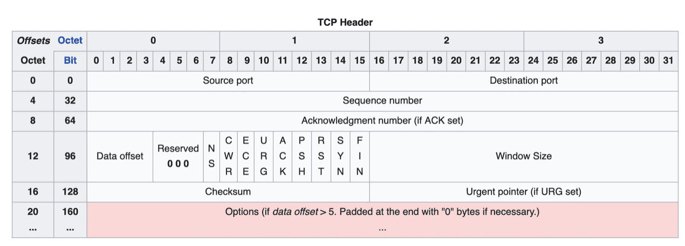
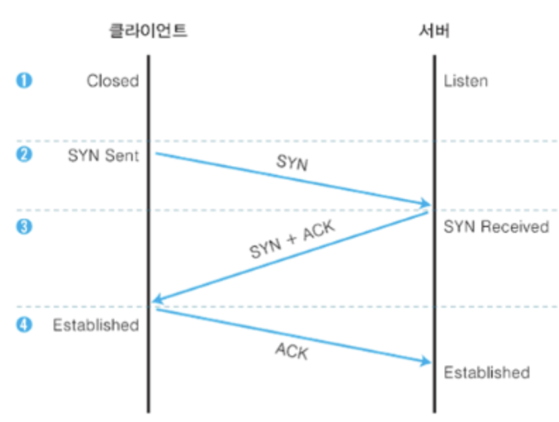

# 6. 전송 계층 : 신뢰할 수 있는 데이터 전송하기
## 전송 계층
### # 트랜스포트 계층의 역할
1. 오류를 점검하는 기능
    - 물리 계층, 데이터 링크 계층, 네트워크 계층 이 3계층이 있으면 목적지 장비까지 데이터를 보낼 수 있다.
    - 하지만 데이터가 손상되거나 유실되더라도 이 3개의 계층들에서는 아무것도 해주지 않는다.
    - 그렇기에 이 **전송 계층에서 목적지에 신뢰할 수 있는 데이터를 전송하기 위해 필요한 계층이다.**
    - 오류가 발생하면 데이터를 재전송하도록 요청한다.
    - 네트워크 계층은 목적지까지 데이터를 전달하고, **전송 계층에서는 데이터가 제대로 도착했는지 확인한다.**
2. 전송된 데이터의 목적지가 어떤 어플리케이션인지 식별
    - 해당 데이터를 목적지 컴퓨터까지 전달하더라도, 어플리케이션 계층에서는 서비스의 수만큼 많은 프로토콜이 존재하는데 어떤 어플리케이션인지 판단해야한다.
        - 홈페이지에서 사용하는 데이터인지, 메일 프로그램에서 사용하는 데이터인지
    - 전송 계층에서 어떤 어플리케이션에 전송해야 하는지 알려 준다.
    - 목적지 프로토콜을 지정하기 위해 **포트**라는 장치를 사용하고, 포트 번호를 통해 여러개 프로토콜을 식별할 수 있고, 다른 통신 서비스를 동시에 사용할 수 있다.
- 즉, 전송 계층은 어플리케이션 계층과 네트워크 계층의 중개 역할을 한다.

 
 

## 포트
### 어플리케이션 계층의 출입구
- 어플리케이션 계층에는 어플리케이션 프로토콜마다 데이터의 출입구가 존재한다.
- 이 출입구를 포트라고 한다. 각 포트에는 포트 번호가 붙어있고, 통신을 수행할 때는 포트 번호를 사용하여 보낼곳을 지정한다.
- TCP 헤더의 **출발지 포트 번호와 목적지 포트 번호**가 있기 때문에 어플리케이션을 구분할 수 있다.
- 포트는 0 ~ 65535번까지 사용할 수 있는데 0 ~ 1023번까지는 다 예약되어 있으며, Well-known port라고 한다.
- 주요 서비스의 포트 번호는 다음과 같다.

|서비스|어플리케이션 계층 프로토콜|포트 번호|
|------|-----|------|
|www|HTTP|80|
|www(보안)|HTTPS|443|
|전자메일(송신)|SMTP|25|
|전자메일(수신)|POP3|110|
|원격 로그인(보안)|SSH|22| 

- 데이터 전송시 상대방의 IP 주소가 필요하고, 어떤 어플리케이션이 사용되고 있는지 구분하려면 포트 번호가 필요하다.  

 
 

--------

## TCP
### # 연결형 통신과 비연결형 통신
- 상대방에게 데이터를 전달한다는 목적을 달성하기 위해 전송 계층에는 두가지 통신 프로토콜이 존재한다.
- 전송 계층은 크게 `신뢰성/정확성`과 `효율성`으로 구분지을 수 있다.
- `신뢰성/정확성`은 데이터를 목적지에 문제없이 전달하는 것 (`연결지향형 통신`)
    - 연결형 통신은 상대편과 서로 여러번 확인해가면서 통신한다.
    - **`TCP`** 프로토콜을 사용한다.
- `효율성`은 데이터를 빠르고 효율적으로 전달하는 것 (비연결형 통신)
    - 상대편을 확인하지 않고 일방적으로 데이터를 전송한다.
    - 동영상은 비연결형 통신을 사용한다.
    - 신뢰할 수 있고 정확한 데이터 전송보다, 빠른 전송이 필요하기 때문에 데이터가 늦게 도착해서 화면이 버벅거리는 동영상을 보는것보다 데이터가 유실되더라도 원활하게 보는 것이 좋기 때문
    - **`UDP`** 프로토콜을 사용한다.

 

### # TCP 란 ?
- Transmission Control Protocol 의 약자로써 전송 제어 프로토콜의 약어이다.
- 앞서 설명한 신뢰성과 정확성을 우선으로 하는 연결형 통신 프로토콜로써 원활한 통신을 위해 데이터 흐름을 제어하고 네트워크 혼잡 상태를 파악해서 대처하는 기능을 프로토콜 자체에 포함하고 있다.
    - 안정적으로, 순서대로, 에러없이 교환할 수 있도록 목적을 둔 프로토콜
- TCP는 전송의 신뢰성과 **흐름 제어, 혼잡 제어** 등의 역할을 맡고 있는 프로토콜이기 때문에, TCP 헤더에도 이러한 기능을 사용하기 위한 여러가지 값들이 담겨있다.
    - TCP로 전송할때 붙이는 헤더를 `TCP 헤더`라고 하며 TCP 헤더가 붙은 데이터를 `세그먼트`라고 한다.
- TCP의 전송 제어 방법은 다음과 같이 나누어진다.
    - 전송되는 데이터의 양을 조절하는 `흐름 제어`
    - 통신 도중에 데이터가 유실되고나 잘못된 데이터가 수신되었을 경우 대처하는 방법인 `오류 제어`
    - 네트워크 혼잡에 대처하는 `혼잡 제어`

 

### # TCP 헤더

- TCP 헤더 길이는 4 Byte, 용량은 20 Byte 이다.
- 용량인 20 Byte는 default 용량일 뿐, 옵션을 추가로 사용하면 크기는 늘어난다.

#### # 1. Source Port, Destination Port 
- 출발지 포트, 목적지 포트 번호로써, 각 16 bit씩 할당 받는다.
- IP 주소는 네트워크 계층의 IP 헤더에 담기기 때문에 전송 계층에서는 포트 번호만 담긴다.

#### # 2. Sequence Number (일련 번호)
- TCP는 데이터를 분할해서 보내는데, 일련 번호는 송신 측에서 수신 측에 "이 데이터가 몇번째 데이터인지 알려주는 역할"을 한다.
- 즉 전송하는 데이터의 순서를 의미하는 번호이다.
- 일련번호를 통해 수신 측은 원래 데이터의 몇 번째 데이터를 받았는지 알 수 있다.

#### # 3. Acknowledgement Number (확인 응답 번호)
- 수신 측이 몇 번째 데이터를 수신했는지 송신 측에 알려주는 번호
- 데이터를 받은 수신자가 예상하는 다음 번호를 의미한다.
- 큰 데이터를 한번에 전송할 수는 없으므로 송신자는 이 데이터를 여러 개의 세그먼트로 쪼개서 조금씩 전송해야한다. 
- 이때 송신자가 한번에 전송할 수 있는 데이터 양을 200 바이트로 가정해보자.
- 일련 번호 3001번은 보내는 200 바이트 데이터의 첫 번째 번호라고 하고 확인 응답 번호는 다음에 보냈으면 하는 데이터의 첫번째 번호가 된다.
    
    |arrow|일련 번호|확인 응답 번호|arrow|설명|
    |------|-----|------|------|----|
    |----->|3001|4001|----->| < 1 > |
    |<-----|4001|3201|<-----| < 2 > |
    |----->|3201|4001|----->| < 3 > | 
    |<-----|4001|3401|<-----| < 4 > |
        
    - < 1 > : 송신측은 수신측으로 200 바이트의 데이터를 전송한다.
    - < 2 > : 수신측은 200 바이트를 수신하고 다음에 수신하고자 하는 데이터 번호를 확인 응답 번호에 넣는다.  
    다음에 수신하고자 하는 데이터는 `상대방이 보낸 시퀀스 번호 + 자신이 받은 데이터의 byte`, 3001 + 200 = 3201번 부터 보내 달라고 요청한다.
    - < 3 > : 송신측은 수신측으로 3201번부터 200 바이트의 데이터를 전송한다.
    - < 4 > : 수신 측은 3201번의 데이터를 받았고, 다음에 수신하고자 하는 3401번을 보내 달라고 확인 응답 번호에 넣고 요청한다.
    - 1 ~ 4번까지를 데이터 전송이 완료될때 까지 반복한다.
- 데이터가 항상 올바르게 전달되는 것은 아니므로 일련번호와 확인 응답 번호를 사용해서 데이터가 손상되거나 유실된 경우 데이터를 재전송하게 되어 있다.
    - 데이터 전송 도중에 오류 발생시, 일정 시간동안 대기한 후 재전송한다. 이것을 재전송 제어라고 한다.
    
#### # 4. Data Offset
- 헤더가 아닌 데이터의 시작 위치를 나타낸다.
- 옵션 필드의 길이가 고정되어 있지 않기 때문이다.

#### # 5. Reversed (예약 영역)
- 0으로 채워져 있다.

#### # 6. Code bit
- TCP 헤더의 107번째 비트부터 112번째 비트까지 6비트로 연결의 제어 정보가 기록되는 곳이다.
- 총 9개의 필드가 존재하며 각 필드별로 역할이 있으며 초기값은 0, 비트가 활성화되면 1로 변경된다.
    - NS, CWR, ECE, URG, ACK, PSH, RST, SYN, FIN
- TCP 통신으로 데이터를 전송하려면 먼저 **연결 (Connection)이라는 가상의 독점 통신로**를 확보해야한다.
    - 연결은 **`SYN`**, **`ACK`** 필드를 사용하여 확립할 수 있다.
    - 앞서 말한 연결을 확인하기 위해 코드 비트중 **`SYN`**, **`ACK`** 1로 활성화하여 패킷 요청을 교환해야 한다.
    - **`SYN`** : Synchronize, `연결 요청`의 의미로써, 상대방의 연결을 생성할때 그리고 시퀀스 번호의 동기화를 맞추기 위한 필드
    - **`ACK`** : Acknowledgment, `확인 응답`의 의미로써 이 필드가 활성화 되었으면 연결이 되었다는 확인 응답을 나타내긴 위한 필드
- 데이터를 보내기 전에 연결을 확립하기 위해 패킷 요청을 세번 교환하는 것을 **`3 - WAY 핸드 쉐이크`**라고 한다.

#### # 7. Window Size
- 세그먼트 하나를 보낼따마다 확인, 응답을 해야하기 때문에 효율이 높지 않다.
- 매번 확인 응답을 기다리는 대신 세그먼트를 연속해서 보내고 난 다음에 확인 응답을 반환하면 효율이 높아진다.
- 상대방에게 연속해서 세그먼트를 보내기 되면 상대방은 받은 세그먼트를 일시적으로 보관하는 `버퍼(Buffer)`가 존재한다.
    - 버퍼 덕분에 세그먼트를 연속해서 보내도 수신측은 대응할 수 있어 확인 응답의 효율도 높아진다.
- 만약 송신 측이 세그먼트를 대량으로 보내면 수신측은 데이터 보관이 넘칠 수 있는데 이것을 `오버플로우(Overflow)` 라고 한다.
- 오버플로우가 발생하지 않도록 **버퍼의 한계 크기를 알고 있어야 한다.** 그것이 TCP 헤더의 윈도우 크기 값에 해당한다.
- 즉 윈도우 크기는 얼마나 많은 용량의 데이터를 저장해 둘 수 있는 버퍼의 크기를 나타낸다.
- 윈도우 크기의 초기값은  **`3 - WAY 핸드 쉐이크`**를 할 때 판단한다.

 

### # 3-way 핸드쉐이크란 ?

- TCP는 신뢰할 수 있는 연결을 하기 위해 데이터를 전송하기 전에 패킷을 교환하는데, 다음과 같이 세 번 확인한다.
1. 연결 확립을 요청한다 SYN
    - 통신을 하려면 컴퓨터 2 에게 허가를 받아야하므로 먼저 컴퓨텅 1에서 컴퓨터 2로 연결 확립 허가를 받기 위한 요청 SYN을 보낸다.
    - SYN : 1
    - ACK : 0
2. 컴퓨터 2는 컴퓨터 1이 보낸 요청을 받은 후에 허가한다는 응답을 회신하기 위해 연결 확립 응답 ACK을 보낸다.  
동시에 컴퓨터 2도 컴퓨터 1에게 데이터 전송을 허가 받기 위해 연결 확립 요청 SYN을 보낸다.
    - SYN : 1
    - ACK : 1
3. 컴퓨터 2의 요청을 받은 컴퓨터 1은 컴퓨터 2로 허가한다는 응답 ACK을 보낸다.
    - SYN : 0
    - ACK : 1

 

- 데이터를 다 전송한 후 연결을 끊기 위한 요청을 교환한다.
    - 연결을 끊을때는 FIN 필드와 ACK를 사용한다.
1. 컴퓨터 1에서 컴퓨터 2로 연결 종료 요청 FIN을 보낸다.
    - FIN : 1
    - ACK : 0
2. 컴퓨터 2에서 컴퓨터 1로 연결 종료 응답 ACK를 반환한다. 또한 컴퓨터 2에서도 컴퓨터 1로 연결 종료 요청 FIN을 보낸다.
    - FIN : 1
    - ACK : 1
3. 컴퓨터 1에서 컴퓨터 2로 연결 종료 응답 ACK를 반환한다.
    - FIN : 0
    - ACK : 1

 

--------

## TCP 흐름 제어
### # TCP 흐름 제어
- 수신 측에서 데이터를 처리하는 속도보다 송신 측이 데이터를 전송하는 속도가 빠르다면 언젠가 수신측의 버퍼가 차버릴 것이다.
    - 버퍼의 꽉참으로 인해 데이터를 다 받지 못하게 되는 불상사가 생긴다.
- 그래서 송신 측은 수신 측의 데이터 처리 속도를 파악하고 자신이 얼마나 빠르게 많은 데이터를 전송할지 결정하는 것을 `TCP 흐름제어`라고 한다.
- TCP 헤더에 Window Size 라는 필드가 존재하는데, 수신 측이 송신 측에게 자신이 처리할 수 있는 데이터의 양을 Window Size 필드를 응답 헤더에 담아서 알려준다.
- 송신 측은 이 Window Size를 고려해서 전체적인 데이터의 흐름을 제어할 수 있게된다.

 

### # Stop and Wait
- 상대방에게 데이터를 보낸 후 잘 받았다는 응답이 올 떄까지 기다리는 방식이다.
    - 상대방이 응답을 하면 데이터를 보낸다.
- 서로 응답을 주고받고 하는 방식은 비효율적이라고 할 수 있다. 송신 측은 자신이 직접 데이터를 보내봐야 수신측이 처리할 수 있는지 알 수 있기 때문이다.
- 이런 비효율성을 커버하기 위해 여러가지 오류 제어 방식을 도입해서 사용한다.

#### # Sliding Window
- Stop and Wait의 비효율적인 부분이 존재하기애 오늘날 같은 TCP는 특별한 경우가 아닌 이상 대부분 Sliding Window 방식을 사용한다.
- 수신 측이 한 번에 처리할 수 있는 데이터를 정해놓고 그때그때 수신 측의 데이터 처리 상황을 송신 측에 알려줘서 데이터의 흐름을 제어하는 방식.
- Stop and Wait와의 차이점은 수신 측이 처리할 수 있는 데이터의 양을 알고 있다는 점이다. (Window Size)
    - 이 정보를 알고 있기 때문에 수신 측의 ack를 일일히 받지 않아도 송신 측이 어느정도 예상이 가능하다.
- 이때 정해진 윈도우 크기는 고정이 아니라 통신을 하는 과정 중간에도 계속 네트워크 환경과 수신 측이 보내주는 윈도우 크기를 통해 동적으로 변경될 수 있다.
- 연속적으로 보낼 데이터의 양인 윈도우의 크기는 동적으로 변경되어 유연하게 흐름을 제어할 수 있다.

 

-------

## TCP 오류 제어
### # TCP 오류 제어
- TCP는 기본적으로 ARP (Automatic Repeat Request), 재전송 기반 오류 제어를 사용한다.
    - 통신 중 오류가 발생하면 송신 측이 수신 측에게 해당 데이터를 다시 전송해야한다.
- TCP를 사용하는 송/수신 측이 오류를 파악하는 방법은 다음과 같다.
1. 수신 측이 송신 측에게 NACK (부정 응답)을 보내는 방법.
    - 수신 측 로직이 상대방에게 ACK를 보낼지, NACK을 보내야할지에 대한 추가 로직이 필요하기 때문에 일반적으로 ACK만 사용해서 오류를 추정한다.
2. 송신 측에서 ACK 가 오지 않거나 중복해서 ACK가 계속 오게되면 오류로 판단한다.
    - 패킷 기반 전송을 하는 TCP의 특성상 패킷의 도착 순서가 무조건 보장이 되는것이 아니기 때문에 중복 ACK를 3회정도 받았을 때 에러로 판별한다.

 

#### # Stop and Wait
- 흐름 제어에서 설명한 Stop and Wait 방법도 응답이 오지 않으면 제대로 받을때까지 데이터를 재전송하는 방법이기에 오류 제어가 가능하다.

#### # Go Back N
- 데이터를 연속적으로 보내다가 어느 데이터부터 오류가 발생했는지 검사하는 방식이다.에
- NACK를 사용한다. 예로 수신 측에서 송신 측이 보낸 1번 데이터부터 에러 발생을 감지하여 송신 측에게 1번 부터 다시 보내줘라고 NACK 요청을 보낸다.
    - 그러면 수신 측에선 1번 이후로 받은 데이터를 다 폐기하고 송신 측은 다시 1번 데이터 부터 되돌아거서 전송한다.
    - Go Back N

#### # Selective Repeat
- 선택적인 재전송, Go Back N 방법은 에러 발생 이후에 데이터를 모두 폐기하는 비효율이 존재한다.
- 그래서 나온 방식이 에러난 데이터만 재전송 하는 Selective Repeat 방식이 도입되었다.
- 선택적으로 데이터를 재전송하개 되면 수신 측에 전송된 데이터가 연속적이지 않는 단점이 존재한다.
- 결국 수신 측에서 재정렬이란 과정이 추가되는데, 상황에 따라 재전송이 효율적이면 Go Back N, 재정렬이 효율적이면 Selective Repeat을 사용하도록 하자.

 
 

## UDP
### # UDP 란
- UDP는 비연결지향 통신이라 데이터를 전송할 때 TCP 처럼 시간이 걸리는 확인 작업을 일일이 하지 않는다.
    - 효율성을 중요하게 여기기 때문
- UDP의 장점으로 데이터를 효율적으로 빠르게 보내는 것이기에 스트리밍 방식으로 전송하는 동영상 서비스와 같은 곳에서 사용한다.

 

### # UDP 헤더
- UDP 헤더가 붙은 데이터를 UDP 데이터그램이라고 한다. (TCP 헤더가 붙은 데이터는 세그먼트라고 한다.)
- UDP 헤더는 신뢰성과 정확성이 필요하지 않아 TCP 헤더보다 간단한 구조를 가지고 있다.
1. 출발지 포트 번호
2. 목적지 포트 번호
3. 길이
4. 체크섬
- 또한 UDP를 사용하면 랜에 있는 컴퓨터나 네트워크 장비에 데이터를 일괄로 보낼 수 있다. => `브로드캐스트`
- TCP 는 3-way 핸드쉐이크와 같이 데이터를 전송할 때도 확인 응답을 하나씩 보내야 하기 때문에 브로드캐스트와 같이 불특정 다수에게 보내는 통신에는 적합하지 않다.
