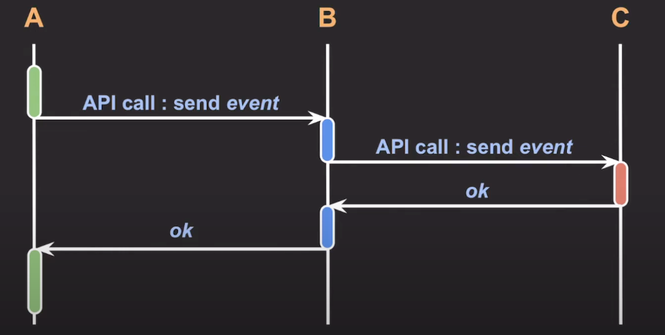
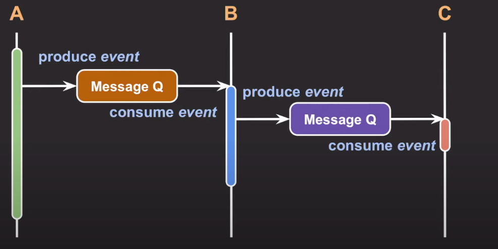
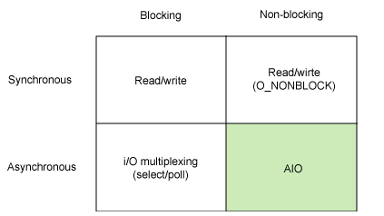
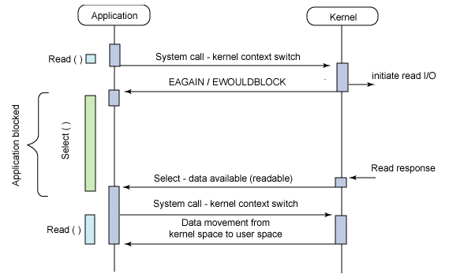

# asynchronous
- **동기와 비동기는 프로세스의 수행 순서 보장에 대한 매커니즘**
- **블록킹과 논블록킹은 프로세스의 유휴 상태에 대한 개념**으로 완전한 별개의 개념

### Synchronous programming
- 여러 작업들을 **순차적으로** 실행하도록 개발
- Synchro- 를 사용하는 단어들은 모두 `동시에 똑같이 진행되는 느낌`의 뉘앙스를 가지는 단어이다.
- 동기 방식은 현재 작업의 응답과 다음 작업의 요청의 타이밍을 맞추는 방식이다
  - 현재 작업의 응답이 발생함과 동시에 다음 작업을 요청한다는 것은 작업이 어떠한 순서를 가지고 진행된다는 것을 의미
 

### Asynchronous programming
- 여러 작업들을 **독립적으로** 실행하도록 개발
- 현재 작업의 응답과 다음 작업의 요청의 타이밍이 일치하지 않아도 되는 방식

<br>

- Asynchronous != multithreading
  - multithreading은 Asynchronous programming의 한 종류
- Asynchronous programming을 가능하게 하는 것은
1. multithreading
2. non-block I/O

- 백엔드 프로그래밍은 스레드를 적게 쓰면서도 non-block I/O를 통해 전체 처리량을 늘리는 방향으로 발전중

<br>

## Asynchronous I/O
- 워낙 광범위하게 사용되는 용어라서 문맥에 따라 비동기 I/O를 3가지 관점으로 해석할 수 있다.

- case 1
  - 처리해야할 작업들을 **어떤 흐름으로 처리할 것인가**의 관점
```
synchronous I/O = block I/O
asynchronous I/O = non-block I/O
```

- case 2
  - 작업 완료에 대해서 작업 요청자가 결과를 챙겨야하는지 여부의 관점
```
synchronous I/O = 요청자가 I/O 작업의 완료나 결과까지 챙겨야 할 때
asynchronous I/O: 요청자가 I/O 작업의 완료나 결과를 직접 챙기지 않아도 완료 noti를 받거나 callback으로 처리
```

- case 3
```
asynchronous I/O : block I/O를 다른 스레드에서 실행
스레드 A가 실행하다가 중간에 block I/O를 실행해야할 때 
스레드 B를 스레드 B를 새로 생성하여 B를 통해 Block I/O를 요청하고 A는 작업을 진행
```

<br>

- Synchronous와 Asynchronous는 순서와 결과의 관점이라면, Blocking과 Nonblocking은 제어의 관점이라 볼 수 있다.
- block/non-block은 I/O에서 쓰이는 개념이기 때문에 I/O 요청을 하고 응답을 기다려야 하느냐 아니면 기다리지 않고 다른 일을 할 수 있으냐로 구분

<br><br>

## 백엔드 아키텍처 관점에서의 비동기
- 하나의 서비스는 기능과 역할에 따라 여러 개의 마이크로 서비스로 구성되고 각 서비스간 빈번하게 커뮤니케이션이 발생한다.
- 이때 커뮤니케이션을 어떻게 하는지에 따라 Synchronous communication 일 수도 Asynchronous communication 일 수도 있다.

### Synchronous communication

  

1. A가 B에게 API call, B가 요청을 받고 C에게 API call
2. 이때 각 서비스들은 blocking 된다.
2. C가 처리해서 B에게 응답, B도 처리하고 A에게 응답

- C에서 예상치 못한 응답 불능 상태에 빠져버리면 다른 서비스에게 장애 전파가 된다.

### Asynchronous communication

  
  
- 메시지 큐를 이용해 커뮤니케이션시 적재된 작업을 메시지 큐로부터 소비하여 처리한다.
- C에서 문제가 생기더라도 A나 B에게 장애가 전파되지가 않는다.
- 그렇다면, 모든 API를 메시지 큐를 이용해야할까?
  - 아니다. A와 B간 신속하게 서로 데이터를 주고받을 필요가 있을 때는 굳이 메세지 큐를 사용할 필요는 없다. 
  - 이벤트를 한쪽으로 단방향으로 전달하는 흐름이라면 메시지 큐를 두는 것이 안정적인 운영 방법이다.

<br>
<br>

## 동기 + 블로킹
- 동기 방식이기 때문에 작업의 흐름도 순차적으로 진행되는 것이 보장되고
- 블록킹 방식이기 때문에 어떠한 작업이 진행 중일 때는 다른 작업을 동시에 진행할 수가 없다.

## 동기 방식 + 논블록킹 방식
- 동기 방식이기 때문에 작업의 흐름도 순차적으로 진행되는 것이 보장되고
- 중간중간 자신의 다른 작업들을 수행할 수 있다.

## 비동기 방식 + 논블록킹 방식
- 비동기 방식이기 때문에 상위 프로세스는 하위 프로세스의 작업 완료 여부를 따로 신경쓰지 않는다.
- 논블로킹 방식이기 때문에 상위 프로세스는 하위 프로세스에게 일을 맡기고 자신의 작업을 계속 수행할 수도 있다.
- 여러 개의 작업을 동시에 처리할 수 있는 부분에서 효율적이라고 할 수 있지만, 너무 복잡하게 얽힌 비동기 처리 때문에 개발자가 어플리케이션의 흐름을 읽기 어려워지는 등의 문제가 있을 수 있다.

## 비동기 방식 + 블로킹 방식
- 일반적인 어플리케이션 레이어에서는 자주 사용되지 않고 Linux와 Unix 운영체제의 I/O 다중화 모델 정도의 저레벨에서 사용되고 있다.
- 얼핏보면 비효율적인 방식으로 이해가 될 수 있다.
  - 비동기 방식의 장점은 하위 프로세스의 작업이 끝나는 것을 기다리지 않음으로써 여러 개의 작업을 동시에 처리할 수 있다는 것인데
  - 프로세스가 블록킹되어버려서 유휴 상태에 빠진다면 아무 것도 처리할 수 없기 때문이다.
- 그래서 [IBM에서 나온 개념이 프로세스를 블록킹해놓고 비동기로 여러 개의 I/O를 다중화해서 받아버리는 놈을 만들자](https://developer.ibm.com/articles/l-async/)가 나왔고
  - 이녀석이 바로 `I/O Multiplexing` 이다.

  

  

- 시퀀스 다이어그램에 select() 이녀석이 프로세스를 블록킹함과 동시에 여러 개의 I/O를 받아서 처리하는 역할을 한다.

<br>
<br>

----

### REF
- [evan-moon blog](https://evan-moon.github.io/2019/09/19/sync-async-blocking-non-blocking/)
- [쉬운코드_OS](https://www.youtube.com/watch?v=EJNBLD3X2yg&list=PLcXyemr8ZeoQOtSUjwaer0VMJSMfa-9G-&index=14&ab_channel=%EC%89%AC%EC%9A%B4%EC%BD%94%EB%93%9C)