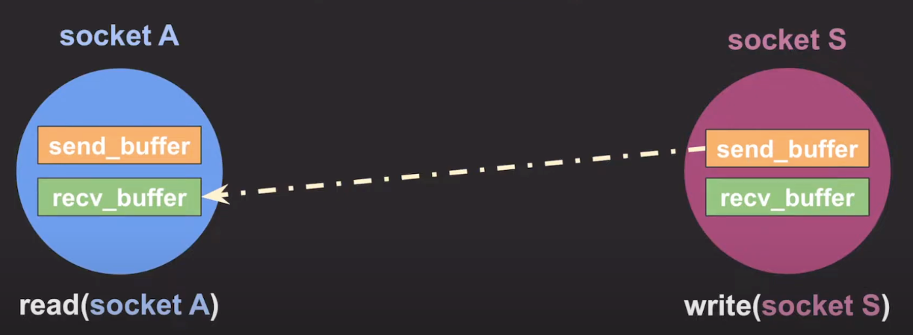
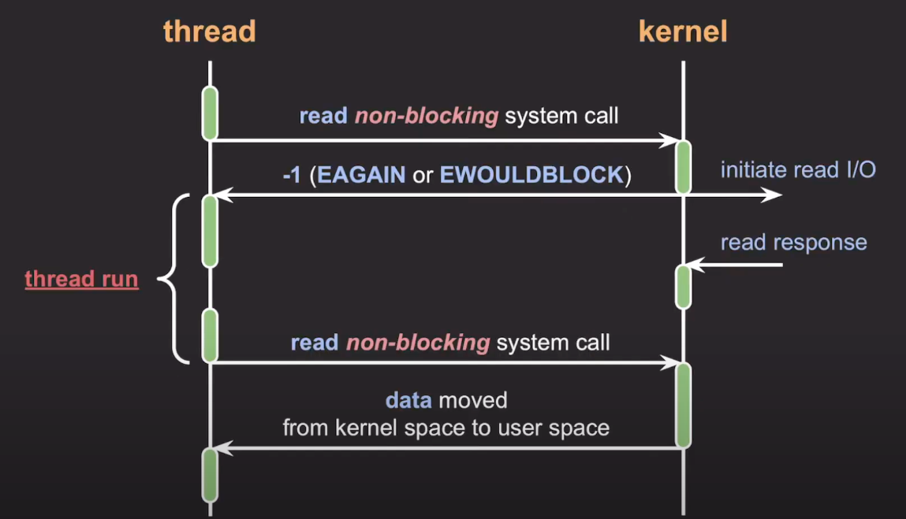
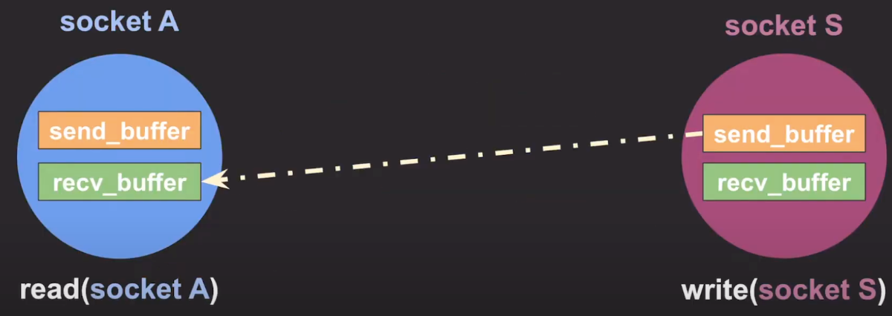
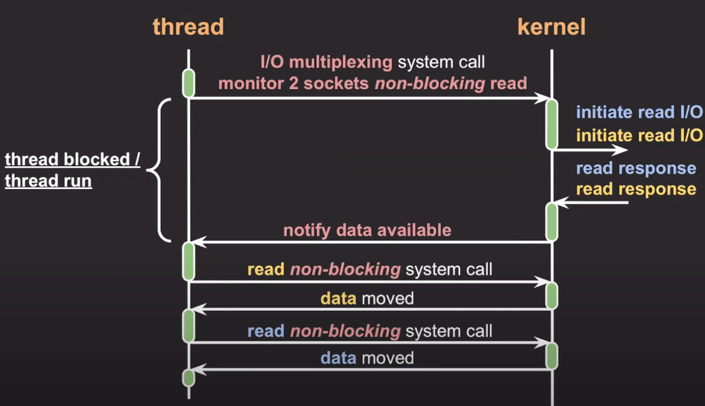

# block - non-block
- **블록킹과 논블록킹은 프로세스의 유휴 상태에 대한 개념**
- **동기와 비동기는 프로세스의 수행 순서 보장에 대한 매커니즘**으로 완전한 별개의 개념
- I/O 종류
  - network (socket)
  - file
  - pipe (프로세스간 통신)
  - device (모니터, 키보드 etc)
  
## socket
- 네트워크 통신은 socket을 통해 데이터 입출력
- 백엔드 서버들은 네트워크 상의 요청자들과 각각 소켓을 열고 통신한다.
- 특정 포트를 통해 양방향 통신이 가능하도록 만들어주는 추상화된 장치

## block I/O
- I/O 작업을 요청한 프로세스/스레드는 요청이 완료될 때까지 블락됨
  
  

1. read blocking system call
2. read system call로 인해 kernel 모드로 전환 (context switching)
3. 해당 thread는 block이 되어 진행 X
4. device에 read i/o 요청 및 응답을 받음
5. 응답 데이터를 커널 space에서 유저 space으로 전송
6. blcok 되었던 스레드는 데이터를 읽고 실행

## socket block I/O
- 소켓이 Blocking 되는 경우는 다음과 같다.

    

- 소켓마다 두개의 버퍼를 가진다.
  - send buffer : 보낼 데이터를 저장하는 송신 버퍼
  - recv buffer : 받는 데이터를 저장하는 수신 버퍼
- socket A, S가 있고 S가 A에게 데이터를 전송하려할 때 
1. 소켓 A에 read 시스템 콜을 호출한 스레드는 recv_buffer에 데이터가 들어올 때까지 block이 된다.
2. 소켓 S에 write 시스템 콜을 호출한 스레드는 가끔 send_buffer가 가득차게 되면 여유 공간이 생길때 까지 block이 된다.

  

## non-blocking I/O
- 프로세스/스레드를 블락시키지 않고 요청에 대한 현재 상태를 즉시 리턴
- 블락되지 않고 즉시 리턴하기 때문에 스레드가 다른 작업을 수행할 수 있다.

  

1. read non-blocking system call
2. read system call로 인해 kernel 모드로 전환 (context switching)
3. device에 read i/o 요청 및 kernel -> thread로 즉시 리턴
4. thread 진행 (커널도 요청받은 read I/O를 계속 실행하여 응답 데이터를 준비)
5. 커널이 device로부터 응답을 받음
6. thread는 다시 read non-blocking system call
7. read system call로 인해 kernel 모드로 전환 (context switching)
8. 응답 데이터를 커널 space에서 유저 space으로 전송

## Socket non-block I/O
- 소켓이 non-blocking 되는 경우는 다음과 같다.

  

1. 소켓 A에 read 시스템 콜을 호출한 스레드는 recv_buffer에 데이터가 없다면 없다고 리턴하고 바로 종료
2. 소켓 S에 write 시스템 콜을 호출한 스레드는 send_buffer가 가득차있더라도 적절한 에러코드와 함께 리턴하고 바로 종료

- non-block I/O 이슈, I/O 작업 완료를 어떻게 확인할 것인가?
1. 완료됐는지 주기적으로 반복적으로 확인
   - 완료된 시간과 완료를 확인한 시간과의 차이가 존재할 수 있어 응답 속도가 느려질 수 있음
   - 반복적인 확인 작업은 CPU 낭비
2. `I/O multiplexing` (다중 입출력) 사용
   - I/O 작업들을 동시에 모니터링하고 그 중 완료된 I/O 작업들을 한번에 알려준다.
3. callback / signal 사용
   - POSIX AIO : Portable Operating System Interface, 이식이 가능한 OS 인터페이스
     - 여러 OS에서 사용할 수 있도록 표준을 정하여 공통 API를 정리한 스펙 
   - LINUX AIO : 리눅스 커널 자체

  

## I/O multiplexing
- 각 클라이언트 마다 별도의 스레드를 생성하는 것이 아닌 하나의 스레드에서 다수의 클라이언트에 연결된 소켓하나라도 들어온 소켓에 OS 혹은 커널에서 알려주는 방식
- 소켓에 이벤트(read/write)가 발생할 경우에만 별도의 스레드를 만들어 (혹은 스레드 풀의 스레드 사용) 해당 이벤트를 처리하도록 구현
    
  

1. thread가 커널에게 I/O multiplexing 기반 non-blocking read system call 요청
   - monitor 2 sockets non-blocking read : 2개의 소켓에 대해서 non-blocking read 요청, 새로운 데이터가 들어오면 알려달라.
2. read system call로 인해 kernel 모드로 전환 (context switching)
3. device에 read i/o 요청
4. sytem call을 호출했던 thread는 block 되거나 run이 된다. (현재는 block 이라고 가정)
5. 커널이 device로부터 응답을 받음
6. 커널에서 스레드에게 데이터가 들어왔다고 알려준다.
7. 스레드는 첫번째 소켓으로부터 데이터를 읽어온다.
8. 스레든는 두번째 소켓으로부터 데이터를 읽어온다.

### I/O multiplexing 종류
- 커널에서는 아래와 같이 하나의 스레드가 여러 개의 소켓을 관리할 수 있는 시스템 콜을 제공한다. 
  - select
  - poll
  - epoll
  - kqueue
  - IOCP (I/O completion port)

 

- select 와 poll 은 성능면에서 좋지않아 잘 활용하지 않음, epoll, kqueue, IOCP가 더 많이 활용된다.
- epoll은 리눅스 계열에서 많이 사용
- kqueue은 맥 OS에서 많이 사용
- IOCP는 윈도우나 솔라리스 계열에서 사용

  

## select
- Linux에서 소켓도 하나의 file descriptor로 생성되어 관리가 된다.
- select 함수는 싱글 스레드로 file descriptor(소켓)의 변화를 관찰하는 함수이며, 파일 디스크립터는 OS에 의해 관리되는 대상
- select 방식은 매번 kernel로부터 이벤트(입력, 출력, 에러)별로 감시할 file descriptor들을 fe_set이라는 파일 상태 테이블에 등록하고, 조사하는 방식 
  - 파일들을 fe_set 이라는 파일 상태 테이블에 등록하고 등록된 파일에 이벤트가 발생한 경우 fd_set을 확인하는 방식

### select의 장점
- 사용하기가 비교적 쉽고
- 지원 하는 OS가 많아 이식성이 좋다. (POSIX 표준)
- 일반적으로 소켓수가 1500이하일때는 퍼모먼스 차이는 다른 I/O multiplexing 들과 거의 없는것 같다.
  - select poll epoll 의 성능차이는 5000 이상부터 급격히 달라진다.

### select의 한계
- 검사할 수 있는 file descriptor 최대 갯수는 1024개로 제한된다.
- I/O 준비가 된 file descriptor(소켓)들만 처리하려면 모든 file descriptor를 순회하면서 처리해야함
- select 함수를 호출할 때 마다 매번 OS에게 관리 대상인 file descriptor 배열 전체에 대한 정보들을 전달해야함
  - 관찰대상의 정보를 줘야한다?? => select 호출 시 정보를 운영체제에 전달한다는 것
  - select 호출시 fd_set에 변화가 생기므로 select를 호출 전에 fd_set의 원본을 복사하고 계속 select 호출 시 새롭게 관찰 대상의 정보를 줘야한다.
  - 즉, 커널과 유저 공간 사이에 여러번의 데이터 복사가 있다는 뜻이고, 운영체제에 정보를 전달하는 것은 오버로드가 크다.