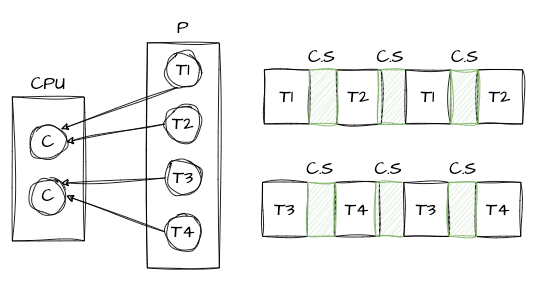
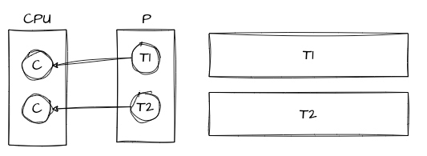

# CPU bound, IO bound
- 프로세스는 특성에 따라 cpu bound나 io bound로 구분되곤 한다.

## CPU, IO burst
- burst : 어떤 현상이 짧은 시간안에 집중적으로 발생
- CPU burst : 메모리에 올라가있는 프로세스가 자신의 차례가 되어 CPU에 실행될 때 자신의 명령들이 연속적으로 실행되는 시간
- IO burst : 프로세스가 I/O 작업을 요청하고 결과를 기다리는 시간
- 프로세스의 인생은 CPU 버스트와 IO 버스트의 연속이다.

## CPU bound 프로세스
- CPU burst가 많은 프로세스 (CPU burst > IO burst)
- ex) 동영상 편집 프로그램, 머신러닝 프로그램
  - 연산 작업들이 많은 프로그램들이 cpu busrt가 많다.

## IO bound 프로세스
- CPU burst 보다 IO burst가 많은 프로ㅔ스
- ex) 백엔드 API 서버

 

## 듀얼코어 CPU에서 동작할 CPU bound 프로그램을 구현한다면 몇 개의 스레드를 쓰는게 좋을까?
- 다다익선일까?
- CPU bound 프로그램에서 적절한 스레드 수는 `number of CPUs + 1`
  - (Brian Goetz라는 유명한 사람이 발표한 내용)  
- 듀얼코어에 쓰레드 4개가 있다는 예를 표현하면 다음과 같을 것이다.

  
  - 불필요한 Context switcing이 발생하면서 오버헤드가 발생할 가능성이 높다.

 

- 코어 갯수만큼 쓰레드를 생성하여 실행하면 다음과 같을 것이다.
  
- 거의 1:1 매핑이 되어 컨텍스트 스위칭이 발생하지 않게 된다. 그로 인해 CPU 낭비가 발생하지 않게 된다.
- CPU bound 프로그램을 구현할 때는 스레드 갯수를 코어 갯수 만큼 혹은 거의 준하는 갯수로 만드는게 적절하다.

 

## IO bound 프로그램은 스레드 몇 개로 구현하는 것이 적절할까?
- 하드웨어 스펙, 예상되는 트래픽, 프로그램 특성 등을 고려하여 여러 상황에 맞춰서 적절한 스레드 수를 찾아야한다.
  - 딱히 가이드라인이 없다.
