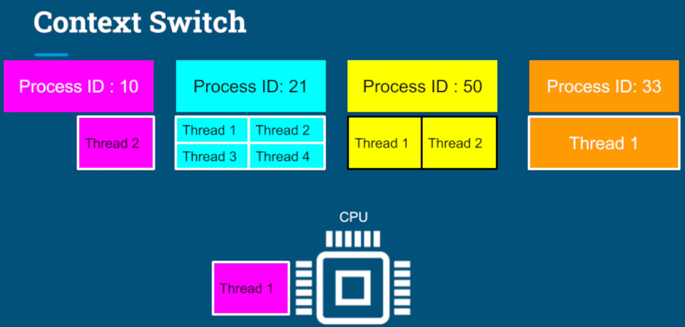

# 컨텍스트 스위칭
- cpu/코어에서 실행 중이던 프로세스/스레드가 다른 프로세스/스레드로 교체되는 것
- 컨텍스트란?
  - 프로세스 / 스레드의 상태를 말한다.
    - 상태란 CPU의 레지스터 정보를 뜻하고 프로세스의 상태는 프로세스의 PCB에 저장된다.
- 프로세스들은 각각 독립적으로 실행된다.
- 프로세스는 최소 1개 이상의 스레드를 가지며 프로세스 내 스레드들은 CPU 실행을 두고 서로 경쟁한다.
- 스레드가 코어보다 많기 때문에 OS는 스레드 하나를 실행하고, 멈추고 다른 스레드를 실행하고 멈추고를 반복한다.
- 하나의 스레드 실행을 멈추고 다른 스레드를 스케줄링한 다음 다시 실행하는 것이 컨텍스트 스위치라고 한다.



<br>

## 컨텍스트 스위칭은 왜 필요할까?
- 여러 프로세스 / 스레드를 동시에 실행시키기 위해서

## 컨텍스트 스위칭은 언제 발생하는가?
- 주어진 time slice를 다 사용했거나
- IO 작업을 하는 경우
- 다른 리소스를 기다리거나

## 컨텍스트 스위칭은 누구에 의해 실행되는가? 
(trigger를 뜻하는 것이 아님)
- OS 커널
  - 각종 리소스를 관리 / 감독하는 역할임
  - 가장 핵심적인 기능을 담당함

## 컨텍스트 스위칭은 구체적으로 어떤 과정으로 일어나는가?
- 다른 프로세스끼리 스위칭인지, 같은 프로세스의 스레드들끼리 스위칭인지에 따라 다르다.
  - 다른 프로세스끼리 스위칭 -> process context switching
  - 같은 프로세스의 스레드들끼리 스위칭 -> thread context switching
- 둘의 공통점은
  - **커널 모드에서 실행**
    - 프로세스가 하드웨어와 밀접한 작업이나 중요한 리스소에 접근해야하는 경우 프로세스에서 OS로 통제권이 넘어가면서 OS를 통해 접근하게 된다.
    - 이때 os에서 실행되는 것을 커널모드라고 한다.
  - **CPU의 레지스터 상태를 교체**
    - 레지스터는 각종 명령어들을 수행하기 위한 여러 데이터를 저장하는 곳
- 둘의 차이점은
  - process context switching은 가상 메모리 주소 관련 처리를 추가로 수행
    - 프로세스간 스위칭이 발생하면 서로 다른 독립적인 메모리를 사용하기 때문에 필요한 작업
    - MMU 라는 Memory Managemnt Unit과 TLB 캐시를 이용
      - MMU : CPU에서 가상 주소 메모리 접근이 필요할 때, 가상 메모리 주소(논리 주소)를 물리 주소값으로 매핑해주는 하드웨어 장치
      
      
  - **thread context switching은 프로세스 내 같은 메모리 공간을 공유하기 때문에 메모리 주소 관련 처리를 하지 않기 때문에 더 빠름**

<br>

- 컨텍스트 스위칭은 다음과 같은 작업을 수행한다. (실행 순서와 무관)
```text
1. 현재 실행 중인 프로세스 혹은 스레드의 context 백업 (가령, CPU 레지스터 값들, 어디까지 실행됐는지 등)

2. CPU 캐시를 비움(flush) (CPU 마다 L1, L2 cache에 대한 동작이 다를 수 있음, 심지어 안 비울 수도 있음)

3. TLB(table lookaside buffer)를 비움

4. MMU(memory management unit)를 변경
```
- 프로세스 컨텍스트 스위칭은 1, 2, 3, 4번을 모두 수행하지만
- 쓰레드 컨텍스트 스위칭은 1번만 수행한다.

<br>


## 컨텍스트 스위칭이 미치는 간접적인 영향
- CPU 캐시 오염
- CPU 내부에 캐시가 존재하는데 메모리에서 자주 접근하는 데이터를 CPU 내부 캐시에 저장해놓는다.
- 다음에 쓸거라고 예상을 하고 미리 가져다 놓은 데이터들인데 컨텍스트 스위칭을 하면 서로 다른 데이터가 되기 때문에 캐시에 있는 데이터는 의미가 없는 데이터가 되어 오염이 되었다고 표현한다.
- 컨텍스트 스위칭이 된 직후에 캐시에 접근해봤자 캐시에는 이전 프로세스가 사용하던 데이터를 들고있기 때문에 현재 프로세스가 찾고 있는 데이터가 없어 메모리에 다시 접근하게 되어 처리 속도가 늦어질 수 있다.
- CPU의 캐시 크기는 메모리에 비해 매우 작기 때문에 프로세스 끼리 나눠서 쓰지 않고 몰빵한다.
  - 프로세스 컨텍스트 스위칭이 발생할 때마다 CPU 캐시를 비워주는 OS 모델도 있다.

<br>
<br>

- 컨텍스트 스위치 개념이 중요한 이유는 동시에 많은 스레드를 다루면 효율성이 떨어지기 때문
- CPU에서 실행되는 각 스레드는 CPU 내의 레지스터나 캐시, 메모리 내의 커널 리소스 등을 일부 점유한다.
- 이때 다른 스레드로 전환할 때는 기존의 모든 데이터를 저장하고 전환되려는 스레드의 데이터를 복원해야한다.
- 너무 많은 스레드를 가동하게 되면 쓰래싱이 발생한다.
    - OS가 스레드 관리를 위해 컨텍스트 스위칭에 좀 더 많은 시간을 할애하게 되는 것
- 스레드는 프로세스보다 리소스를 더 적게 사용한다.
    - 프로세스 내 스레드들은 서로 공유하는 리소스가 많다보니 적게 사용
    - 프로세스 내 두 스레드 간 컨텍스트 스위치가 각각 다른 프로세스의 두 스레드 간 컨텍스트 스위치보다 효율적이다.