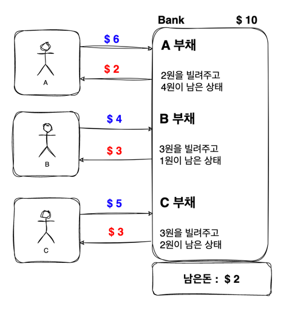
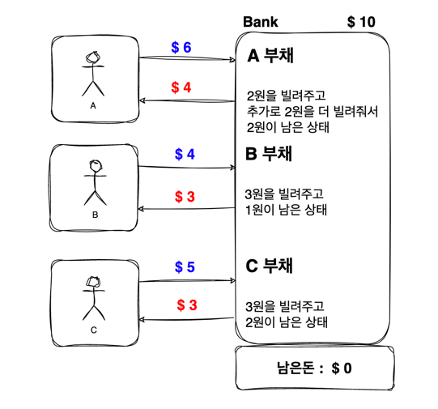

# 데드락
- 두 개 이상의 프로세스 혹은 스레드가 서로가 가진 리소스를 기다리는 상태

## 데드락을 만드는 네가지 조건
- 아래 네가지 조건을 모두 만족하면 데드락이 발생한다.
1. 상호 배제 `Mutual exclusion`
    - 리소스를 공유해서 사용할 수 없다.
    - 한번에 하나의 프로세스 / 스레드만 점유할 수 있다. 
2. 점유 대기 `Hold and wait`
    - 프로세스가 이미 하나 이상의 리소스를 취득한(hold) 상태에서
    - 다른 프로세스가 사용하고 있는 리소스를 추가로 기다린다.(wait)
3. 비선점 `No preemption`
    - 리소스 반환(release)은 오직 해당 리소스를 취득한 프로세스 / 스레드만 할 수 있다.
    - 즉, 다른 프로세스의 작업이 끝날 때 까지 리소스를 뺏을 수 없다.
4. 순환 대기 `Circular wait`
    - 프로세스들이 순환 (circular) 형태로 서로의 리소스를 기다린다.
   
## OS의 데드락 해결 방법
### 1. 데드락 방지 (deadlock prevention)
- 위 네가지 조건 중 하나가 충족되지 않게 시스템을 디자인
1. Mutual exclusion
  - 리소스를 공유 가능하게 한다.
  - 이 방법은 거의 불가능하다. 개발에서도 우리가 이유가 있어서 임계 영역 생성을 하고 락을 쥐고 반환하도록 설계하는 경우가 다반사이기 때문
2. Hold and wait
  - 사용할 리소스들을 모두 획득한 뒤에 시작 혹은 리소스를 전혀 가지지 않은 상태에서만 리소스 요청하도록 제약
  - 이 방법은 다음과 같은 단점이 있다.
  - 만약 여러 리소스를 획득하고 차례로 진행하고 있는데 작업이 길어지면 획득했던 남은 리소스는 놀게되어 리소스 효율성 저하
  - 만약 획득하려는 리소스가 인기가 많은 리소스라면 확보가 쉽지 않아 무한히 대기할 수도 있다. (Starvation - 기아현상)
3. No preemption
  - 추가적인 리소스를 기다려야 하는 상황에서 내가 이미 획득한 리소스를 다른 프로세스가 요청을 하면 쥐고 있는 리소스를 다른 프로세스가 선점 가능하도록 한다.
    - context switching과 비슷함.
4. Circular wait
  - 모든 리소스에 순서 체계를 부여해서 오름차순으로 리소스를 요청
  - 이 방식이 데드락 방지를 위해 많이 사용하는 방식이라고 함.

<br>

### 2.데드락 회피 (deadlock avoidance)
- OS가 동작하면서 사용 가능한 리소스들, 할당된 리소스, 다음 작업에 필요한 리소스 등 추가적인 정보를 활용해서 데드락이 발생할 것 같은 상황을 회피하는 것
- 데드락 회피로 유명한 `은행원 알고리즘 (Banker algorithm)`이 있다.

<br>

### 3. 데드락 감지와 복구
- 데드락을 허용하고 데드락이 발생하면 복구하는 전략
1. 프로세스를 종료하는 방법이 있다.
   - 데드락에 빠진 모든 프로세스를 종료한다.
   - 혹은 하나씩 종료한다.
   - 진행하고 있던 작업을 읽어버리기 때문에 거의 최후의 수단.
2. 리소스의 일시적인 선점을 허용한다.
   - 데드락이 발생했을 때 획득한 리소스를 일시적으로 다른 프로세스에게 양보하도록

<br>

### 4. 데드락 무시
- OS가 아몰랑 무시하는 방법도 있다.

<br>

### 자바 데드락 예제 코드
```java
public class Main {
	public static void main(String[] args) {
		Object lock1 = new Object();
		Object lock2 = new Object();
        
		Thread t1 = new Thread(() -> {
			synchronized (lock1) {
				System.out.println("[t1] get lock1");
				synchronized (lock2) {
					System.out.println("[t1] get lock2");
				}
			}
		});
        
		Thread t2 = new Thread(() -> {
			synchronized (lock2) {
				System.out.println("[t2] get lock2");
                synchronized (lock1) {
					System.out.println("[t2] get lock1");
				}
			}
		});
        
		t1.start();
		t2.start();
	}
}
```
- 이 문제를 해결하기 위해선 다음과 같은 방법이 있다.
  - Circular wait가 존재하기 때문에 순서 체계를 부여해서 오름차순으로 리소스를 요청하는 방법도 고민해보자.
    - lock1 -> lock2
  - Hold and wait가 존재하기 때문에 중첩 synchronized를 밖으로 빼낸다.

<br>
<br>

### 은행원 알고리즘
- 다익스트라가 만든 알고리즘
- 리소스 요청을 허락해줬을 때 데드락이 발생할 가능성이 있으면 리소스를 할당해도 안전할 때 까지 계속 요청을 거절하는 알고리즘
- 즉 OS는 `안전 상태`를 유지하는 요구만을 수락하고, `불안전한 상태`를 유발하는 요구는 계속 거절한다.

<br>

- 예시를 보면서 파악해보자. 10달러를 가진 은행이 있고 돈을 빌리려는 3명의 고객이 있다.
- A라는 고객은 6달러를, B라는 고객은 4달러를, C라는 고객은 5달러를 빌리려고 한다. 은행은 아래와 같이 돈을 빌려줬을 때 

    

- A한테 남은 2달러를 전부 주더라도 A는 돈을 다 받지 못해서 계속 빌리려고 하는 상황이 된다.
- 갚을 능력이 있어보이는 B한테 남은 1달러를 주거나 고객이 돈을 갚을 때 까지 기다린다. B는 4원을 상환하면 남은 금액을 B나 C에게 빌려준다. 
- 혹은 갚을 능력이 있어보이는 C한테 남은 2달러를 주고 돈을 갚을 때 까지 기다린다. C는 5원을 상환하면 남은 금액을 A나 B에게 빌려준다.
- 은행은 모든 고객들에게 돈을 빌려주고 은행이 다시 돈을 돌려받을 수 있는 상태를 `안전 상태`라고 한다.

<br>

- 이런 상황에서 갑자기 A가 급전이 너무 필요해서 은행은 남은돈 2원을 더 빌려서 아래와 같은 상황이 되었을 때

   

- 3명의 고객은 돈을 계속 요구하고 있고 은행은 세명을 다 해결해줄 수가 없는 상태가 된다.
- 고객들에게 추가적인 돈을 빌려주지 않으면, 갚지 못하는 상황이 되어 은행은 돈을 돌려 받을 수가 없다.
- 이런 상태를 `불안정 상태` 라고 한다. 바로 데드락인 상태가 된 것이다.
- **안정 상태에서 불안정 상태로 변할 수 있다.**

<br>

- 그래서 은행원 알고리즘이 말하는 것은 `최소한 고객 한명에게 대출해줄 수 있는 금액을 은행이 보유하고 있어야 한다.`는 것이다.
- 즉 고객이 프로세스라고 하면 돈은 리소스, 은행원은 OS가 된다.
- 프로세스가 리소스를 요청하면 OS 추가적으로 얻을 수 있는 정보를 최대치로 받아서 돈을 갚을 수 있는지 없는지 판단하는 것을 말한다.

- 안정 상태 : OS가 데드락이 일어나지 않도록 프로세스가 요구하는 리소스 요구량에 필요한 자원을 할당해줄 수 있는 상태
  - 안정 상태에서 불안정 상태로 변경될 수 있다.
- 불안정 상태 : OS가 할당해줄 수 있는 리소스가 부족해서 각 프로세스가 요구하는 리소스 요구량에 할당해주지 못하고 각 프로세스가 계속 대기하고 있는 교착 상태
  - 데드락은 불안정 상태에서만 발생한다.

<br>

### 은행원 알고리즘 단점
1. 각 프로세스마다 최대 자원 요구량을 미리 알아야 한다.
2. 쉬워보이지만 복잡하다.
3. 프로세스는 유한한 시간에 자원을 반납해야한다.
- 그래서 현재 채택하고 있는 방식은 아니라고 한다.