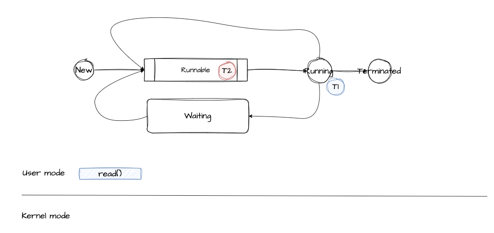
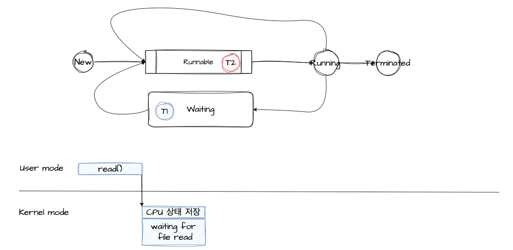
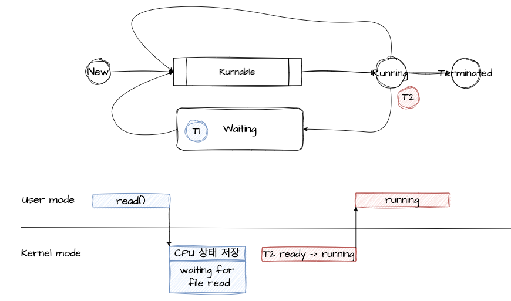
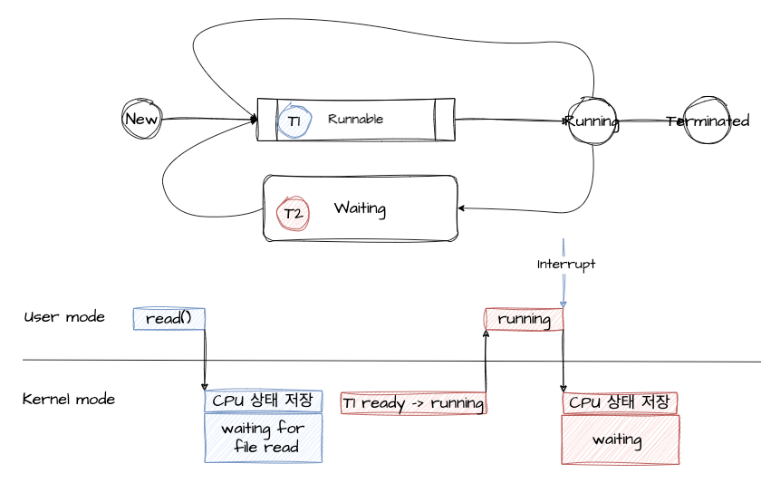
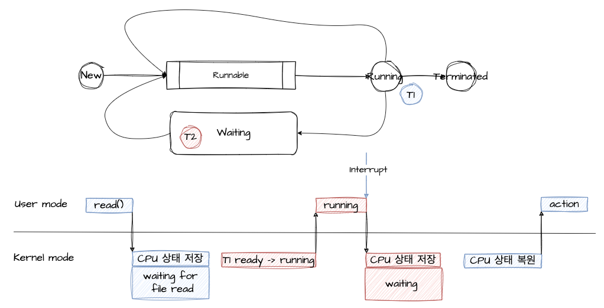
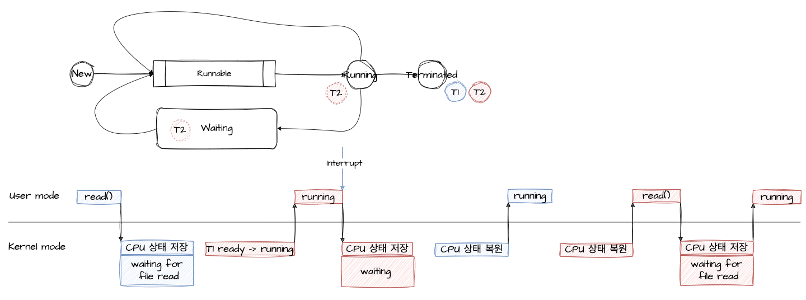

# 인터럽트
## User mode
- 우리가 개발하는 프로그램은 일반적으로 `유저 모드`에서 실행
- 프로그램 실행 중에 `인터럽트`가 발생하거나 `시스템 콜`을 호출하게 되면 `커널 모드`로 전환된다. 
- Kernel mode에서 User mode로 전환된 후 프로그램이 이어서 실행된다.
- 프로그램 카운터가 메모리 주소 중 사용자 프로그램이 존재하는 메모리 위치를 가리키는 경우도 해당

## Kernel mode
- 컴퓨터가 켜지면 OS도 하나의 SW로써 메모리에 적재되는데, 이때 메모리에 상주하는 OS를 커널이라고 한다.
- OS의 핵심으로써 시스템을 전반적으로 관리, H/W와 관련된 작업을 직접 수행
- 프로그램의 현재 CPU 상태를 저장한다.
- CPU의 제어권을 가지고 인터럽트나 시스템 콜을 직접 처리
  - 즉, CPU에서 커널 코드가 실행된다.
- 처리가 완료되면 중단됐던 프로그램의 CPU 상태를 복원 후 다시 통제권을 프로그램에게 반환 (Kernel -> User)
- 프로그램 카운터가 메모리 주소 중 운영 체제 코드의 위치를 가리키는 경우도 해당

## Kernel mode를 만든 이유
- **시스템을 보호하기 위해서**
  - 커널이 없다면 우리가 만든 프로그램이 이상한 명령을 수행하여 다른 프로그램의 메모리를 침범하는 등의 모든 프로세스에게 영향을 줄 수 있음
- 자원을 효율적으로 배분
  - 커널이 없다면 특정 프로세스가 CPU, 메모리, 하드디스크 등 다 점유할 수도 있기 때문에 프로세스 간에 자원이 형평성 있게 분배되도록

<br>

## Interrupt
- 시스템에서 발생한 다양한 종류의 이벤트 혹은 이벤트를 알리는 메커니즘
- CPU의 서비스가 필요할 때 통보하는 방법
- 인터럽트의 예
  - 전원에 문제가 생겼을을 때
  - I/O 작업이 완료됐을 때
  - 시간이 다 됐을 때 (timer 하드웨어)
    - timer 하드웨어란? 특정 프로그램이 무한루프로 CPU를 독점할 수도 있어서 CPU가 독점을 막기 위해 OS는 타이머라는 HW를 사용한다.
    - 타이머는 정해진 시간이 지나면 인터럽트를 발생시켜 CPU 제어권을 이양시킨다.
  - 0으로 나눴을 때
  - 잘못된 메모리 공간에 접근을 시도할 때
  - 등등
- 인터럽트가 발생하면 CPU에서는 즉각적으로 인터럽트 처리를 위해 커널 코드를 커널 모드에서 실행

## 시스템 콜
- OS에 정의된 함수를 호출하는 것
- 프로그램은 OS 커널이 제공하는 서비스를 이용하고 싶을 때 시스템 콜을 통해 실행
- 시스템 콜이 발생하면 해당 커널 코드가 커널 모드에서 실행
- 시스템 콜의 예
  - 프로세스 / 스레드 관련 (스레드 생성과 킬 등)
  - 파일 I/O
  - 소켓
  - 장치 관련
  - 프로세스 통신 관련
- 리눅스 기준 시스템 콜 레퍼런스

    

    - (더 많음)
  
- 하드웨어 혹은 시스템 관련 기능은 어떤 프로그램이라도 반드시 시스템 콜을 통해서만 사용 가능
- 프로그래밍 언어에는 시스템 콜을 wrapping하여 제공
  - 예로 자바에서 쓰레드 생성 혹은 실행은 반드시 시스템 콜이 필요함
      ```java
      private native void start0();
      public synchronized void start() {
            boolean started = false;
            try {
                start0();
                started = true;
            } finally {
                try {
                    if (!started) {
                        group.threadStartFailed(this);
                    }
                } catch (Throwable ignore) {
                    // ...
                }
            }
        }
      ```
- native 라는 JNI(Java Native Interface)를 통해 OS의 시스템 콜을 호출한다.


<br>

## 시스템 콜과 인터럽트 예제
- 싱글 코어 환경에서 T1, T2 두 개의 쓰레드가 파일을 읽기 위한 시스템 콜(read())을 예로 들어본다.
- T1은 running, T2는 ready 상태라고 가정했을 때
1. T1이 CPU를 보유하고 유저 모드에서 프로그램 내 명령을 수행하던 중 파일을 읽어와야해서 read() 시스템 콜 호출

    

2. 프로그램은 자신의 주소 공간에서 입출력 함수를 실행할 권한이 없어 CPU 제어권을 OS에게 이양하며 커널 모드로 전환
   - **T1의 CPU 상태 저장**
   - T1은 파일 읽기를 수행
     - 이 때 I/O는 많은 시간이 소요되어 CPU가 놀고 있게 되므로 block되어 T1은 waiting으로 전환

    

3. 스케줄러는 CPU 활용을 위해 대기하고 있는 T2를 ready -> running으로 전환하여 CPU 제어 권 이양 후 커널 모드에서 유저 모드로 전환하여 프로그램 실행
    
    

4. T2가 실행 중 T1이 파일 입출력 작업이 완료되어 CPU에게 인터럽트를 발생 (디스크 컨트롤러 -인터럽트-> CPU)
    - T1이 멈췄던 작업을 다시 수행하기 위해 T2의 CPU 상태를 저장하기 위해 커널 모드로 전환 
    - T2의 상태를 running -> waiting or ready으로 전환
    - 디스크 입출력을 수행했던 T1에게 다시 CPU 제어권을 넘겨주기 위해 상태를 waiting -> ready로 전환
 
    

5. T1은 스케줄러에 의해 CPU 제어권을 받아 ready -> running로 전환되고, 남은 명령어 수행

    

6. T1은 종료가 되고 T2는 다시 스케줄러에 의해 running 상태로 전환되고 이어서 작업을 수행
    - 파일 입출력을 수행을 위해 커널 모드로 전환
    - T2의 CPU 상태를 저장
    - T2의 상태가 waiting으로 전환
    - 파일 입출력 작업이 완료되어 CPU에게 인터럽트를 발생
    - 다시 running으로 전환 후 남은 작업 수행후 종료

    