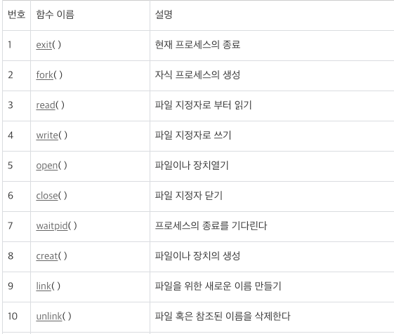

# 인터럽트
## User mode
- 우리가 개발하는 프로그램은 일반적으로 `유저 모드`에서 실행
- 프로그램 실행 중에 `인터럽트`가 발생하거나 `시스템 콜`을 호출하게 되면 `커널 모드`로 전환된다. 
- Kernel mode에서 User mode로 전환된 후 프로그램이 이어서 실행된다.
- 프로그램 카운터가 메모리 주소 중 사용자 프로그램이 존재하는 메모리 위치를 가리키는 경우도 해당

## Kernel mode
- 컴퓨터가 켜지면 OS도 하나의 SW로써 메모리에 적재되는데, 이때 메모리에 상주하는 OS를 커널이라고 한다.
- OS의 핵심으로써 시스템을 전반적으로 관리, H/W와 관련된 작업을 직접 수행
- 프로그램의 현재 CPU 상태를 저장한다.
- CPU의 제어권을 가지고 인터럽트나 시스템 콜을 직접 처리
  - 즉, CPU에서 커널 코드가 실행된다.
- 처리가 완료되면 중단됐던 프로그램의 CPU 상태를 복원 후 다시 통제권을 프로그램에게 반환 (Kernel -> User)
- 프로그램 카운터가 메모리 주소 중 운영 체제 코드의 위치를 가리키는 경우도 해당

## Kernel mode를 만든 이유
- **시스템을 보호하기 위해서**
  - 커널이 없다면 우리가 만든 프로그램이 이상한 명령을 수행하여 다른 프로그램의 메모리를 침범하는 등의 모든 프로세스에게 영향을 줄 수 있음
- 자원을 효율적으로 배분
  - 커널이 없다면 특정 프로세스가 CPU, 메모리, 하드디스크 등 다 점유할 수도 있기 때문에 프로세스 간에 자원이 형평성 있게 분배되도록

 

## Interrupt
- 시스템에서 발생한 다양한 종류의 이벤트 혹은 이벤트를 알리는 메커니즘
- CPU의 서비스가 필요할 때 통보하는 방법
- 인터럽트의 예
  - 전원에 문제가 생겼을을 때
  - I/O 작업이 완료됐을 때
  - 시간이 다 됐을 때 (timer 하드웨어)
    - timer 하드웨어란? 특정 프로그램이 무한루프로 CPU를 독점할 수도 있어서 CPU가 독점을 막기 위해 OS는 타이머라는 HW를 사용한다.
    - 타이머는 정해진 시간이 지나면 인터럽트를 발생시켜 CPU 제어권을 이양시킨다.
  - 0으로 나눴을 때
  - 잘못된 메모리 공간에 접근을 시도할 때
  - 등등
- 인터럽트가 발생하면 CPU에서는 즉각적으로 인터럽트 처리를 위해 커널 코드를 커널 모드에서 실행

## 시스템 콜
- OS에 정의된 함수를 호출하는 것
- 프로그램은 OS 커널이 제공하는 서비스를 이용하고 싶을 때 시스템 콜을 통해 실행
- 시스템 콜이 발생하면 해당 커널 코드가 커널 모드에서 실행
- 시스템 콜의 예
  - 프로세스 / 스레드 관련 (스레드 생성과 킬 등)
  - 파일 I/O
  - 소켓
  - 장치 관련
  - 프로세스 통신 관련
- 리눅스 기준 시스템 콜 레퍼런스

    

    - (더 많음)
