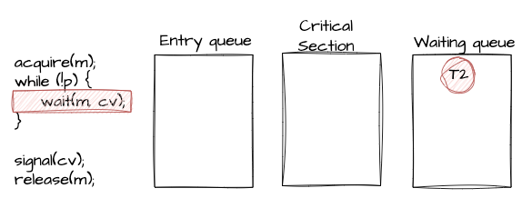

# 모니터 락
- mutex와 semaphore는 편리하고 효과적인 락이지만 사용하기가 어렵다.
- 게다가 타이밍 에러가 가끔 발생한다.
  - 바이너리 세마포어를 여러 프로세스가 사용할 때 만약 wait()를 하고 signal()을 호출해야하는데 해당 순서가 안지켜지게 되면 두개 이상의 프로세스가 크리티컬 섹션에 동시에 들어갈 수 있다. 
- 이로 인한 문제를 방지하기 위해 자바에서는 모니터 락을 제공한다.
- concurrency mechanism for thread synchronization
- **mutual exclusion을 보장**
- **조건에 따라 스레드가 대기 상태로 전환 기능**
- 자바에서 두 키워드를 사용하여 모니터 락을 사용할 수 있다.
  - synchronized keyword
  - wait() and notify()

### synchronized
- critical section에 해당하는 코드 블록을 명시적으로 선언할 때 사용하는 자바 키워드
- 해당 코드 블록에는 모니터락을 획득해야 진입이 가능
- 모니터 락을 가진 객체 인스턴스를 지정할 수 있음
- 해당 임계 영역에 들어가기 위해서는 파라미터 인스턴스가 모니터 락을 획득해야한다
```java
synchronized (object) {
    // critical section    
}
```
- 메소드에 선언하면 메소드 코드 블록 전체가 임계 영역으로 지정된다.
- 이때 모니터 락을 가진 객체 인스턴스는 this 객체이다.
```java
public synchronized void add() {
    // critical section    
} 
```

### wait() and notify()
- java.lang.Object에 선언되어 있어서 모든 자바 객체가 가진 메소드이다.
- 스레드가 어떤 객체의 wait() 메소드를 호출하면 해당 객체의 모니터 락을 획득하기 위해 대기 상태로 진입한다.
- 스레드가 어떤 객치의 notify() 메소드를 호출하면 해당 객체의 모니터에 대기중인 쓰레드 하나를 깨운다.
  - notifyAll() 메소드를 호출하면 대기중인 스레드 전부를 깨운다.

<br>

## 모니터는 언제 사용되나?
- 한번에 하나의 스레드만 실행되어야 할 때
- 여러 스레드와 협업이 필요할 때

## 모니터의 구성 요소
- `mutex`
  - critical section에 진입하려면 mutex lock을 취득해야한다.
  - mutex lock을 취득하지 못한 스레드는 큐에 들어간 후 대기(waiting) 상태로 전횐된다.
  - mutex lock을 획득한 스레드가 lock을 반환하면 락을 기다리며 큐에 대기 상태로 있던 스레드 중 하나가 실행
- `condition variables`
  - waiting queue를 가진다.
    - 조건이 충족되길 기다리는 스레드들이 대기 상태로 머무는 곳이다.

### condition variables에서 주요 동작
- `wait`
  - 스레드가 자기 자신을 `condition variables`의 waiting queue에 넣고 대기 상태로 전환한다.
- `signal`
  - waiting queue에서 대기중인 스레드 중 하나를 깨운다.
- `broadcast`
  - waiting queue에서 대기중인 스레드 전부를 깨운다.

<br>

## 모니터의 두개의 큐
- entry queue : critical section에 진입을 기다리는 큐이다.
  - mutex에서 관리하는 큐
- waiting queue : 조건이 충족되길 기다리는 큐이다.
  - condition variables에서 관리되는 큐
  - 모니터가 notify() 해줄 때까지 기다리는 스레드를 관리하는 큐

### 모니터 예제 코드
- sudo
```text
acquire(m);         // 모니터의 락 취득
while(!p) {         // 조건 확인
    wait(m, cv)     // 조건 충족 안되면 waiting
}

... // 연산 수행

signal(cv); or broadcast(cv2) // 스레드를 깨운다. cv와 cv2는 같을 수 있음
release(m);     // 모니터 락 반환
```
- 위 예제를 통해 크게 두가지 상황을 볼 수 있다.
- https://happy-coding-day.tistory.com/8
  1. 모니터 락 획득(acquire)과 반환(release)
  2. 조건에 따른 모니터 락 획득(acquire)과 반환(release)

<br>

- 모니터 락 획득(acquire)과 반환(release)
1. T1이 lock을 획득하여 critical section에 진입
2. T2가 진입하려는데 모니터 락을 소유한 스레드가 이미 있어서 Entry Queue에 대기
  
    

3. T1이 lock을 반환하고 release()을 통해 Entry Queue에서 대기하고 있는 스레드를 깨움.

<br>

- 조건에 따른 모니터 락 획득(acquire)과 반환(release)
1. T1이 lock을 획득하여 critical section에 진입
2. T2가 진입하려는데 lock을 획득하지 못해 Entry Queue에 대기

   

3. T1이 lock을 반환하고 release()을 통해 Entry Queue에서 대기하고 있는 T2 스레드를 깨움.
4. T2가 lock을 획득했지만 조건에 만족하지 못해 waiting queue에 들어가게 되면서 lock 반환

    

5. T3가 진입하여 lock을 획득하여 critical section에 진입
6. T4가 진입하려는데 lock을 획득하지 못하고 Entry Queue에 대기

    

7. T3 lock을 반환하려고 할 때 signal()을 통해 Waiting Queue에 있는 스레드를 깨워 다시 모니터 락 획득을 위해 Entry Queue로 이동

    
