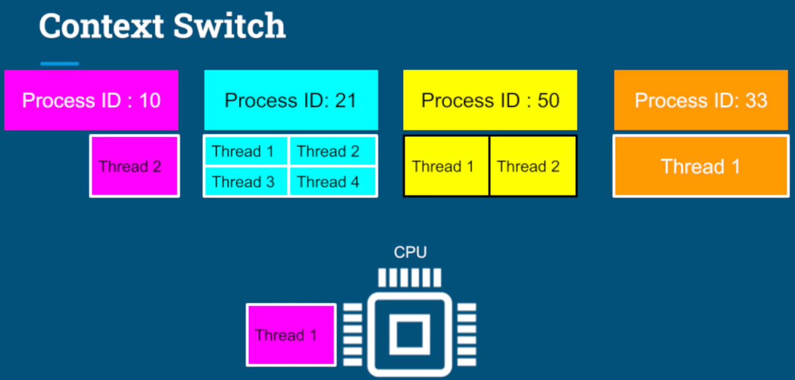

# OS 공부 저장소

### 프로세스
- CS 내용도 같이 공부한다.
- 우리가 컴퓨터를 키면 OS가 디스크에서 메모리로 로드가 된다.
- 프로그램을 실행하면 OS는 디스크에 있던 프로그램을 메모리에 가져와 프로그램의 인스턴스를 생성한다.
    - 이 인스턴스를 프로세스라고 한다.
    - 각 프로세스는 완전히 별개이다. 즉, 독립적으로 수행한다.
- 프로세스 안에 있는 메타 데이터를 살펴보면 다음과 같다.

- PID : 프로세스 ID, 어플리케이션이 읽고 쓰기 위해 여는 파일
- code : cpu에서 실행되는 프로그램의 명령
- heap : 어플리케이션에 필요한 모든 데이터가 들어있다.
- main thread : 최소 한개가 존재하며, 스택과 명령어 포인터가 들어있다.
    - 각 스레드는 독립적인 스택과 명령어 포인터를 가진다.
    - 그 외 프로세스 내의 나머지 컴포넌트들을 모든 스레드가 공유한다.
    - 스택 : 지역 변수가 저장되고 기능이 실행되는 영역
    - 명령어 포인터 : 스레드가 실행할 다음 명령어의 주소를 가리킨다.

 

### 컨텍스트 스위칭
- 프로세스들은 각각 독립적으로 실행된다.
- 프로세스는 최소 1개 이상의 스레드를 가지며 프로세스 내 스레드들은 CPU 실행을 두고 서로 경쟁한다.
- 스레드가 코어보다 많기 때문에 OS는 스레드 하나를 실행하고, 멈추고 다른 스레드를 실행하고 멈추고를 반복한다.
- 하나의 스레드 실행을 멈추고 다른 스레드를 스케줄링한 다음 다시 실행하는 것이 컨텍스트 스위치라고 한다.

 

- 컨텍스트 스위치 개념이 중요한 이유는 동시에 많은 스레드를 다루면 효율성이 떨어지기 때문
- CPU에서 실행되는 각 스레드는 CPU 내의 레지스터나 캐시, 메모리 내의 커널 리소스 등을 일부 점유한다.
- 이때 다른 스레드로 전환할 때는 기존의 모든 데이터를 저장하고 전환되려는 스레드의 데이터를 복원해야한다.
- 너무 많은 스레드를 가동하게 되면 쓰래싱이 발생한다.
  - OS가 스레드 관리를 위해 컨텍스트 스위칭에 좀 더 많은 시간을 할애하게 되는 것
- 스레드는 프로세스보다 리소스를 더 적게 사용한다.
  - 프로세스 내 스레드들은 서로 공유하는 리소스가 많다보니 적게 사용
  - 프로세스 내 두 스레드 간 컨텍스트 스위치가 각각 다른 프로세스의 두 스레드 간 컨텍스트 스위치보다 효율적이다.

### 쓰레드 스케쥴링
- OS는 언제 어떤 스레드를 실행할지 어떻게 결정하는가?
- 코어 하나에 여러 스레드가 있다고 가정할 때, 작업의 도착 순서와 실행 시간이 주어지면 OS는 누구를 가장 먼저 실행할까?
1. 선착순, First Come First Serve
   - 먼저 도착하면 먼저 끝남
   - 이 접근법이 문제점은 실행 시간이 긴 스레드가 먼저 도착하면 다른 스레드들은 대기
2. Shortest Job First
   - 작업 시간이 짧은 스레드들을 먼저 처리
   - 연산이 긴 작업은 후순위로 계속 밀려 영원히 처리가 안될 수도 있다.
3. Epochs
  - 일반적으로 운영 체제는 시간을 에포크(Epoch)라는 단위로 적당하게 나누며 모든 작업은 해당 시간 조각 동안 실행할 수 있다.
  - 스레드마다 타임 슬라이스를 하여 종류벌로 에포크에 할당한다.
  - 모든 스레드가 각 에포크에서 실행되거나 완료되지는 않는다.

### 쓰레드 vs 프로세스