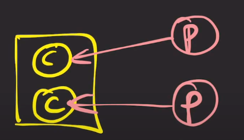

# OS 공부 저장소

### CPU
- 명령어를 실행하는 연산 장치

### 메인 메모리
- 프로세스가 CPU에서 실행되기 위해 대기하는 곳

### 프로세스
- 우리가 컴퓨터를 키면 OS가 디스크에서 메모리로 프로그램을 적재한다.
- 프로그램을 실행하면 OS는 디스크에 있던 프로그램을 메모리에 가져와 프로그램의 인스턴스를 생성한다.
    - 이 인스턴스를 프로세스라고 한다.
    - **각 프로세스는 완전히 별개이다. 즉, 독립된 메모리 공간을 할당받아 수행한다.**
- 프로세스 안에 있는 메타 데이터를 살펴보면 다음과 같다.

- PID : 프로세스 ID, 어플리케이션이 읽고 쓰기 위해 여는 파일
- code : cpu에서 실행되는 프로그램의 명령
- heap : 어플리케이션에 필요한 모든 데이터가 들어있다.
- main thread : 최소 한개가 존재하며, 스택과 명령어 포인터가 들어있다.
    - 각 스레드는 독립적인 스택과 명령어 포인터를 가진다.
    - 그 외 프로세스 내의 나머지 컴포넌트들을 모든 스레드가 공유한다.
    - 스택 : 지역 변수가 저장되고 기능이 실행되는 영역
    - 명령어 포인터 : 스레드가 실행할 다음 명령어의 주소를 가리킨다.

 

### 단일 프로세스 시스템의 단점
- CPU 사용 효율이 좋지 않음
- 왜?
  - 단일 프로세스 하나가 IO 작업을 하고 있으면 CPU는 놀고 있게 된다.

### 멀티 프로그래밍
- 그래서 여러 개의 프로그램을 메모리에 올려놓고 동시에 실행시킴으로써 IO 작업이 발생하면 다른 프로세스가 CPU에서 실행된다.
- **여러 프로그램들을 동시에 실행할 수 있음**
- **CPU 사용률을 극대화 시키는게 목적임**
- 멀티 프로그래밍의 단점은 특정 프로세스의 CPU 사용 기간이 길어지면 다른 프로세스는 계속 대기하게 된다.

### 멀티 태스킹

- 해결책으로 프로세스는 한번 CPU를 사용할 때 아주 짧은 시간 (quantum)만 CPU에서 실행되도록 하였다.
- 이를 멀티 태스킹이라 하며 동시에 여러 프로그램을 시작하는것이 멀티 프로그래밍과 유사해보인다.
- **차이는 CPU 타임을 짧게 쪼개어 프로세스가 번갈아가면서 실행**되는 차이가 있다.
- 멀티 태스킹은 `프로세스의 응답 시간을 최소화` 시키는게 목적임
- 응답 시간을 최소화?
  - 사용자 체감상 동시에 시작되어 즉각적인 반응을 느끼는 부분
- 멀티 태스킹 아쉬운 점은 여러 프로세스가 동시에 실행되는게 지원이 되지만 
- 하나의 프로세스가 동시에 여러 작업을 수행하지 못한다. ㅠㅠ
- 여러 프로세스를 실행시키면 되는거 아냐?
  - 프로세스를 여러개 만들어서 동작하게 되면 컨텍스트 스위칭이 일어난다.
    - 컨텍스트 스위칭은 무거운 작업이다.
  - 그리고 프로세스는 각각 독립적이기에 데이터 공유가 어렵다.
  - CPU 제조사에서 CPU를 늘린다면 발열 등의 이슈가 존재하여 차라리 하나의 cpu에 코어를 늘려 전체적인 성능을 높히는 방향으로 감
- **`오늘 날 CPU 실행단위가 스레드이기에 여러 프로세스 혹은 여러 스레드가 CPU에 실행될 때 cpu time slice를 짧게 나눠 가지면서 번갈아가며 실행되는 것을 뜻한다.`**

### 스레드
- 코어를 잘쓰기 위한 수단으로 등장함.
- 하나의 프로세스에서 여러개의 작업을 동시에 실행하기 위해서 필요함.
- 여러 개의 작업을 각각 맡아서 처리하는 애가 스레드이며 프로세스는 한 개 이상의 스레드를 가질 수 있다.
- cpu에서 실행되는 단위 (unit of execution)
- 같은 프로세스의 스레드들끼리 컨텍스트 스위칭이 가볍다.
  - 자신들이 속한 프로세스의 메모리 영역을 공유할 수 있어 데이터 공유가 쉽다.

### 멀티 스레딩
- 하나의 프로세스가 쓰레드들을 통해 동시에 여러 작업을 실행하는데 목적

### 멀티 프로세싱
- 두개 이상의 프로세서나 코어를 활용하여 여러 프로세스와 여러 스레드가 아주 짧게 쪼개진 cpu time을 나눠 갖는 시스템

 

### 멀티 태스킹 vs 멀티 스레딩 vs 멀티 프로세싱
- ex) 싱글 코어 CPU에 싱글-스레드, 프로세스 2 개가 있을 때
  - [x] 멀티 태스킹
  - [ ] 멀티 스레딩
  - [ ] 멀티 프로세싱
- ex) 싱글 코어 CPU에 듀얼-스레드, 프로세스 1 개가 있을 때
  - [x] 멀티 태스킹
  - [x] 멀티 스레딩
  - [ ] 멀티 프로세싱
- ex) 듀얼 코어 CPU에 싱글 스레드, 프로세스 2개가 있을 때
  - [ ] 멀티 태스킹
  - [ ] 멀티 스레딩
  - [x] 멀티 프로세싱

  

  - 멀티 태스킹이 아닌 이유는 우선 코어가 2개라고 헷갈리면 안되고 **코어 하나를 가지고 경합하는지 봐야한다.**
  - 프로세스는 각각의 코어를 사용하기 때문에 경합이 없어서 멀티 태스킹이 아니다.

 

- ex) 듀얼 코어 CPU에 듀얼 스레드, 프로세스 한개
  - [ ] 멀티 태스킹
    - 각각의 스레드가 각 코어를 사용하기 때문에 멀티 태스킹 X
  - [x] 멀티 스레딩
  - [x] 멀티 프로세싱
  
- ex) 듀얼 코어 CPU에 듀얼 스레드, 듀얼 프로세스
- 해당 예제는 두 개의 케이스가 있을 수 있다.
- 첫번째 케이스

  

  - [x] 멀티 태스킹
  - [x] 멀티 스레딩
  - [x] 멀티 프로세싱
- 두번째 케이스

  

  - [x] 멀티 태스킹
    - 코어 하나당 2개의 쓰레드가 경합중이라 맞다.
  - [x] 멀티 스레딩
  - [x] 멀티 프로세싱
  - 오늘날 우리가 쓰는 컴퓨터와 비슷하게 동작하지 않나 싶다.

 
 

### 프로세스는 언제 생성 되는가?
- OS가 모든 프로세스를 생성하지 않는다.
  - 시스템 부팅 후 최초 프로세스는 OS가 만든다.
- 실행중인 프로세스가 다른 프로세스를 복제 생성하게 된다.
- 이때 프로세스를 생성한 프로세스를 부모 프로세스라고 하고 생성된 프로세스를 자식 프로세스라고 한다.
- 프로그램을 실행할 때

### 프로세스마다 데이터 공유가 힘든 이유
- 프로그램을 실행하면 프로세스가 실행될텐데 그때마다 독립적인 프로세스마다 VM을 할당해줘야한다.
- 각 VM에 있는 데이터들 동기화가 힘들 것 같다.
  - 현재 켜져있는 맥북을 생각해봤을 떄 많은 프로세스와 쓰레드가 동작하고 있을 것
  - 이때 어떤 프로세스간 데이터를 읽고 쓰는지 힘들 것 같고, 일관된 데이터 읽기라든가 데이터 동기화가 안되어 난리가 날듯
  - IPC, LPC, Shared Memory 등의 방법을 통해 공유할 수 있다곤 하지만 그만큼 오버헤드가 발생하게 되어 독립적으로 관리하고 수행하도록 설계했을 것. 
  - 요즘 저출산 문제가 발생하는 이유가 자기 자신 관리하기도 힘든데 자식들을 케어하기 힘든 것과 비슷하지 않을까?

### 쓰레드 스케쥴링
- OS는 언제 어떤 스레드를 실행할지 어떻게 결정하는가?
- 코어 하나에 여러 스레드가 있다고 가정할 때, 작업의 도착 순서와 실행 시간이 주어지면 OS는 누구를 가장 먼저 실행할까?
1. 선착순, First Come First Serve
   - 먼저 도착하면 먼저 끝남
   - 이 접근법이 문제점은 실행 시간이 긴 스레드가 먼저 도착하면 다른 스레드들은 대기
2. Shortest Job First
   - 작업 시간이 짧은 스레드들을 먼저 처리
   - 연산이 긴 작업은 후순위로 계속 밀려 영원히 처리가 안될 수도 있다.
3. Epochs
  - 일반적으로 운영 체제는 시간을 에포크(Epoch)라는 단위로 적당하게 나누며 모든 작업은 해당 시간 조각 동안 실행할 수 있다.
  - 스레드마다 타임 슬라이스를 하여 종류벌로 에포크에 할당한다.
  - 모든 스레드가 각 에포크에서 실행되거나 완료되지는 않는다.

