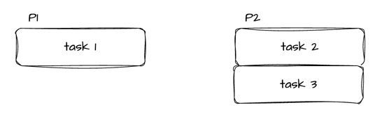
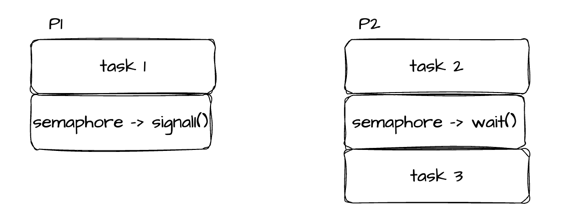
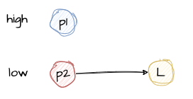
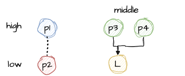
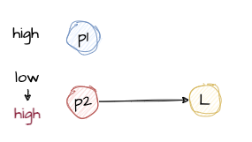

# 세마포어 (semaphore)
- signal mechanism을 가진, **하나 이상**의 프로세스 / 스레드가 critical section에 접근 가능하도록 하는 방식
- Mutex와 달리 Semaphore는 임의의 갯수를 세는 Counter처럼 동작해 임의의 갯수 만큼 프로세스 / 스레드만이 Critical section에 동시적으로 접근할 수 있도록 한다.
- 예로 들자면 5개의 스레드가 존재할 때 최대 3까지 세는 Semaphore는 한 스레드가 Critical section에 진입할 때마다 Counter 값을 1씩 낮추고, Critical section을 탈출할 때마다 Counter 값을 다시 1씩 높인다.
- 만약 어떤 스레드가 Critical section에 진입하려는데 Count 값이 0이라면 초기에 계획했던 대로 3개의 스레드가 이미 동시 작업중이라는 의미이다.
    - 하나의 스레드가 Critical section을 나오면서 Counter 값을 다시 1 증가시킬 때까지 큐에 들어가 Block된다.
- counting 값을 1보다 더 많은 값을 가지는 세마포어를 카운팅 세마포어라고 한다.

 

**- 세마포어는 작업 순서를 정해줄 때도 사용할 수 있다.**
- 서로 다른 프로세스 1, 2가 있을 때

- 프로세스 1의 task 1을 수행 후 프로세스 2의 task3를 수행되도록 순서를 보장하고 싶은 경우

- 만약 P1이 먼저 실행되면 counter 값은 1이 되고
    - P2가 wait() 함수를 호출하게 되면 바로 counter 값을 감소시켜 task3를 실행
- 만약 P2가 먼저 실행되면 counter 값은 0이라 큐에서 휴식을 취하게 됨
    - P1가 signal() 함수를 호출하면 큐에 대기 중인 스레드가 있으므로 P2를 깨우게 되고 task3를 실행
- `wait() 와 signal() 이 같은 프로세스/스레드에서 호출될 필요가 없다.`

 

## 바이너리 세마포어
- 값을 0과 1만 가지는 세마포어임
- 상호 배제(mutual exclusion) 를 위해 신호 전달 메커니즘을 사용해서 잠금을 구현함
- 세마포어가 0이면 잠겨있는 것이고, 1이면 잠금이 해제된 것

 

## 뮤텍스와 바이너리 세마포어는 같은 것 아닌가?
- 똑같지 않다.
- **뮤텍스는 락을 가진 자만 락을 해제할 수 있다. 세마포어는 그렇지 않다.**
- 뮤텍스는 락을 가진 프로세스 / 스레드만 락을 헤제할 수 있기 때문에 **뮤텍스 락은 락을 가진 프로세스 / 스레드에 소속된다.**
    - 그래서 뮤텍스 같은 경우 누가 락을 해제하는지 예상하기 쉽다.
- 세마포어는 위 예제처럼 signal() 신호를 날리는 프로세스 / 스레드와 wait() 신호를 날리는 프로세스 / 스레드가 다를 수 있다.

 

- 또다른 차이는 `priority inheritance` 여부이다.
  - 뮤텍스는 `priority inheritance` 속성을 가진다.
  - 세마포어는 이 속성이 없다. 누가 시그널을 날릴지 알 수가 없어서!
- priority inheritance 란?
    - 여러 프로세스 / 스레드가 동시에 실행될 때 cpu에서 컨텍스트 스위칭이 발생해 어떤 프로세스 / 스레드를 우선적으로 실행할지 스케쥴링을 하게 되는데 스케줄링 방법 중 우선순위를 높은 애들을 실행하는 방법이 있다.
    - 이때 같은 자원에서 여러 프로세스가 자원 경쟁을 하게 될 경우 **가장 높은 우선순위를 가졌지만 결국 가장 나중에 완료가 되는 경우가 있을 수 있다.** (우선순위 역전)
   
     
    
    - 아래 예를 들어보면 P1, P2가 있고 우선순위가 낮은 P2가 먼저 Lock을 선점하게 되는 경우 P1은 우선순위가 높음에도 대기하게 된다.

      

    - 이때부터 P1은 P2에 의존성을 가지게 된다. P1은 P2가 락을 반환할 때까지 대기하게 된다. 
    
     
     
    - 대기하고 있는데 다른 프로세스들이 접근하게 되는 경우 스케줄링에 의해 P2가 잠시 중단되고 다른 프로세스 P3, P4가 P1보다 먼저 실행될 수 있다.
   
      
  
    - P3, P4가 실행이 끝나고 다시 P2가 실행되고 P2가 끝나고 P1이 가장 늦게 실행되는 경우이다.
    - 우선순위가 높음에도 가장 늦게 실행되는 이 문제를 mutex에서는 P2의 우선순위를 대기하고 있는 P1의 우선순위로 증가시켜서 해결하는걸 `우선순위 상속`이라고 한다.
    - 임계영역에서 수행중인 프로세스가 우선순위가 낮은 경우 해당 프로세스를 의존하면서 대기하고 있는 프로세스의 우선순위만큼 일시적으로 부여하는 행위이다.
    
      

 

- 상호 배제만 필요하면 뮤텍스를, 작업 간의 실행 순서 동기화가 필요하면 세마포어를 권장한다.