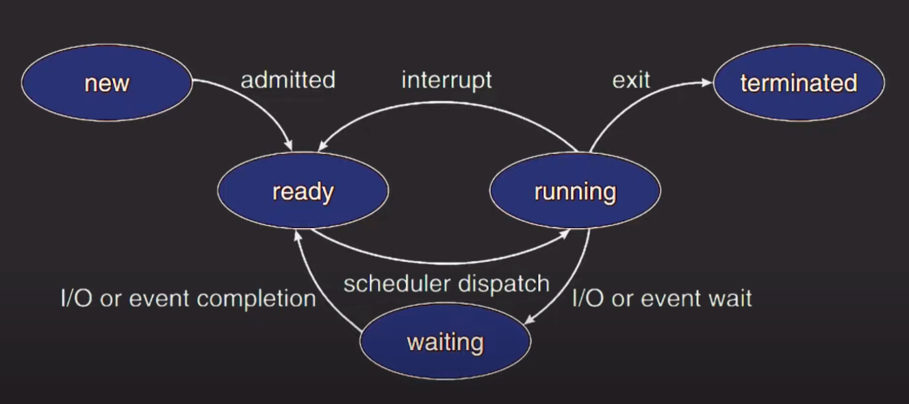

# State
- OS 프로세스의 상태 변화와 자바 스레드의 상태와는 어떻게 다른지 비교해보자.

## OS에서 프로세스 상태



- `new` : 처음 프로세스가 생성되면 해당 상태를 가지고 시작한다.
- `ready` : new 에서 ready 상태로 전환되면서 CPU에서 실행되기 위해 대기를 하는 단계.
  - real time OS 같은 특수한 상황에서 new 상태로 기다리고 있다가 long term scheduler가 허락을 해주면 ready 상태로 된다.
  - 일반적인 OS들은 long term scheduler가 따로 없고 **처음 프로세스가 생성되면 바로 ready 상태가 된다.**
- `running` : 스케쥴러에 의해 차례가 되면 CPU에서 실행되고 있는 단계 (ready -> running)
  - 할당된 time slice를 다 사용하게 되면 다시 running -> ready로 전환된다.
- `waiting` : CPU에서 실행되다가 critical section에 진입하기 위해 대기하거나 I/O 작업으로 인해 대기하게 되는 단계
  - **running -> waiting으로 전환된 상태에서 IO 작업이 끝났거나 critical section에 들어갈 수 있게 되면 running 상태가 되는 것이 아닌 ready 상태로 전환된다.**
- `terminated` : 프로세스가 작업을 마치고 리소스를 반환하는 단계

<br>

## Java thread의 상태 종류
- 스레드는 프로세스의 메모리를 공유하기 때문에 스레드의 상태와 프로세스의 상태가 거의 비슷하다.
- `new` : 스레드가 생성되고 아직 start()를 호출하지 않은 상태 (시작하지 않은 상태)
- `waiting` : 스레드가 종료 되지 않고 일시정지인 상태, 다른 스레드를 기다리는 상태
  - Object.wait()
  - Thread.join()
  - 등을 통해 `waiting` 상태가 된다.
- `timed waiting` : 제한 시간을 두고 다른 스레드를 기다리는 상태
  - Object.wait(time)
  - Thread.join(time)
  - Thread.sleep()
- `blocked` : critical section으로 진입하려고 모니터 락을 얻기 위해 기다리는 상태
- `runnable` : 실행 중 또는 실행 가능인 상태
  - CPU에서 실행되는 실행되고 있는 `running` 상태를 포함
  - 다른 리소스를 기다리는 상태도 포함
  - 즉, 주어진 실행 상태가 다되거나 yield() 등을 만나면 다시 실행 대기 상태가 되고 다음 차례에 있는 스레드가 실행 상태가 된다.
- `terminated` : 실행을 마치고 종료된 상태

<br>

### 예제 코드로 살펴보는 state
- 이전 모니터 락의 예제 코드이다. 컨슈머 스레드 위주로 상태 변화를 파악해보자.
```java
public class BoundedBuffer {
    private final int[] buffer = new int[5];
    private int count = 0;

    public synchronized void produce(int item) {
        while (count == 5) {
            wait();
        }
        buffer[count++] = item;
        notify();
    }
    
    public void consume() {
        int item = 0;
        synchronized (this) {
            while (count == 0) {
                wait();
            }
            item = buffer[--count];
            notify();
        }
        System.out.println("consume :" + item);
    }
    
    public static void main(String[] args) {
        BoundedBuffer buffer = new BoundedBuffer();
        
        Thread consumer = new Thread(() -> {
            buffer.consume();
        });
        
        Thread producer = new Thread(() -> {
            buffer.produce(100);
        });
        
        consumer.start();
        producer.start();
        
        consumer.join();
        producer.join();
    }
}
```
1. 컨슈머 스레드 C1이 생성되면 은 `new` 상태가 되고 start()를 실행하면 `runnable`이 된다.
2. C1이 buffer.consume()을 실행하면서 동기화 블럭을 만난 경우
   - 만약 락을 쥐고 있는 스레드가 없다면 동기화 블럭 내부로 들어온다.
   - contition variables를 통해 조건이 충족하지 않은 경우 wait()로 인해 `waiting`으로 전환된다.
3. 프로듀서 스레드 P1이 생성되면 `new` 상태가 되고 start()를 실행하면 `runnable`이 된다.
4. P1이 produce()을 실행하여 동기화 블럭을 만난 경우 락을 쥐고있는 스레드가 없다고 가정하고 락을 획득하여 진입
5. notify() 호출 시 C1을 깨움 
6. **이 때 자바는 `signal and continue` 방식으로 동작하기 때문에 P1은 계속 모니터 락을 쥐고 작업하고 있기에 C1은 모니터 락을 획득하기 위해 `waiting` 에서 `blocked` 상태로 
   전환된다.**
7. P1이 종료가 되고 락을 반납하여 C1이 획득하면 `blocked` 에서 `runnable`이 된다.
8. 작업이 종료가 되면 `terminated`가 된다.