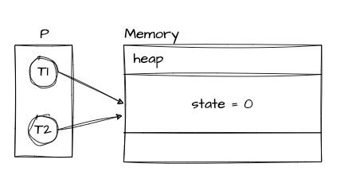
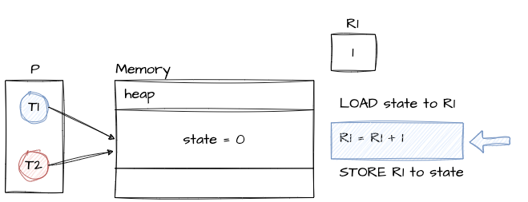
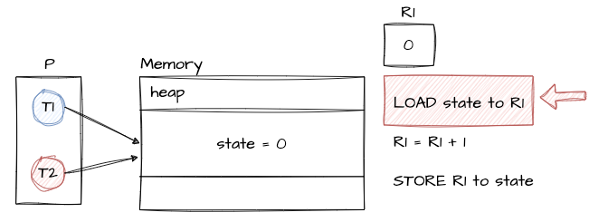
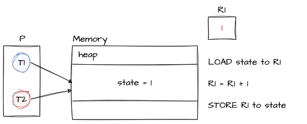
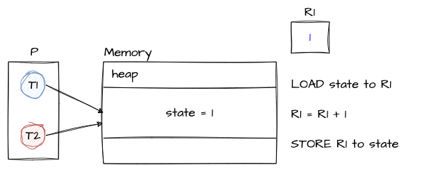

# Synchronization

### 하나의 객체를 두 개의 스레드가 접근할 때 생기는 일은?
- 다음과 같은 객체가 있다고 가정해보자
```java
public class Counter {
    private int state = 0;
    public void increment() {
        this.state++;
    }
}
```

- **싱글 코어**에서 **두 개의 쓰레드**가 increment()를 계속 호출한다고 가정했을 때

  

<br>

- CPU 레벨에서는 state++; 구문이 아래 어셈블리어로 변환되면서 동작한다. 
```text
R1 - 레지스터, CPU 안에 포함된 데이터 저장소

LOAD state to R1   <- 메모리에 있는 state 변수 값을 레지스터 R1로 적재 
R1 = R1 + 1        <- 레지스터에 있는 값을 +1 해서 다시 레지스터에 저장
STORE R1 to state  <- 레지스터에 있는 값을 메모리에 있는 state 변수로 저장 
```

<br>

### 만약 두 스레드가 동시에 ++ 연산을 수행하게 되면 어떤 현상이 생길 수 있을까?

1. T1이 increment()를 먼저 수행했을 때 CPU 레벨에서는 `LOAD state to R1`을 실행
2. T1이 `R1 = R1 + 1` 을 실행, 그럼 현재 상황은 다음과 같다.
  

3. 이때 컨텍스트 스위칭이 발생해서 T2가 시작하게되어 increment()가 시작되면 다시 CPU 레벨에서 `LOAD state to R1`을 실행
   - 이때 메모리에 있는 state 값은 0이기 때문에 R1에 0이 올라가게 된다.
  
   

4. 그리고나서 T2는 계속 `R1 = R1 + 1` 명령어 수행후 `STORE R1 to state`를 수행하게 되면 메모리에 있는 state 값은 0 -> 1로 바뀔 것이다.
  
5. 그리고나서 컨텍스트 스위칭이 발생해서 T1으로 돌아온다.
6. T1은 다음 작업인 `STORE R1 to state`를 수행하면 R1에 마지막 상태 값인 1 값을 로딩을 하여 메모리에 적재한다.
  

<br>

- **결과적으로 쓰레드 스스로가 작업하던 값이 아닌 다른 값으로 연산을 할 수 있다!**
  - 즉 T1이 작업하던 데이터가 컨텍스트 스위칭이 발생하여 메모리에 써지지 않은 상태에서 <br> T2가 시작이 되어 T1이 반영한 값으로 작업을 하지 못함
  
- 하나의 쓰레드에서 언제 컨텍스트 스위칭이 발생하냐에 따라 결과가 달라질 수 있다.

<br>
<br>

## Race Condition (경쟁 조건)
- 여러 프로세스 / 스레드가 동시에 같은 데이터를 조작할 때 컨텍스트 스위치, 타이밍이나 접근 순서에 따라 결과가 달라질 수 있는 상황을 뜻한다.


## Synchronization
- 여러 프로세스 / 스레드가 동시에 실행해도 공유 데이터의 일관성을 유지하는 것을 동기화라고 한다.
- 위 코드를 어떻게 동기화 시킬 것인가?
  - 컨텍스트 스위칭이 발생하지 않도록 하면 되지 않을까?
    - 싱글 코어에서만 가능하고 멀티 코어에서는 불가능하다.
  - 하나의 스레드만 실행하도록 하면 되지 않을까?
    - 멀티 코어인 경우 하나의 쓰레드에서 이미 수행중이기 때문에 다른 코어의 쓰레드가 기다려야하기에 가능

## Critical Section 
- 공유 데이터의 일관성을 보장하기 위해 하나의 프로세스 / 스레드만 진입해서 실행 가능한 영역을 임계 영역이라고 한다.
- 락을 쥐고 나서부터 락을 해제하기 전까지의 영역
- 임계 영역 접근에 대한 조건은 3가지가 있다.
1. mutual exclustion (상호 배제)
    - 한번의 하나의 프로세스 / 스레드만 임계 영역에서 실행 할 수 있어야 한다.
2. progress (진행)
    - 만약 임계 영역에서 수행중인 프로세스 / 스레드가 없고 어떤 프로세스 / 스레드가 임계 영역에 들어가길 원한다면 그 중에 하나는 실행될 수 있어야한다.
3. bounded waiting (한정된 대기)
    - 어떤 프로세스 / 스레드가 임계 영역에 들어가지 못해 무한정 대기하고 있으면 안된다.

<br>

## 어떻게 해야 mutual exclusionn을 보장할 수 있을까?
- 락을 사용한다. 여러 스레드가 공유해서 쓰는 데이터를 보호할 때 사용된다.
- 스핀락, 뮤텍스, 세마포어 추가 정리

----

<br>

### SimpleDateFormat.class
- 여담으로 자바에서 대표적인 thread-unsafe한 대표적인 클래스이다.
- 문서를 읽어보면 다음과 같이 되어있다.
```text
 * Date formats are not synchronized.
 * It is recommended to create separate format instances for each thread.
 * If multiple threads access a format concurrently, it must be synchronized externally.
```


